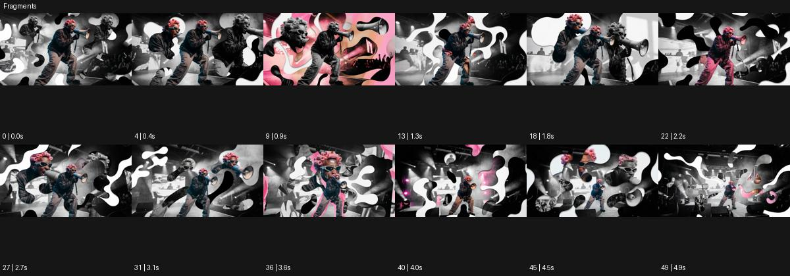

# Fragments

출처: Higgsfield · 공식 원본명: **Fragments** · 분류: look / 스타일 · ID: f41020a7-8f3d-46fa-9ef7-cd966037121d

[원본 미리보기](https://cdn.higgsfield.ai/mixed_media_preset/4f884245-2915-4a24-a19a-b18cd252ab1f.mp4) · [원본 썸네일](https://cdn.higgsfield.ai/mixed_media_preset/a9a7aaa6-86ea-4cec-b454-8506de1e9c04.webp)


## 확인 근거

공식 미리보기의 12개 표본 프레임을 확인한 관찰 기록을 바탕으로 작성했다. 원본 50프레임, 메타데이터 길이 5초. 전체 재생 감상·전 프레임 검사·음향 청취·생성 테스트를 했다는 뜻이 아니다.

표본 시점(초): 0, 0.4, 0.9, 1.3, 1.8, 2.2, 2.7, 3.1, 3.6, 4, 4.5, 4.9



## 원본에서 관찰한 변화

메가폰 든 공연자의 컬러·흑백 복제 조각이 서로 겹치며 흰 유기적 구멍 사이로 바뀐다. 중간에 분홍 면이 들어온다.

## 장면에 재사용할 원리와 층 구분

움직이는 색·흑백 영상 조각과 유기적 빈 영역을 겹쳐 복수의 시점을 만든다. 조각 폭발 대신 시선의 우선순위와 가림 순서를 설계한다.

## 확인 한계

단순 파편 폭발이 아닌 살아 움직이는 콜라주 레이어. 표본 사이의 미세한 변화·정확한 반복 경계·제작 공정은 확정하지 않는다. 음향은 확인하지 않았다.

## 뮤직비디오 각색 · 완성형 프롬프트

아래는 관찰한 시각 원리를 다른 장면 목적에 맞게 재설계한 창작안이다. 원본의 소재·길이·사건을 자동 상속하지 않는다.

```text
7초 뮤직비디오, 성인 보컬이 회색 무대에서 마이크를 들고 정면을 본다. 카메라는 고정된 상반신 구도다. 보컬이 팔을 들면 같은 동작의 흑백 손 조각과 컬러 옆얼굴 조각이 흰 유기적 구멍 사이에서 나타난다. 각 조각은 현재 동작보다 조금 늦게 움직이고 중앙 눈 주변은 끝까지 가리지 않는다. 4초에 분홍 면이 화면 아래에서 올라와 주변 조각을 잠깐 묶고 보컬이 팔을 내리면 조각들이 옆으로 정렬된다. 마지막 2초는 중앙 실사 얼굴과 두 개의 작은 조각만 남겨 분열된 감정이 가라앉는 모습을 보여준다. 문자·대사는 없다.
```

## 브랜드필름 각색 · 완성형 프롬프트

```text
8초 주얼리 브랜드필름, 짙은 회색 배경에 성인 모델의 귀와 은색 귀걸이를 가까이 담는다. 고정 카메라로 귀걸이 형태를 먼저 2초 읽힌다. 이어 손으로 만지는 디테일과 목선의 흑백 영상 조각이 흰 유기적 여백 사이에 겹쳐 나타나고 중앙 제품은 컬러로 선명하게 유지한다. 조각은 제품을 절단한 듯 보이지 않도록 귀걸이 밖에 배치한다. 5초에 모델이 고개를 아주 조금 돌리면 주변 조각이 멈추고 하나씩 옅어진다. 마지막 3초는 귀걸이의 금속 반사와 착용 간격에 안착한다. 제품 수·연결 구조·기존 로고를 유지하고 새 문자 없이 무음으로 끝낸다.
```

생성 테스트: 미실시. 스타일의 명칭만으로 자동 재현을 보장하지 않으며 촬영·그래픽·합성·편집 층을 구별해 구현한다.
