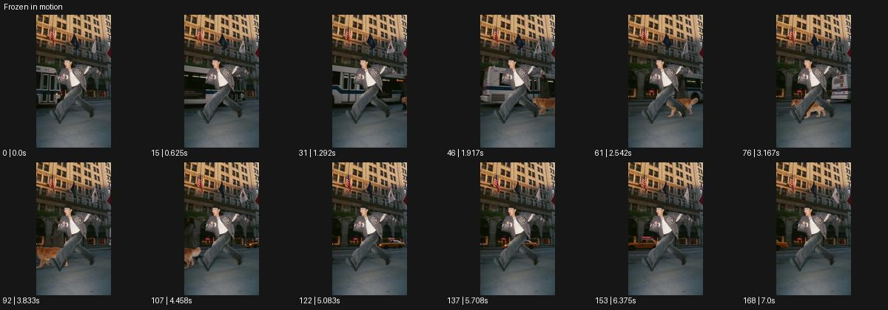

# Frozen in motion

- 원본 효과명: **Frozen in motion**
- 출처·분류: Higgsfield / scene
- 원본 ID: 6e822598-7221-4f89-9a7d-81bb812433d9
- [공식 원본 미리보기](https://cdn.higgsfield.ai/viral_hub/59c46689-f756-4843-b298-f34b9761187e.mp4)
- 확인 방식: 공식 미리보기의 12개 표본 프레임을 확인한 관찰 기록을 바탕으로 작성. 169프레임, 메타데이터 길이 7.042초. 표본 시점: [0.0, 0.625, 1.292, 1.917, 2.542, 3.167, 3.833, 4.458, 5.083, 5.708, 6.375, 7.0]초. 전체 재생·모든 프레임 검사·청음이나 생성 재현 테스트를 뜻하지 않는다.




## 실제 관찰

달리는 자세의 인물이 공중 같은 위치에 머물고 뒤 버스와 개가 지나간다. 카메라 구도는 거의 고정돼 움직이는 배경과 비교된다.

## 작동 원리와 역할

멈춘 주체와 계속 움직이는 배경을 같은 구도에서 대조한다. 주체의 공중 자세·그림자·위치를 보존하고 주변 사건의 시간만 계속 흘리며 해제 여부를 명시한다.

## 해석의 한계

그림자·발의 작은 변화를 완전한 물리 정지로 검증한 것은 아니다. 샘플 사이의 연결과 루프 경계는 별도 검사하지 않았다. 아래는 원본 설정을 복사한 기록이 아닌 새로운 장면 각색이며 생성 테스트는 하지 않았다.

## 뮤직비디오 적용 · 완성형 프롬프트

아래 길이와 설정은 독립 창작 예시다. 실제 요청의 길이·참조·음향·컷 조건을 우선한다.

```text
7초 뮤직비디오. 붉은 코트의 성인 댄서가 횡단보도에서 작은 점프를 한다. 고정 와이드로 양발이 바닥에서 떨어지는 순간을 보여준 뒤 댄서만 공중 자세로 멈춘다. 뒤의 버스와 행인, 코트 옆을 지나가는 종이 조각은 계속 움직여 시간이 다르게 흐르는 것을 읽힌다. 카메라는 줌하거나 돌지 않고 멈춘 발과 그림자의 간격을 일정하게 둔다. 후반 배경 사람들이 빠져나가면 댄서의 시간이 다시 흐르고 자연스럽게 착지한다. 마지막 2초 댄서가 혼자 서서 렌즈를 보는 모습으로 끝낸다.
```

## 브랜드필름 적용 · 완성형 프롬프트

현재 제품과 브랜드 목적에 맞게 다시 설계하고 마지막 제품 가독성을 확보한다.

```text
7초 고급 러닝화 필름. 성인 러너가 밝은 실내 트랙에서 도약하는 전신을 낮은 고정 카메라로 담는다. 한 발을 내민 공중 자세에서 러너와 신발만 잠깐 정지시키고 뒤의 다른 러너 두 명은 계속 지나가게 한다. 정지 중 신발 측면의 소재와 밑창 구조가 선명히 읽히며 몸이나 발 위치는 흔들리지 않는다. 카메라는 같은 위치에서 고정하고 배경 조명도 일정하게 유지한다. 시간이 다시 흐르면 러너가 한 번 착지하고 멈춘다. 끝 2초 양발과 신발이 바닥에 안정적으로 놓인 구도를 남긴다.
```

원본 음향은 확인하지 않았다. 실제 음원, 무음, NO BGM 등 사용자 조건을 유지한다. 명칭만으로 특정 생성 모델의 자동 재현을 보장하지 않는다.
