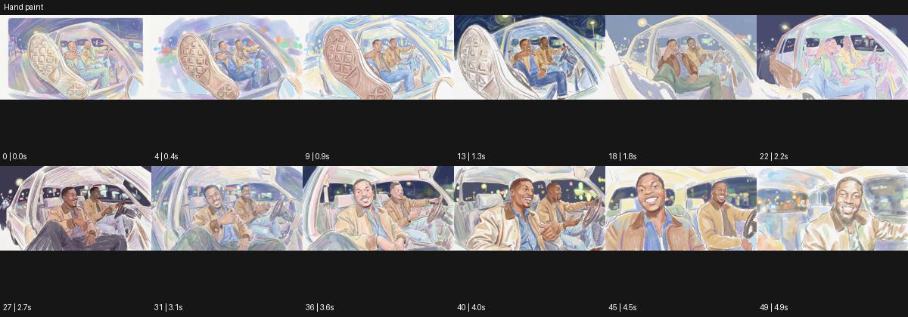

# Hand paint

출처: Higgsfield · 공식 원본명: **Hand paint** · 분류: look / 스타일 · ID: 9b3ff025-252e-40c5-bddb-97513d35c38a

[원본 미리보기](https://cdn.higgsfield.ai/mixed_media_preset/0adfa8b5-7e87-461b-90a8-5542a506d0f6.mp4) · [원본 썸네일](https://cdn.higgsfield.ai/mixed_media_preset/c054cfb5-0b35-4d43-9ac3-3ea9bc0f5a87.webp)


## 확인 근거

공식 미리보기의 12개 표본 프레임을 확인한 관찰 기록을 바탕으로 작성했다. 원본 50프레임, 메타데이터 길이 5초. 전체 재생 감상·전 프레임 검사·음향 청취·생성 테스트를 했다는 뜻이 아니다.

표본 시점(초): 0, 0.4, 0.9, 1.3, 1.8, 2.2, 2.7, 3.1, 3.6, 4, 4.5, 4.9



## 원본에서 관찰한 변화

차 창문 밖으로 큰 신발 밑창과 탑승 인물이 보인다. 밝은 파스텔 선·색면이 실사 구조를 따라 흔들리고 후반 얼굴 근경으로 이동한다.

## 장면에 재사용할 원리와 층 구분

실사 구조를 따라 파스텔 선·색면이 조금씩 흔들리게 해 손으로 그린 표면 인상을 만든다. 주체의 원근과 재질 식별은 유지하며 수작업 공정을 주장하지 않는다.

## 확인 한계

직접 수작업 그림 제작을 확인한 것은 아니다. 저채도 손그림 같은 외형. 표본 사이의 미세한 변화·정확한 반복 경계·제작 공정은 확정하지 않는다. 음향은 확인하지 않았다.

## 뮤직비디오 각색 · 완성형 프롬프트

아래는 관찰한 시각 원리를 다른 장면 목적에 맞게 재설계한 창작안이다. 원본의 소재·길이·사건을 자동 상속하지 않는다.

```text
7초 손그림 질감 뮤직비디오, 성인 보컬이 정지한 차의 열린 창에 팔을 걸치고 밖을 바라본다. 카메라는 창밖 낮은 위치에서 손과 얼굴을 함께 담는다. 파스텔색 윤곽과 옅은 색면이 실사 구조를 따라 조금씩 바뀌고 첫 2초는 손의 움직임을 선명하게 읽힌다. 보컬이 고개를 카메라 쪽으로 돌리면 카메라는 천천히 얼굴에 접근한다. 창틀과 얼굴 비율은 고정하고 손그림 선만 미세하게 흔들린다. 5초에 보컬이 작은 웃음을 보이면 카메라가 멈추고 마지막 2초는 따뜻한 초상으로 남긴다. 새 문자·대사 없이 실내 공기 소리만 둔다.
```

## 브랜드필름 각색 · 완성형 프롬프트

```text
8초 캔버스 슈즈 브랜드필름, 성인 모델의 발에 신긴 크림색 운동화를 낮은 측면으로 담는다. 전체 화면에 부드러운 파스텔 선과 옅은 손그림 색면을 적용하되 신발 끈·밑창 무늬·발 비율은 정확히 유지한다. 모델이 2초에 발뒤꿈치를 들어 올리면 카메라가 밑창 곡선을 따라 20cm 이동하고 색면 경계가 천의 주름을 따라 조금 달라진다. 5초에 발을 다시 바닥에 놓으면 선의 흔들림도 줄어든다. 마지막 3초는 신발의 측면과 실제 캔버스 조직이 함께 읽히는 구도에서 멈춘다. 새 로고·문구·과장된 만화 동작 없이 발소리만 둔다.
```

생성 테스트: 미실시. 스타일의 명칭만으로 자동 재현을 보장하지 않으며 촬영·그래픽·합성·편집 층을 구별해 구현한다.
