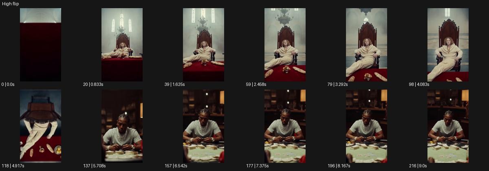

# High flip

- 원본 효과명: **High flip**
- 출처·분류: Higgsfield / scene
- 원본 ID: 93a606f8-87cb-4fb0-98a8-694d08f9b319
- [공식 원본 미리보기](https://cdn.higgsfield.ai/viral_hub/001156a7-cfdb-4e16-8f13-68c246ddc06c.mp4)
- 확인 방식: 공식 미리보기의 12개 표본 프레임을 확인한 관찰 기록을 바탕으로 작성. 217프레임, 메타데이터 길이 9.042초. 표본 시점: [0.0, 0.833, 1.625, 2.458, 3.292, 4.083, 4.917, 5.708, 6.542, 7.375, 8.167, 9.0]초. 전체 재생·모든 프레임 검사·청음이나 생성 재현 테스트를 뜻하지 않는다.




## 실제 관찰

밝은 왕좌에 앉은 인물을 향해 접근한 뒤 위쪽을 넘는 뒤집힌 시점이 나타나고 어두운 테이블에 앉은 다른 인물로 이어진다.

## 작동 원리와 역할

카메라가 위쪽으로 넘어가는 뒤집힌 시점과 다음 구도의 상하 정렬을 연결한다. 주체 변형과 카메라 롤·피치, 가림 또는 편집 지점을 명시해 공간 전환을 읽힌다.

## 해석의 한계

표본만으로 실제 연속 카메라 이동이나 숨은 컷 유무는 확정하지 않는다. 샘플 사이의 연결과 루프 경계는 별도 검사하지 않았다. 아래는 원본 설정을 복사한 기록이 아닌 새로운 장면 각색이며 생성 테스트는 하지 않았다.

## 뮤직비디오 적용 · 완성형 프롬프트

아래 길이와 설정은 독립 창작 예시다. 실제 요청의 길이·참조·음향·컷 조건을 우선한다.

```text
8초 뮤직비디오. 흰 피아노 앞에 앉은 성인 보컬을 정면 중간 구도로 시작한다. 보컬이 마지막 건반에서 손을 떼면 카메라가 얼굴을 향해 접근한 뒤 머리 위로 올라가 뒤쪽으로 넘어가는 아치 경로를 그린다. 천장이 화면을 채우고 구도가 뒤집히는 순간 같은 밝기의 다른 천장으로 한 번 컷한다. 이어 카메라가 반대편으로 내려와 검은 피아노 앞의 같은 보컬을 정면에서 드러낸다. 마지막에는 수평을 회복하고 두 손을 건반에 얹은 모습에 2초 머문다. 인물이 공중제비를 하거나 피아노가 변형되지 않게 한다.
```

## 브랜드필름 적용 · 완성형 프롬프트

현재 제품과 브랜드 목적에 맞게 다시 설계하고 마지막 제품 가독성을 확보한다.

```text
8초 고급 호텔 필름. 밝은 대리석 로비의 소파에 성인 투숙객이 앉아 작은 가방을 무릎에 놓는다. 카메라는 정면에서 천천히 접근하다 투숙객의 머리 위로 높이 올라가 천장을 향하며 뒤집힌 시점이 된다. 같은 중심 장식의 객실 천장으로 한 번 연결하고 카메라가 아래로 내려와 객실 의자에 앉은 같은 인물을 보여준다. 가방의 손잡이 방향과 인물 자세를 맞춰 공간 이동을 자연스럽게 느끼게 한다. 마지막 수평 구도에서 투숙객이 가방을 옆 테이블에 놓는다. 끝 2초 객실의 재질과 가방 전체를 안정적으로 읽힌다.
```

원본 음향은 확인하지 않았다. 실제 음원, 무음, NO BGM 등 사용자 조건을 유지한다. 명칭만으로 특정 생성 모델의 자동 재현을 보장하지 않는다.
