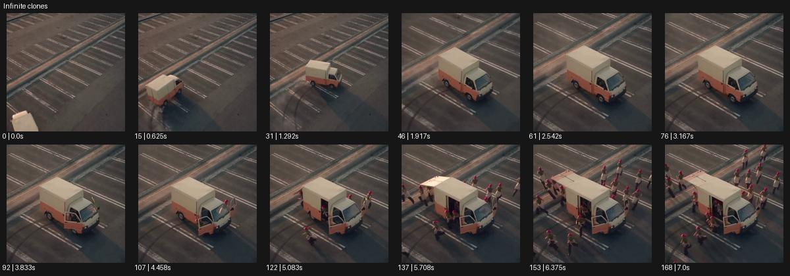

# Infinite clones

- 원본 효과명: **Infinite clones**
- 출처·분류: Higgsfield / scene
- 원본 ID: 6821208a-3078-4431-92df-8f2e46a833f4
- [공식 원본 미리보기](https://cdn.higgsfield.ai/viral_hub/04df3d28-67de-464a-9426-55568d4ee55c.mp4)
- 확인 방식: 공식 미리보기의 12개 표본 프레임을 확인한 관찰 기록을 바탕으로 작성. 169프레임, 메타데이터 길이 7.042초. 표본 시점: [0.0, 0.625, 1.292, 1.917, 2.542, 3.167, 3.833, 4.458, 5.083, 5.708, 6.375, 7.0]초. 전체 재생·모든 프레임 검사·청음이나 생성 재현 테스트를 뜻하지 않는다.




## 실제 관찰

빈 주차장에 작은 트럭이 들어와 멈춘 뒤 문이 열리고 같은 차림 인물들이 주변 여러 방향으로 늘어나 달려나간다.

## 작동 원리와 역할

복제 인물들이 하나의 출입구에서 여러 동선으로 분산되는 과정을 설계한다. 기준 인물, 복제의 수와 출발 간격, 이동 경로를 정해 무질서한 형태 증식을 막는다.

## 해석의 한계

카탈로그는 static이라지만 초반 시점/구도 변화가 있다. 무한성은 실제 유한 미리보기에서 입증되지 않는다. 샘플 사이의 연결과 루프 경계는 별도 검사하지 않았다. 아래는 원본 설정을 복사한 기록이 아닌 새로운 장면 각색이며 생성 테스트는 하지 않았다.

## 뮤직비디오 적용 · 완성형 프롬프트

아래 길이와 설정은 독립 창작 예시다. 실제 요청의 길이·참조·음향·컷 조건을 우선한다.

```text
8초 뮤직비디오. 비어 있는 실내 주차장에 성인 보컬이 탄 작은 전기 카트가 들어와 멈춘다. 고정 와이드로 카트와 좌우 빈 동선을 먼저 보여준다. 문이 열리면 동일한 보컬 다섯 명이 한 명씩 내려 각기 다른 방향으로 걸어 나간다. 얼굴과 검은 수트는 모두 같지만 한 명은 넥타이를 풀고 다른 한 명은 박자를 세는 손짓을 한다. 카메라는 가운데 원래 보컬을 중심에 남긴 채 천천히 뒤로 이동해 복제들의 간격을 넓게 읽힌다. 마지막에는 가운데 한 명만 렌즈를 보고 나머지는 멈춘다. 무한성을 다섯 복제로 압축해 신체 겹침을 피한다.
```

## 브랜드필름 적용 · 완성형 프롬프트

현재 제품과 브랜드 목적에 맞게 다시 설계하고 마지막 제품 가독성을 확보한다.

```text
8초 고급 여행 가방 필름. 밝은 역 대합실의 중앙 문에서 같은 베이지 코트의 성인 여행자 네 명이 차례로 나온다. 각자 동일한 검은 캐리어를 끌되 좌우 서로 다른 동선을 따라 이동한다. 카메라는 높은 정면 와이드에 고정해 복제 인물과 가방이 겹치지 않게 간격을 유지한다. 마지막 여행자만 중앙에서 멈춰 캐리어를 세우고 다른 세 명은 후경의 문으로 빠져나간다. 카메라가 중앙 제품을 향해 짧게 접근하여 손잡이와 바퀴를 읽힌다. 끝 2초 한 사람과 가방만 남으며 제품 모델과 구조는 모든 복제에서 일치한다.
```

원본 음향은 확인하지 않았다. 실제 음원, 무음, NO BGM 등 사용자 조건을 유지한다. 명칭만으로 특정 생성 모델의 자동 재현을 보장하지 않는다.
