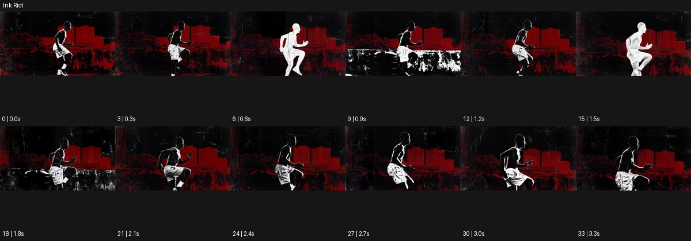

# Ink Riot

출처: Higgsfield · 공식 원본명: **Ink Riot** · 분류: look / 스타일 · ID: aa5d78cc-00bf-466d-bb91-aff6ea79495c

[원본 미리보기](https://cdn.higgsfield.ai/mixed_media_preset/c3fcf814-6542-4b51-a704-3b76153c91c6.mp4) · [원본 썸네일](https://cdn.higgsfield.ai/mixed_media_preset/2d4a39c0-21e4-48b8-90ed-83f29598f90c.webp)


## 확인 근거

공식 미리보기의 12개 표본 프레임을 확인한 관찰 기록을 바탕으로 작성했다. 원본 34프레임, 메타데이터 길이 3.4초. 전체 재생 감상·전 프레임 검사·음향 청취·생성 테스트를 했다는 뜻이 아니다.

표본 시점(초): 0, 0.3, 0.6, 0.9, 1.2, 1.5, 1.8, 2.1, 2.4, 2.7, 3, 3.3



## 원본에서 관찰한 변화

달리는 인물이 검정·흰색 덩어리와 가는 윤곽으로 바뀌며 붉은 건물층 앞에 놓인다. 중간에 흰 거친 띠와 밝은 실루엣이 끼어든다.

## 장면에 재사용할 원리와 층 구분

실사 동작의 방향을 유지한 채 검정·흰색 덩어리와 거친 띠로 윤곽을 재해석한다. 인물 동작, 고정 배경색, 시간에 따라 교체되는 잉크층을 분리하면 읽히는 혼란을 설계할 수 있다.

## 확인 한계

회화 원작 실사화가 아닌 그래픽 질감. 시간별 명암 교체가 원본에 보인다. 표본 사이의 미세한 변화·정확한 반복 경계·제작 공정은 확정하지 않는다. 음향은 확인하지 않았다.

## 뮤직비디오 각색 · 완성형 프롬프트

아래는 관찰한 시각 원리를 다른 장면 목적에 맞게 재설계한 창작안이다. 원본의 소재·길이·사건을 자동 상속하지 않는다.

```text
6초 뮤직비디오, 성인 댄서가 붉은 벽 앞에서 검은 재킷을 입고 선다. 낮은 정면 카메라가 첫 1초 천천히 접근해 얼굴을 읽힌다. 댄서가 오른팔을 길게 뻗으면 소매 윤곽이 거친 검정 잉크 덩어리로 퍼지고 팔 뒤에는 흰 붓질 한 줄이 남는다. 두 번째 몸 회전에서 잉크가 어깨를 따라 끊겼다 이어지지만 얼굴과 손가락의 기본 형태는 유지한다. 카메라는 회전하지 않고 중앙 몸을 따라 약하게 팬한다. 마지막 2초에 댄서가 멈추면 번진 띠도 멈춰 하나의 그래픽 초상으로 안착한다. 다음 장소 전환·임의 글자 없이 옷감 소리만 둔다.
```

## 브랜드필름 각색 · 완성형 프롬프트

```text
7초 스니커즈 브랜드필름, 흰 콘크리트 바닥 위 검은 운동화 한 켤레를 낮은 측면 카메라로 담는다. 첫 2초는 신발의 실물 형태와 밑창을 선명하게 보여준다. 성인 모델이 한 발을 앞으로 밀면 그림자에서만 굵은 잉크 붓질이 길게 뻗고 흰 거친 선이 이동 방향을 따라 붙는다. 신발의 로고·끈·갑피는 잉크로 덮지 않는다. 카메라는 발을 따라 50cm 이동한 뒤 착지한 측면에서 멈춘다. 마지막 2초는 바닥에 남은 한 줄의 잉크와 깨끗한 제품의 대비를 유지한다. 화면 전체 반전·새 문자·로고 없이 발소리만 둔다.
```

생성 테스트: 미실시. 스타일의 명칭만으로 자동 재현을 보장하지 않으며 촬영·그래픽·합성·편집 층을 구별해 구현한다.
