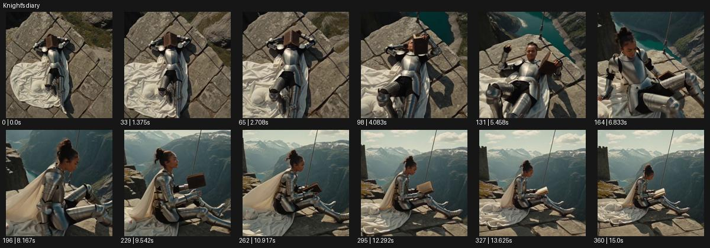

# Knight's diary

- 원본 효과명: **Knight's diary**
- 출처·분류: Higgsfield / scene
- 원본 ID: 18c71d5b-f702-47fd-99c8-ce8392265c70
- [공식 원본 미리보기](https://cdn.higgsfield.ai/viral_hub/eefdd4a1-d9d6-484a-b257-2bb5ccea9a3d.mp4)
- 확인 방식: 공식 미리보기의 12개 표본 프레임을 확인한 관찰 기록을 바탕으로 작성. 361프레임, 메타데이터 길이 15.042초. 표본 시점: [0.0, 1.375, 2.708, 4.083, 5.458, 6.833, 8.167, 9.542, 10.917, 12.292, 13.625, 15.0]초. 전체 재생·모든 프레임 검사·청음이나 생성 재현 테스트를 뜻하지 않는다.




## 실제 관찰

바위 위 누운 갑옷 인물을 위에서 보다가 앉아 책을 읽는 옆모습으로 옮긴다. 뒤로 큰 산과 호수가 드러난다.

## 작동 원리와 역할

장비를 갖춘 인물의 휴식과 독서, 주변 풍경 공개로 전투 이미지에 다른 감정 맥락을 준다. 카메라 위쪽 시점과 측면 시점의 연결은 주체의 작은 행동을 따라간다.

## 해석의 한계

상징적 휴식 장면. 소품의 정확한 명칭과 장소는 확인하지 않는다. 샘플 사이의 연결과 루프 경계는 별도 검사하지 않았다. 아래는 원본 설정을 복사한 기록이 아닌 새로운 장면 각색이며 생성 테스트는 하지 않았다.

## 뮤직비디오 적용 · 완성형 프롬프트

아래 길이와 설정은 독립 창작 예시다. 실제 요청의 길이·참조·음향·컷 조건을 우선한다.

```text
8초 뮤직비디오. 큰 호수 옆 평평한 바위에 은색 갑옷을 입은 성인 보컬이 누워 있다. 카메라는 수직 오버헤드에서 시작해 얼굴과 가슴 위의 작은 노트를 담는다. 보컬이 몸을 일으켜 앉고 노트를 펼치면 카메라는 바위 옆으로 천천히 내려와 측면 중간 구도로 이어진다. 뒤의 산과 호수가 점차 드러나고 갑옷의 반사는 자연광에 차분하게 빛난다. 보컬은 노트 한 장을 넘긴 뒤 먼 풍경을 바라본다. 마지막에는 카메라가 멈춰 책, 옆얼굴, 넓은 호수를 함께 남긴다. 전투나 상처를 원인으로 추가하지 않는다.
```

## 브랜드필름 적용 · 완성형 프롬프트

현재 제품과 브랜드 목적에 맞게 다시 설계하고 마지막 제품 가독성을 확보한다.

```text
8초 고급 가죽 노트 필름. 회색 여행복을 입은 성인 사용자가 호숫가 바위에 앉아 갈색 가죽 노트를 무릎에 둔다. 카메라는 위에서 내려다보며 표지의 결을 먼저 읽힌다. 사용자가 표지를 열고 한 장을 넘기면 카메라가 부드럽게 낮아져 손과 노트, 뒤의 산을 함께 담는 측면 구도로 이동한다. 자연광이 종이 가장자리와 가죽 두께를 드러내고 사용자는 펜을 들기 전에 잠깐 풍경을 본다. 마지막에는 노트를 덮어 손바닥을 위에 놓는다. 끝 2초 제품의 표면과 조용한 휴식 상태를 유지하며 읽히는 임의 글자를 만들지 않는다.
```

원본 음향은 확인하지 않았다. 실제 음원, 무음, NO BGM 등 사용자 조건을 유지한다. 명칭만으로 특정 생성 모델의 자동 재현을 보장하지 않는다.
