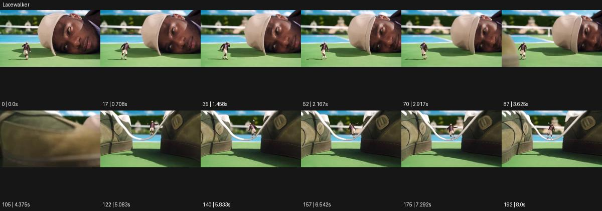

# Lacewalker

- 원본 효과명: **Lacewalker**
- 출처·분류: Higgsfield / scene
- 원본 ID: 7ca07da7-5471-48fa-80a7-97a29a7ec2bc
- [공식 원본 미리보기](https://cdn.higgsfield.ai/viral_hub/d806368c-0d8a-4a7b-b43a-8ff22fa64563.mp4)
- 확인 방식: 공식 미리보기의 12개 표본 프레임을 확인한 관찰 기록을 바탕으로 작성. 193프레임, 메타데이터 길이 8.042초. 표본 시점: [0.0, 0.708, 1.458, 2.167, 2.917, 3.625, 4.375, 5.083, 5.833, 6.542, 7.292, 8.0]초. 전체 재생·모든 프레임 검사·청음이나 생성 재현 테스트를 뜻하지 않는다.




## 실제 관찰

테니스 코트에 누운 커다란 얼굴 앞을 작은 인물이 걷는다. 뒤이어 거대한 가방 사이 흰 끈 위를 작은 인물이 균형 잡고 이동한다.

## 작동 원리와 역할

작은 사람과 거대한 제품·끈의 크기 대비를 유지하며 균형 동작을 보여준다. 카메라는 작은 주체를 추적하되 제품의 연결 지점을 함께 밝혀 비현실적인 규모에도 공간 논리를 준다.

## 해석의 한계

원본은 두 크기 관계와 두 구도. 실제 브랜드/제품 기능을 입증하는 장면은 아니다. 샘플 사이의 연결과 루프 경계는 별도 검사하지 않았다. 아래는 원본 설정을 복사한 기록이 아닌 새로운 장면 각색이며 생성 테스트는 하지 않았다.

## 뮤직비디오 적용 · 완성형 프롬프트

아래 길이와 설정은 독립 창작 예시다. 실제 요청의 길이·참조·음향·컷 조건을 우선한다.

```text
8초 뮤직비디오. 두 거대한 검은 스피커 사이에 팽팽하게 걸린 마이크 케이블 위로 작은 성인 보컬이 천천히 걷는다. 카메라는 작은 보컬의 옆에서 전신을 따라가며 전경 케이블의 굵기와 먼 스피커를 함께 담는다. 보컬이 팔을 벌려 균형을 잡고 한 발씩 내딛을 때 케이블은 작게만 처진다. 중간에 카메라가 조금 멀어져 보컬과 장비의 극단적인 크기 차이를 공개한다. 마지막에는 보컬이 케이블 연결부에 도착해 앉고 발을 늘어뜨린다. 얼굴과 신체는 정상 비율을 유지하며 갑자기 커지지 않는다.
```

## 브랜드필름 적용 · 완성형 프롬프트

현재 제품과 브랜드 목적에 맞게 다시 설계하고 마지막 제품 가독성을 확보한다.

```text
8초 고급 운동화 필름. 흰 스튜디오에 놓인 거대한 회색 운동화의 두 아일렛 사이 끈을 작은 성인 모델이 균형 잡고 걷는다. 낮은 매크로 카메라가 모델 옆을 따라가며 끈의 직조와 금속 아일렛을 커다란 건축물처럼 보여준다. 모델은 세 걸음을 천천히 옮기고 마지막 연결부에 손을 짚는다. 카메라는 부드럽게 뒤로 이동해 운동화 전체와 작은 모델을 함께 담는다. 끝 2초 모델이 멈춘 상태로 신발의 실루엣, 로고, 소재를 읽힌다. 신발은 변형하지 않고 끈의 양 끝이 실제 구멍에 연결된 상태를 유지한다.
```

원본 음향은 확인하지 않았다. 실제 음원, 무음, NO BGM 등 사용자 조건을 유지한다. 명칭만으로 특정 생성 모델의 자동 재현을 보장하지 않는다.
