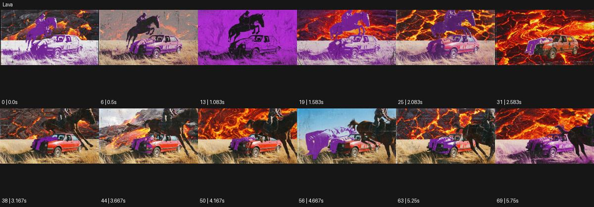

# Lava

출처: Higgsfield · 공식 원본명: **Lava** · 분류: look / 스타일 · ID: 3f631876-f34e-499f-87e6-bc9eada94581

[원본 미리보기](https://cdn.higgsfield.ai/mixed_media_preset/d62537bf-2356-4131-90bb-c398a27c46c7.mp4) · [원본 썸네일](https://cdn.higgsfield.ai/mixed_media_preset/2553e368-e35c-4d9f-8b38-d670d94bad62.webp)


## 확인 근거

공식 미리보기의 12개 표본 프레임을 확인한 관찰 기록을 바탕으로 작성했다. 원본 70프레임, 메타데이터 길이 5.833초. 전체 재생 감상·전 프레임 검사·음향 청취·생성 테스트를 했다는 뜻이 아니다.

표본 시점(초): 0, 0.5, 1.083, 1.583, 2.083, 2.583, 3.167, 3.667, 4.167, 4.667, 5.25, 5.75



## 원본에서 관찰한 변화

말과 자동차가 있는 들판이 보라색·흑백 면으로 바뀌며 붉은 용암 갈라짐 배경과 교차한다. 말이 차를 넘는 여러 동작이 이어진다.

## 장면에 재사용할 원리와 층 구분

붉은 갈라짐 배경과 보라·흑백 색 분리로 강한 재질 대비를 만든다. 주체나 제품이 실제 용암으로 녹는 변형과 구별한다.

## 확인 한계

제품/인물이 실제 용암으로 녹는 효과가 아니다. 배경 질감과 색 분리가 주효과. 표본 사이의 미세한 변화·정확한 반복 경계·제작 공정은 확정하지 않는다. 음향은 확인하지 않았다.

## 뮤직비디오 각색 · 완성형 프롬프트

아래는 관찰한 시각 원리를 다른 장면 목적에 맞게 재설계한 창작안이다. 원본의 소재·길이·사건을 자동 상속하지 않는다.

```text
7초 뮤직비디오, 성인 댄서가 검은 무대 바닥에서 두 발을 넓게 벌리고 선다. 카메라는 낮은 정면 와이드숏이며 인물은 보라색과 흑백의 큰 면으로 표현한다. 2초에 댄서가 바닥을 한 번 밟으면 뒤의 벽에만 붉은 갈라짐 무늬가 아래에서 위로 밝아진다. 바닥과 몸은 갈라지거나 녹지 않고 균열은 그래픽 배경으로 유지한다. 카메라는 천천히 접근하며 댄서가 팔을 펼치는 동작을 읽힌다. 5초에 동작이 멈추면 붉은 틈은 낮은 밝기로 가라앉는다. 마지막 2초는 강한 실루엣과 얇은 붉은 선으로 안착한다. 문자·대사 없이 무음이다.
```

## 브랜드필름 각색 · 완성형 프롬프트

```text
8초 금속 시계 브랜드필름, 검정 돌 받침 위 실버 시계 한 개를 세운다. 카메라는 케이스 근경에서 시작해 25도 천천히 오빗한다. 첫 2초는 실제 금속을 읽히고 이어 뒤 패널에만 붉은 용암 갈라짐 같은 빛 무늬가 나타나 열과 냉금속의 대비를 만든다. 시계 표면은 녹거나 보라색으로 변하지 않고 문자판·바늘·스트랩 구조를 유지한다. 5초에 붉은 빛이 약해지면 중성 하이라이트가 케이스에 남고 카메라가 멈춘다. 마지막 3초는 제품의 정확한 두께와 마감에 안착한다. 내열 성능 수치·새 로고·문구 없이 낮은 환경음만 둔다.
```

생성 테스트: 미실시. 스타일의 명칭만으로 자동 재현을 보장하지 않으며 촬영·그래픽·합성·편집 층을 구별해 구현한다.
