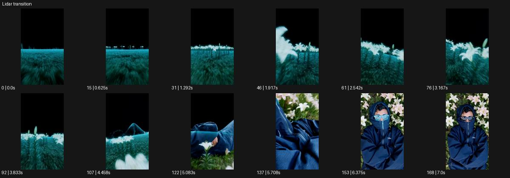

# Lidar transition

- 원본 효과명: **Lidar transition**
- 출처·분류: Higgsfield / scene
- 원본 ID: af71aba0-66b8-42a2-a33d-d08aa7ec5836
- [공식 원본 미리보기](https://cdn.higgsfield.ai/viral_hub/9a8e4804-9e49-4a3b-8087-021ba9b447cf.mp4)
- 확인 방식: 공식 미리보기의 12개 표본 프레임을 확인한 관찰 기록을 바탕으로 작성. 169프레임, 메타데이터 길이 7.042초. 표본 시점: [0.0, 0.625, 1.292, 1.917, 2.542, 3.167, 3.833, 4.458, 5.083, 5.708, 6.375, 7.0]초. 전체 재생·모든 프레임 검사·청음이나 생성 재현 테스트를 뜻하지 않는다.




## 실제 관찰

검은 하늘 아래 청록색 점묘/스캔 느낌 꽃밭을 전진한다. 꽃과 누운 인물이 드러나며 후반에 파란 옷·흰 꽃의 실사 질감으로 바뀐다.

## 작동 원리와 역할

점·선으로 표현한 공간을 따라가는 카메라 전진과 실제 재질로 바뀌는 합성 전환을 분리한다. 특정 물체를 유지한 채 점묘 밀도와 표면 정보가 증가하며 도착 상태를 읽힌다.

## 해석의 한계

공식 목록 설명은 Incline과 같으나 영상 내용과 맞지 않는다. 기울어지는 세계 설명을 적용하지 않는다. 샘플 사이의 연결과 루프 경계는 별도 검사하지 않았다. 아래는 원본 설정을 복사한 기록이 아닌 새로운 장면 각색이며 생성 테스트는 하지 않았다.

## 뮤직비디오 적용 · 완성형 프롬프트

아래 길이와 설정은 독립 창작 예시다. 실제 요청의 길이·참조·음향·컷 조건을 우선한다.

```text
8초 뮤직비디오. 검은 공간 속 청록색 점으로만 그려진 긴 온실을 카메라가 천천히 전진한다. 중앙 통로 끝에는 흰 재킷의 성인 보컬이 벤치에 앉아 있다. 카메라가 가까워지면 전경 잎부터 점들이 실제 잎의 표면과 물방울로 채워지고 변화가 보컬 쪽으로 이어진다. 보컬은 고개만 들어 렌즈를 바라보며 위치와 신체 형태는 유지한다. 마지막에는 모든 공간이 새벽 자연광의 실사 온실이 되고 카메라는 가슴 위 구도에 감속해 멈춘다. 눈과 재킷이 선명한 상태를 2초 남기고 다른 장소로 넘어가지 않는다.
```

## 브랜드필름 적용 · 완성형 프롬프트

현재 제품과 브랜드 목적에 맞게 다시 설계하고 마지막 제품 가독성을 확보한다.

```text
8초 고급 러닝화 필름. 검정 배경에 청록색 점으로 스캔된 신발과 암석 받침이 놓인다. 카메라는 신발 앞쪽에서 낮게 전진하며 점으로 된 밑창 구조와 메쉬의 윤곽을 읽힌다. 받침 앞면에 부드러운 빛이 닿는 순간 점들이 실제 돌과 직물로 차례로 채워지고 신발 앞코에서 뒤꿈치 방향으로 재질 변화가 이어진다. 신발은 움직이거나 휘지 않고 카메라만 완만하게 옆으로 이동한다. 마지막에는 실사 신발의 측면 구도로 정지해 메쉬, 밑창, 로고가 2초간 선명하게 보인다. 기술 정보처럼 보이는 임의 수치는 넣지 않는다.
```

원본 음향은 확인하지 않았다. 실제 음원, 무음, NO BGM 등 사용자 조건을 유지한다. 명칭만으로 특정 생성 모델의 자동 재현을 보장하지 않는다.
