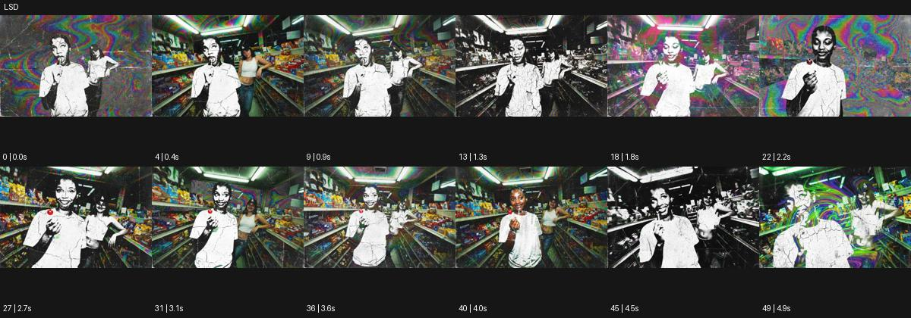

# LSD

출처: Higgsfield · 공식 원본명: **LSD** · 분류: look / 스타일 · ID: 16ac0b13-2e62-4764-9469-56ff287b6a08

[원본 미리보기](https://cdn.higgsfield.ai/mixed_media_preset/f2163456-4099-4b1e-9f62-2d4953d2b7bf.mp4) · [원본 썸네일](https://cdn.higgsfield.ai/mixed_media_preset/e4f288a5-8d1a-4844-8958-80d3176d4b95.webp)


## 확인 근거

공식 미리보기의 12개 표본 프레임을 확인한 관찰 기록을 바탕으로 작성했다. 원본 50프레임, 메타데이터 길이 5초. 전체 재생 감상·전 프레임 검사·음향 청취·생성 테스트를 했다는 뜻이 아니다.

표본 시점(초): 0, 0.4, 0.9, 1.3, 1.8, 2.2, 2.7, 3.1, 3.6, 4, 4.5, 4.9



## 원본에서 관찰한 변화

가게 안 공연자가 흰색 오린 실루엣으로 바뀌고 실사·흑백·무지갯빛 물결 배경이 번갈아 겹친다.

## 장면에 재사용할 원리와 층 구분

실사·단색 실루엣·다색 물결의 층을 시간에 따라 교체한다. 명칭은 원본 스타일 식별용이고 실제 약물 경험이나 의학적 묘사를 뜻하지 않는다.

## 확인 한계

명칭은 원본 스타일명이며 실제 약물 효과를 설명하는 자료가 아니다. 표본 사이의 미세한 변화·정확한 반복 경계·제작 공정은 확정하지 않는다. 음향은 확인하지 않았다.

## 뮤직비디오 각색 · 완성형 프롬프트

아래는 관찰한 시각 원리를 다른 장면 목적에 맞게 재설계한 창작안이다. 원본의 소재·길이·사건을 자동 상속하지 않는다.

```text
7초 실험적 뮤직비디오, 성인 보컬이 비어 있는 흰 편의점 통로에 선다. 카메라는 정면 미디엄숏에서 천천히 접근한다. 첫 2초는 실사 얼굴을 보여주고 보컬이 양손을 펼치면 몸 외곽만 흰 실루엣으로 정리되며 진열대 뒤에 무지갯빛 물결이 흐른다. 4초에 손을 가슴으로 모으면 얼굴과 손은 실사로 돌아오고 물결은 배경에만 남는다. 몸의 위치와 의상 외곽은 같은 크기로 유지해 변화의 기준이 되게 한다. 마지막 2초는 물결이 천천히 잦아든 뒤 정면 응시에 안착한다. 약물·문자·대사 없이 무음으로 끝낸다.
```

## 브랜드필름 각색 · 완성형 프롬프트

```text
8초 실험적 실크 브랜드필름, 아이보리 스튜디오의 성인 모델이 큰 스카프를 양손으로 펼친다. 카메라는 정면 전신에서 시작한다. 2초에 스카프 뒤 배경이 부드러운 다색 물결로 바뀌고 모델 외곽은 잠깐 단색 실루엣이 되지만 실제 스카프는 색·무늬·질감을 그대로 유지한다. 카메라는 천천히 접근해 천의 주름과 배경 흐름이 다른 속도로 움직이는 관계를 보여준다. 5초에 모델이 스카프를 어깨에 두르면 인물도 실사로 돌아오고 배경색은 두 가지로 가라앉는다. 마지막 3초는 착용 형태에 안착한다. 새 로고·문구 없이 천 소리만 둔다.
```

생성 테스트: 미실시. 스타일의 명칭만으로 자동 재현을 보장하지 않으며 촬영·그래픽·합성·편집 층을 구별해 구현한다.
