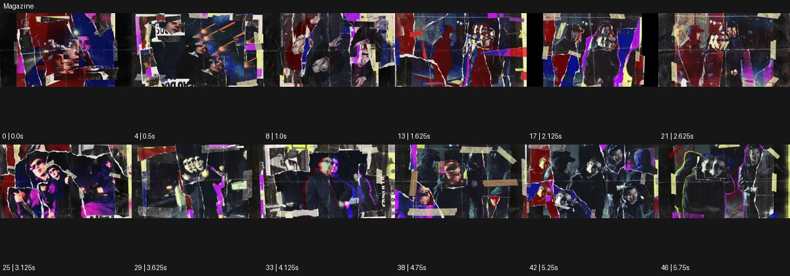

# Magazine

출처: Higgsfield · 공식 원본명: **Magazine** · 분류: look / 스타일 · ID: 28f715ae-0f20-4e57-87b7-9a856e96621a

[원본 미리보기](https://cdn.higgsfield.ai/mixed_media_preset/f48ae4ba-635d-47ed-bbe5-0d519c009106.mp4) · [원본 썸네일](https://cdn.higgsfield.ai/mixed_media_preset/b8e1d24c-b389-4fe6-88c4-14a5e2bdcb32.webp)


## 확인 근거

공식 미리보기의 12개 표본 프레임을 확인한 관찰 기록을 바탕으로 작성했다. 원본 47프레임, 메타데이터 길이 5.875초. 전체 재생 감상·전 프레임 검사·음향 청취·생성 테스트를 했다는 뜻이 아니다.

표본 시점(초): 0, 0.5, 1, 1.625, 2.125, 2.625, 3.125, 3.625, 4.125, 4.75, 5.25, 5.75



## 원본에서 관찰한 변화

공연자 여러 근경과 전신이 찢어진 잡지·테이프·신문 조각의 불규칙 패널 안에서 움직인다. 빨강·파랑·보라 면과 검정 빈 공간이 자리를 바꾼다.

## 장면에 재사용할 원리와 층 구분

찢어진 종이·테이프·인쇄 조각을 영상 창의 틀로 쓰고 색면·검정 여백으로 시선을 조직한다. 실제 잡지 문구나 특정 지면을 복제하지 않는다.

## 확인 한계

실제 잡지 지면/문구를 복제하지 않는다. 연속 카메라 공간 아닌 콜라주. 표본 사이의 미세한 변화·정확한 반복 경계·제작 공정은 확정하지 않는다. 음향은 확인하지 않았다.

## 뮤직비디오 각색 · 완성형 프롬프트

아래는 관찰한 시각 원리를 다른 장면 목적에 맞게 재설계한 창작안이다. 원본의 소재·길이·사건을 자동 상속하지 않는다.

```text
7초 잡지 콜라주 뮤직비디오, 성인 보컬의 전신·손·얼굴을 각기 다른 찢어진 종이 창에 배치한다. 검정 바탕에서 처음 2초는 얼굴 창 하나만 중앙에 두고 보컬이 눈을 들면 빨강·파랑 종이 조각이 옆으로 펼쳐져 다른 두 창을 드러낸다. 각 창 안 동작은 현재 표정과 손의 움직임을 유지하고 창 자체는 조금씩 기울어 손으로 붙인 느낌을 만든다. 5초에 테이프 조각 두 개가 모서리를 고정하면 모든 창 이동이 멈춘다. 마지막 2초는 얼굴 창을 가장 크게 남겨 감정이 읽히게 한다. 읽을 수 있는 기사·가사·로고 없이 종이 소리만 둔다.
```

## 브랜드필름 각색 · 완성형 프롬프트

```text
8초 패션 룩북 브랜드필름, 크림색 바탕에 성인 모델의 재킷 전신과 커프스·단추 디테일 영상 세 개를 찢어진 종이 창으로 올린다. 각 창의 가장자리는 종이 섬유와 얇은 테이프로 표현하되 제품 영역은 선명하게 유지한다. 2초에 모델이 재킷을 여미면 전신 창이 중앙으로 이동하고 두 디테일 창이 아래에 정렬된다. 카메라 이동 대신 편집 창의 위치로 구성을 바꾸며 실사 제품의 비율은 변하지 않는다. 5초에 모든 창이 멈추면 마지막 3초는 실루엣과 봉제의 관계를 읽힌다. 가짜 기사·가격·브랜드 문자 없이 옷감과 종이 소리만 둔다.
```

생성 테스트: 미실시. 스타일의 명칭만으로 자동 재현을 보장하지 않으며 촬영·그래픽·합성·편집 층을 구별해 구현한다.
