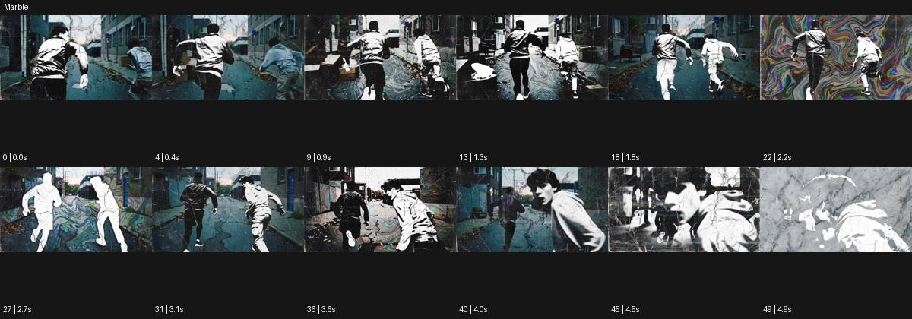

# Marble

출처: Higgsfield · 공식 원본명: **Marble** · 분류: look / 스타일 · ID: ea4f53a8-a265-44ed-8f25-b7ce86da16b9

[원본 미리보기](https://cdn.higgsfield.ai/mixed_media_preset/f300c8f1-9071-4737-abd0-9f7dbd354519.mp4) · [원본 썸네일](https://cdn.higgsfield.ai/mixed_media_preset/00006660-8b5e-426a-ad0e-51b02c8c14f7.webp)


## 확인 근거

공식 미리보기의 12개 표본 프레임을 확인한 관찰 기록을 바탕으로 작성했다. 원본 50프레임, 메타데이터 길이 5초. 전체 재생 감상·전 프레임 검사·음향 청취·생성 테스트를 했다는 뜻이 아니다.

표본 시점(초): 0, 0.4, 0.9, 1.3, 1.8, 2.2, 2.7, 3.1, 3.6, 4, 4.5, 4.9



## 원본에서 관찰한 변화

골목을 달리는 인물들이 실사·흑백 실루엣으로 오가고 배경에 대리석 맥과 다색 마블 소용돌이가 섞인다.

## 장면에 재사용할 원리와 층 구분

대리석 맥·다색 마블 흐름과 실사·흑백 실루엣을 층으로 결합한다. 인물의 석상 변신보다 광물 무늬의 위치·속도와 주체 가독성을 설계한다.

## 확인 한계

인물 조각상 변신이 아니다. 광물 무늬/명암 층을 혼합하는 스타일. 표본 사이의 미세한 변화·정확한 반복 경계·제작 공정은 확정하지 않는다. 음향은 확인하지 않았다.

## 뮤직비디오 각색 · 완성형 프롬프트

아래는 관찰한 시각 원리를 다른 장면 목적에 맞게 재설계한 창작안이다. 원본의 소재·길이·사건을 자동 상속하지 않는다.

```text
7초 뮤직비디오, 성인 보컬이 흰 복도를 천천히 걸어온다. 정면 카메라는 보컬과 같은 속도로 뒤로 이동해 얼굴 크기를 유지한다. 2초부터 벽에 검정 대리석 맥이 나타나 걷는 방향과 반대로 느리게 흐르고 보컬의 옷만 잠깐 흑백 색면으로 정리된다. 피부와 눈은 실사로 유지해 인물이 돌로 변한 인상을 피한다. 4초에 벽의 한 부분에만 파랑·분홍 마블이 섞였다가 다시 흰색으로 옅어진다. 5초에 보컬이 멈추면 카메라도 멈추고 마지막 2초는 남은 얇은 맥과 정면 응시로 끝낸다. 새 문자·대사 없이 발소리만 둔다.
```

## 브랜드필름 각색 · 완성형 프롬프트

```text
8초 세라믹 트레이 브랜드필름, 흰 테이블 위 무늬 없는 도자기 트레이 한 개를 둔다. 카메라는 사선 위쪽에서 천천히 20도 오빗한다. 2초부터 제품 밖 테이블 배경에만 검정과 청회색 마블 무늬가 잔잔하게 흐르고 도자기 곡면에는 실제 조명의 반사만 남긴다. 제품이 돌로 변하거나 표면 무늬가 새로 생기지 않게 한다. 4초에 손이 트레이 위에 작은 컵을 내려놓으면 무늬의 흐름도 느려진다. 마지막 3초는 제품의 깨끗한 경계·유약 질감·컵과의 크기 관계에 안착한다. 새 로고·문구·소재 성능 주장을 넣지 않고 도자기 접촉음만 둔다.
```

생성 테스트: 미실시. 스타일의 명칭만으로 자동 재현을 보장하지 않으며 촬영·그래픽·합성·편집 층을 구별해 구현한다.
