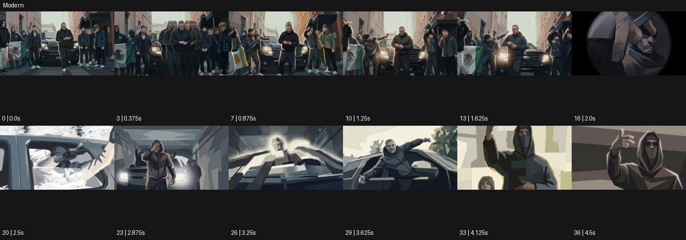

# Modern

출처: Higgsfield · 공식 원본명: **Modern** · 분류: look / 스타일 · ID: 744ebc4f-b323-47a0-aefe-560663bfe1a7

[원본 미리보기](https://cdn.higgsfield.ai/mixed_media_preset/04bab337-d074-465d-9c5f-27e4eb270225.mp4) · [원본 썸네일](https://cdn.higgsfield.ai/mixed_media_preset/59ad84b2-f971-4432-a060-2113c0b9387a.webp)


## 확인 근거

공식 미리보기의 12개 표본 프레임을 확인한 관찰 기록을 바탕으로 작성했다. 원본 37프레임, 메타데이터 길이 4.625초. 전체 재생 감상·전 프레임 검사·음향 청취·생성 테스트를 했다는 뜻이 아니다.

표본 시점(초): 0, 0.375, 0.875, 1.25, 1.625, 2, 2.5, 2.875, 3.25, 3.625, 4.125, 4.5



## 원본에서 관찰한 변화

거리 군중과 차량에서 저각도 공연자 구도로 바뀌며 얼굴·옷·건물이 큰 각진 회색/갈색 색면으로 단순화된다.

## 장면에 재사용할 원리와 층 구분

얼굴·옷·건축을 큰 다각형 색면으로 단순화하면서 방향과 명암을 유지한다. 추상적인 '현대적' 지시보다 면 크기·색 범위·중심 디테일을 구체화한다.

## 확인 한계

'현대적'이라는 추상어보다 큰 다각형 면 분할이 관찰 핵심. 표본 사이의 미세한 변화·정확한 반복 경계·제작 공정은 확정하지 않는다. 음향은 확인하지 않았다.

## 뮤직비디오 각색 · 완성형 프롬프트

아래는 관찰한 시각 원리를 다른 장면 목적에 맞게 재설계한 창작안이다. 원본의 소재·길이·사건을 자동 상속하지 않는다.

```text
7초 뮤직비디오, 성인 보컬이 회색 도심 광장에서 천천히 몸을 돌린다. 낮은 삼사분면 카메라가 일정한 거리로 나란히 이동한다. 얼굴·재킷·건물을 회색과 갈색의 큰 각진 면으로 단순화하고 눈·입·손가락 윤곽은 식별 가능하게 남긴다. 보컬이 3초에 한 손을 들어 건물 쪽을 가리키면 빛을 받은 면만 한 단계 밝아져 몸과 공간의 방향을 읽힌다. 면이 임의로 증식하거나 대상 외곽을 흔들지 않는다. 5초에 손을 내리고 정면을 보면 카메라도 멈춘다. 마지막 2초는 큰 면으로 정리된 초상과 도시 여백에 안착한다. 문자·대사는 없다.
```

## 브랜드필름 각색 · 완성형 프롬프트

```text
8초 건축 가구 브랜드필름, 성인 모델이 밝은 회색 공간의 갈색 의자 옆에 선다. 카메라는 의자 다리의 낮은 근경에서 시작해 천천히 위로 틸트한다. 배경과 의상은 큰 회색·갈색 다각형 면으로 표현하고 의자 구조와 접합부는 실제 비율로 선명하게 유지한다. 모델이 3초에 의자에 앉으면 옷의 평면 명암만 새 자세에 맞춰 바뀌고 제품은 변형되지 않는다. 5초에 카메라가 등받이와 옆얼굴이 함께 보이는 구도에서 멈춘다. 마지막 3초는 절제된 면 구성과 의자의 곡선 대비를 읽힌다. 새 로고·치수·문구 없이 실내 소리만 둔다.
```

생성 테스트: 미실시. 스타일의 명칭만으로 자동 재현을 보장하지 않으며 촬영·그래픽·합성·편집 층을 구별해 구현한다.
