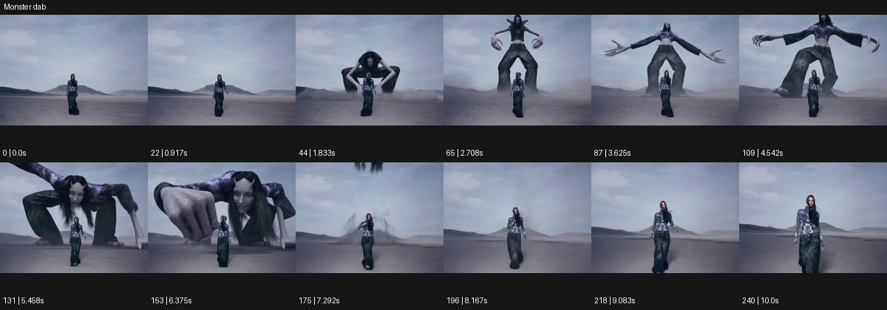

# Monster dab

- 원본 효과명: **Monster dab**
- 출처·분류: Higgsfield / scene
- 원본 ID: ddb12fd4-5bbf-4bb1-800b-7d409f3066b5
- [공식 원본 미리보기](https://cdn.higgsfield.ai/viral_hub/0ab0fb19-95df-44c7-9b92-6804122e02ff.mp4)
- 확인 방식: 공식 미리보기의 12개 표본 프레임을 확인한 관찰 기록을 바탕으로 작성. 241프레임, 메타데이터 길이 10.042초. 표본 시점: [0.0, 0.917, 1.833, 2.708, 3.625, 4.542, 5.458, 6.375, 7.292, 8.167, 9.083, 10.0]초. 전체 재생·모든 프레임 검사·청음이나 생성 재현 테스트를 뜻하지 않는다.




## 실제 관찰

황야에서 인물이 전진하는 뒤로 거대한 긴 팔다리 존재가 내려와 몸을 펴고 손을 내민다. 후반 다시 위로 빠져나가고 전경 인물만 남는다.

## 작동 원리와 역할

전경의 일상 인물을 규모 기준으로 고정하고 뒤의 거대한 존재가 나타나 행동한 뒤 빠지는 대비다. 주체와 괴물은 별개이며 카메라의 넓어짐은 크기 관계를 읽히는 역할을 한다.

## 해석의 한계

낙하·재도약 세부는 표본 시간 사이 해석. 원본 인물 자체가 괴물로 변하는 것은 아니다. 샘플 사이의 연결과 루프 경계는 별도 검사하지 않았다. 아래는 원본 설정을 복사한 기록이 아닌 새로운 장면 각색이며 생성 테스트는 하지 않았다.

## 뮤직비디오 적용 · 완성형 프롬프트

아래 길이와 설정은 독립 창작 예시다. 실제 요청의 길이·참조·음향·컷 조건을 우선한다.

```text
8초 뮤직비디오. 황혼의 넓은 채석장에서 성인 보컬이 정면으로 천천히 걸어온다. 카메라는 허리 위 거리에서 뒤로 이동해 얼굴을 읽힌다. 보컬이 어깨를 한 번 튕기면 후경의 긴 그림자에서 거대한 종이 질감의 인간형 존재가 천천히 일어나 같은 어깨 동작을 과장해 따라 한다. 카메라는 조금 넓어져 두 존재의 크기 차이를 보여주되 보컬은 놀라거나 뛰지 않는다. 큰 존재가 다시 낮아져 바위 뒤로 사라지면 카메라는 보컬의 가슴 위 구도에 안착한다. 끝 2초 차분한 정면 시선만 남긴다.
```

## 브랜드필름 적용 · 완성형 프롬프트

현재 제품과 브랜드 목적에 맞게 다시 설계하고 마지막 제품 가독성을 확보한다.

```text
8초 고급 아웃도어 의류 필름. 거친 회색 절벽 앞을 겨자색 재킷의 성인 하이커가 걸어간다. 낮은 추적 카메라가 하이커의 전신을 담고 뒤쪽에는 재킷의 주름을 닮은 거대한 천 형태가 바위 사이에서 일어난다. 하이커가 후드를 정리하면 큰 천 형상도 부드럽게 접혀 바람을 막는 벽처럼 잠깐 펼쳐진다. 카메라는 넓어져 보호감과 스케일을 읽히고 거대 형상은 다시 바위 뒤로 내려간다. 마지막 하이커가 멈추어 측면 자세를 취하면 카메라도 정지한다. 끝 2초 실제 재킷의 봉제와 소재는 선명하고 정상 형태로 남는다.
```

원본 음향은 확인하지 않았다. 실제 음원, 무음, NO BGM 등 사용자 조건을 유지한다. 명칭만으로 특정 생성 모델의 자동 재현을 보장하지 않는다.
