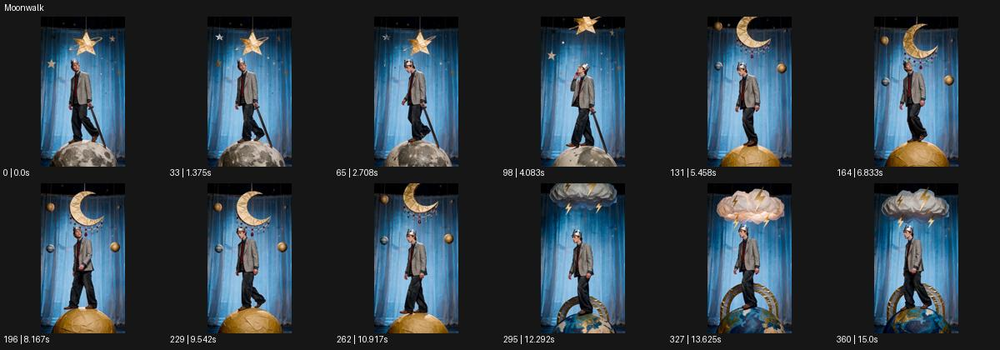

# Moonwalk

- 원본 효과명: **Moonwalk**
- 출처·분류: Higgsfield / scene
- 원본 ID: 7e2ea896-2c5b-42d8-9992-95ae24cae5cc
- [공식 원본 미리보기](https://cdn.higgsfield.ai/viral_hub_preset/f67251d5-9830-4435-9feb-aa3b54515f30.mp4)
- 확인 방식: 공식 미리보기의 12개 표본 프레임을 확인한 관찰 기록을 바탕으로 작성. 361프레임, 메타데이터 길이 15.042초. 표본 시점: [0.0, 1.375, 2.708, 4.083, 5.458, 6.833, 8.167, 9.542, 10.917, 12.292, 13.625, 15.0]초. 전체 재생·모든 프레임 검사·청음이나 생성 재현 테스트를 뜻하지 않는다.




## 실제 관찰

푸른 막 앞 왕관 쓴 인물이 작은 달·노란 구·지구 같은 무대 소품 위를 걸으며 배경 장식이 바뀐다.

## 작동 원리와 역할

달·행성처럼 꾸민 소품 위를 걷는 무대적 장면이다. 천체의 사실적인 물리보다 발의 접촉, 세트의 교체, 가림과 인물 방향의 연속성을 유지한다.

## 해석의 한계

실제 천체 여행이 아닌 연극 세트 같은 연출. 표면 전환의 편집 방식 미확인. 샘플 사이의 연결과 루프 경계는 별도 검사하지 않았다. 아래는 원본 설정을 복사한 기록이 아닌 새로운 장면 각색이며 생성 테스트는 하지 않았다.

## 뮤직비디오 적용 · 완성형 프롬프트

아래 길이와 설정은 독립 창작 예시다. 실제 요청의 길이·참조·음향·컷 조건을 우선한다.

```text
8초 뮤직비디오. 푸른 커튼 앞에 작은 달 모양의 낮은 무대가 있고 은색 의상의 성인 보컬이 그 위를 걷는다. 카메라는 전신 정면에서 느리게 옆으로 이동한다. 보컬이 달의 끝에서 한 걸음을 내디디면 옆에서 노란 구형 무대가 굴러와 다음 발을 받는다. 뒤의 별 장식은 실에 매달린 듯 가볍게 흔들려 연극적 세계를 유지한다. 이어 작은 푸른 지구 모양 받침으로 한 걸음 더 옮긴 후 보컬이 멈춰 관객 쪽을 본다. 마지막 카메라는 수평 와이드에 안착한다. 실제 우주 이동보다 장난스러운 무대 동선을 읽힌다.
```

## 브랜드필름 적용 · 완성형 프롬프트

현재 제품과 브랜드 목적에 맞게 다시 설계하고 마지막 제품 가독성을 확보한다.

```text
8초 고급 부츠 필름. 짙은 파란 무대에 달의 표면처럼 만든 회색 낮은 발판 세 개가 놓인다. 성인 모델이 검은 가죽 부츠를 신고 발판을 천천히 건넌다. 낮은 측면 카메라가 발과 발판의 접촉을 따라가며 가죽의 주름과 굽 구조를 읽힌다. 두 번째 발판은 황금색 구형, 세 번째는 푸른 반구로 이어지지만 모두 스튜디오 소품처럼 실제적인 재질이다. 모델이 마지막 발판 위에 두 발을 모으면 카메라도 멈춘다. 끝 2초 부츠 전체와 무대의 여백을 함께 담고 발이 소품 안으로 들어가거나 크기가 바뀌지 않게 한다.
```

원본 음향은 확인하지 않았다. 실제 음원, 무음, NO BGM 등 사용자 조건을 유지한다. 명칭만으로 특정 생성 모델의 자동 재현을 보장하지 않는다.
