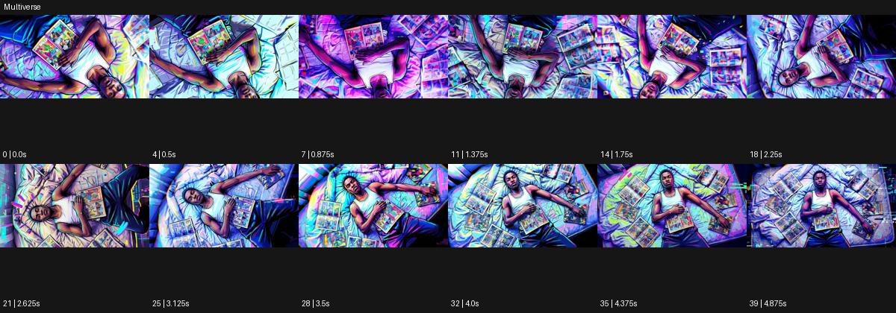

# Multiverse

출처: Higgsfield · 공식 원본명: **Multiverse** · 분류: look / 스타일 · ID: a8bc6ac3-f47c-40f9-900d-96fc06f20da7

[원본 미리보기](https://cdn.higgsfield.ai/mixed_media_preset/f12b80d6-b7dc-48ac-8a77-8eadcee6e3ac.mp4) · [원본 썸네일](https://cdn.higgsfield.ai/mixed_media_preset/e8956394-cbd6-4e10-9491-899a9c993131.webp)


## 확인 근거

공식 미리보기의 12개 표본 프레임을 확인한 관찰 기록을 바탕으로 작성했다. 원본 40프레임, 메타데이터 길이 5초. 전체 재생 감상·전 프레임 검사·음향 청취·생성 테스트를 했다는 뜻이 아니다.

표본 시점(초): 0, 0.5, 0.875, 1.375, 1.75, 2.25, 2.625, 3.125, 3.5, 4, 4.375, 4.875



## 원본에서 관찰한 변화

침대에 누워 책을 든 인물을 위에서 보며 시점이 돈다. 청록·자홍·노랑 굵은 윤곽과 패널 조각이 공간을 채우고 인물 방향도 달라진다.

## 장면에 재사용할 원리와 층 구분

다색 윤곽과 패널 조각으로 한 인물의 공간을 여러 시각 층으로 분리한다. 카메라 롤·인물 방향·색면 이동을 구별하고 실제 다른 우주 전환을 필수로 삼지 않는다.

## 확인 한계

서로 다른 우주로 실제 전환된다는 증거보다 강한 다색 그래픽 처리로 보인다. 표본 사이의 미세한 변화·정확한 반복 경계·제작 공정은 확정하지 않는다. 음향은 확인하지 않았다.

## 뮤직비디오 각색 · 완성형 프롬프트

아래는 관찰한 시각 원리를 다른 장면 목적에 맞게 재설계한 창작안이다. 원본의 소재·길이·사건을 자동 상속하지 않는다.

```text
7초 뮤직비디오, 성인 보컬이 흰 침대 위에 누워 작은 책을 가슴에 올려 둔다. 천장 정수직 카메라가 천천히 시계 방향으로 45도 롤한다. 첫 2초 후 침대 외곽에 청록·자홍·노랑 윤곽이 분리되어 나타나고 주변 바닥은 같은 방을 보여주는 세 개의 패널로 나뉜다. 보컬은 책을 덮고 고개만 옆으로 돌리며 실제 몸은 회전하지 않는다. 5초에 카메라 롤을 멈추고 패널들이 원래 바닥 위치에 정렬된다. 마지막 2초는 남은 세 색의 얇은 윤곽과 조용한 얼굴로 끝낸다. 새로운 장소·인물·문자를 만들지 않고 책 소리만 둔다.
```

## 브랜드필름 각색 · 완성형 프롬프트

```text
8초 패션 액세서리 브랜드필름, 성인 모델의 손에 든 검은 클러치를 정수직 카메라로 담는다. 크림색 바닥 위에 청록·자홍·노랑 사각 패널이 제품 밖으로 갈라져 보이고 각 패널에는 같은 손의 다른 각도가 나타난다. 카메라는 20도만 천천히 롤하며 제품 중심을 고정한다. 3초에 손이 클러치를 뒤집으면 패널들도 같은 동작을 시간차로 따라가 소재의 앞뒤를 읽힌다. 5초에 제품이 정면으로 멈추면 패널은 한 바닥으로 정리된다. 마지막 3초는 클러치 봉제선·잠금장치·정확한 외곽에 안착한다. 제품에 색 윤곽을 겹쳐 구조를 흐리거나 새 문구를 만들지 않는다.
```

생성 테스트: 미실시. 스타일의 명칭만으로 자동 재현을 보장하지 않으며 촬영·그래픽·합성·편집 층을 구별해 구현한다.
