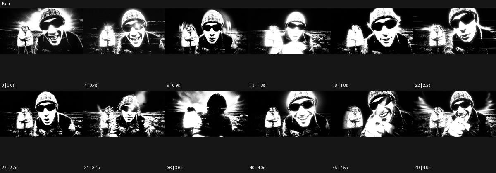

# Noir

출처: Higgsfield · 공식 원본명: **Noir** · 분류: look / 스타일 · ID: dfef0d55-b122-4727-aa3d-9fc9ffda976b

[원본 미리보기](https://cdn.higgsfield.ai/mixed_media_preset/9f68f799-81a0-47c0-8ed9-437a10c71cb9.mp4) · [원본 썸네일](https://cdn.higgsfield.ai/mixed_media_preset/448e170c-1c61-4151-b897-fa57c2a4276d.webp)


## 확인 근거

공식 미리보기의 12개 표본 프레임을 확인한 관찰 기록을 바탕으로 작성했다. 원본 50프레임, 메타데이터 길이 5초. 전체 재생 감상·전 프레임 검사·음향 청취·생성 테스트를 했다는 뜻이 아니다.

표본 시점(초): 0, 0.4, 0.9, 1.3, 1.8, 2.2, 2.7, 3.1, 3.6, 4, 4.5, 4.9



## 원본에서 관찰한 변화

선글라스 공연자가 검정 배경 앞 매우 강한 흑백 덩어리로 나타난다. 흰 후광과 횡선, 흑백 반전 같은 순간이 동작 사이를 채운다.

## 장면에 재사용할 원리와 층 구분

중간 회색보다 강한 흑백 덩어리·후광·횡선 대비를 활용한다. 인물의 읽힐 부위와 반전 시점을 제한하면 동작과 그래픽 강도가 함께 작동한다.

## 확인 한계

전통 누아르의 부드러운 회색조로 단순화하면 이 예시와 달라진다. 표본 사이의 미세한 변화·정확한 반복 경계·제작 공정은 확정하지 않는다. 음향은 확인하지 않았다.

## 뮤직비디오 각색 · 완성형 프롬프트

아래는 관찰한 시각 원리를 다른 장면 목적에 맞게 재설계한 창작안이다. 원본의 소재·길이·사건을 자동 상속하지 않는다.

```text
6초 뮤직비디오, 선글라스를 쓴 성인 보컬이 완전한 검정 무대에서 한 손을 들어 올린다. 고정된 정면 상반신 카메라로 턱·손·재킷 어깨만 흰 덩어리처럼 밝힌다. 2초에 손이 눈높이에 도달하면 뒤의 흰 후광이 넓어지고 가는 횡선 두 개가 배경을 가로지른다. 인물 얼굴을 통과하는 선은 넣지 않는다. 4초에 보컬이 고개를 옆으로 돌리면 후광은 한쪽으로 좁아져 옆얼굴 실루엣을 남긴다. 마지막 2초는 흑백 대비를 유지한 정지 포즈로 끝낸다. 빈번한 전체 반전·문자·대사 없이 무음으로 만든다.
```

## 브랜드필름 각색 · 완성형 프롬프트

```text
7초 블랙 주얼리 브랜드필름, 검정 받침 위 실버 반지 한 개를 세운다. 카메라는 낮은 정면에서 25도 천천히 오빗한다. 첫 2초는 반지의 곡률을 가는 흰 반사선으로 드러내고 3초에 뒤쪽 흰 후광이 넓어져 반지 외곽을 강한 흑백 덩어리로 읽힌다. 금속 표면은 완전한 평면으로 지우지 않고 끝부분에 미세한 재질을 남긴다. 5초에 후광이 작아지면 카메라가 멈추고 마지막 2초는 제품의 두께와 안쪽 구조를 선명하게 보여준다. 배경 횡선은 한 번만 지나가며 반지나 기존 각인을 덮지 않는다. 새 문자와 대사는 없다.
```

생성 테스트: 미실시. 스타일의 명칭만으로 자동 재현을 보장하지 않으며 촬영·그래픽·합성·편집 층을 구별해 구현한다.
