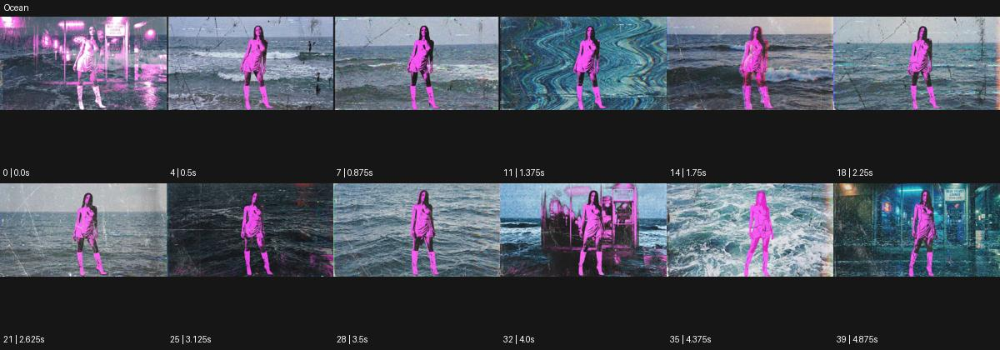

# Ocean

출처: Higgsfield · 공식 원본명: **Ocean** · 분류: look / 스타일 · ID: 9ce05278-37ec-4cde-a483-c04868242f77

[원본 미리보기](https://cdn.higgsfield.ai/mixed_media_preset/bcc94f8c-d4f6-4f1c-870c-258a98529418.mp4) · [원본 썸네일](https://cdn.higgsfield.ai/mixed_media_preset/a16ff2f4-1ec6-41e7-b64d-f61925d3b262.webp)


## 확인 근거

공식 미리보기의 12개 표본 프레임을 확인한 관찰 기록을 바탕으로 작성했다. 원본 40프레임, 메타데이터 길이 5초. 전체 재생 감상·전 프레임 검사·음향 청취·생성 테스트를 했다는 뜻이 아니다.

표본 시점(초): 0, 0.5, 0.875, 1.375, 1.75, 2.25, 2.625, 3.125, 3.5, 4, 4.375, 4.875



## 원본에서 관찰한 변화

자홍색 실루엣 인물을 유지하며 바다 물결·도시 네온·주름진 파도 질감이 배경과 일부 패널에 번갈아 나타난다.

## 장면에 재사용할 원리와 층 구분

물결·네온·주름진 파도 질감을 인물과 분리된 배경·패널 층으로 조절한다. 바다 이동이나 수중 장면보다 색과 표면의 흐름에 초점을 둔다.

## 확인 한계

인물이 실제 바다로 이동한다기보다 질감 배경 합성으로 읽힌다. 표본 사이의 미세한 변화·정확한 반복 경계·제작 공정은 확정하지 않는다. 음향은 확인하지 않았다.

## 뮤직비디오 각색 · 완성형 프롬프트

아래는 관찰한 시각 원리를 다른 장면 목적에 맞게 재설계한 창작안이다. 원본의 소재·길이·사건을 자동 상속하지 않는다.

```text
7초 뮤직비디오, 성인 보컬을 어두운 무대의 자홍색 실루엣으로 세우고 얼굴의 눈·입은 약하게 읽히게 한다. 카메라는 정면에서 천천히 접근한다. 2초에 보컬이 고개를 들면 뒤의 검정 바탕에 푸른 물결 질감이 나타나 왼쪽에서 오른쪽으로 흐른다. 몸 안으로 바다를 채우지 않고 어깨 밖의 두 좁은 패널에서만 도시 네온 반사가 물결과 겹치게 한다. 보컬이 손을 내리는 5초에 패널이 사라지고 수평 물결만 남는다. 마지막 2초는 움직임이 잦아든 배경과 보컬의 정면 응시로 끝낸다. 실제 수중 호흡·문자·대사 없이 무음이다.
```

## 브랜드필름 각색 · 완성형 프롬프트

```text
8초 향수 브랜드필름, 짙은 남색 스튜디오의 투명 병 뒤에 세로로 긴 패널 두 장을 세운다. 카메라는 제품 정면을 유지하며 오른쪽으로 20cm 이동한다. 첫 2초는 실제 유리와 액체를 읽히고 이어 패널에만 깊은 바다 물결과 청록색 네온 반사가 천천히 흐른다. 제품 라벨과 병목에는 물결 왜곡을 적용하지 않는다. 4초에 패널 흐름이 서로 반대 방향이 되어 잔잔한 깊이를 만들고 5초부터 속도가 줄어든다. 마지막 3초는 병의 정상 형태와 안정된 푸른 배경에 안착한다. 제품이 물로 변하거나 다른 장소로 전환되지 않는다. 새 문자·음성은 없다.
```

생성 테스트: 미실시. 스타일의 명칭만으로 자동 재현을 보장하지 않으며 촬영·그래픽·합성·편집 층을 구별해 구현한다.
