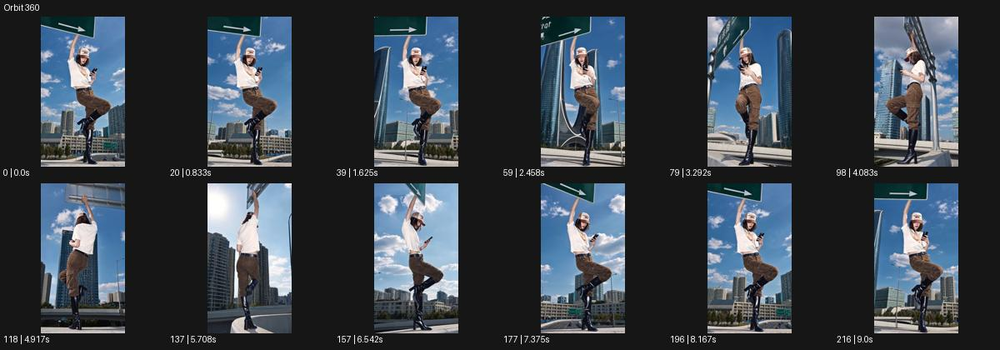

# Orbit 360

- 원본 효과명: **Orbit 360**
- 출처·분류: Higgsfield / scene
- 원본 ID: 0d12822c-e095-43ec-a335-b4d335a897b3
- [공식 원본 미리보기](https://cdn.higgsfield.ai/viral_hub_preset/4b866a81-e773-4be5-b041-9dcad102e9b9.mp4)
- 확인 방식: 공식 미리보기의 12개 표본 프레임을 확인한 관찰 기록을 바탕으로 작성. 217프레임, 메타데이터 길이 9.042초. 표본 시점: [0.0, 0.833, 1.625, 2.458, 3.292, 4.083, 4.917, 5.708, 6.542, 7.375, 8.167, 9.0]초. 전체 재생·모든 프레임 검사·청음이나 생성 재현 테스트를 뜻하지 않는다.




## 실제 관찰

교통 표지 기둥 아래 한 다리를 든 인물 주위를 시점이 돌아 옆면·후면·정면을 보여준다. 인물 자세는 비슷하게 남고 배경 빌딩 순서가 바뀐다.

## 작동 원리와 역할

유사한 자세의 주체 주위를 카메라가 돌아 배경의 순서와 앞·옆·뒤를 공개한다. 인물 회전과 카메라 오빗을 구분하고 시작·끝 각도와 속도를 정한다.

## 해석의 한계

공식명360 보존. 정확한 누적각은 카메라 데이터로 측정하지 않았다. 샘플 사이의 연결과 루프 경계는 별도 검사하지 않았다. 아래는 원본 설정을 복사한 기록이 아닌 새로운 장면 각색이며 생성 테스트는 하지 않았다.

## 뮤직비디오 적용 · 완성형 프롬프트

아래 길이와 설정은 독립 창작 예시다. 실제 요청의 길이·참조·음향·컷 조건을 우선한다.

```text
8초 뮤직비디오. 새벽 광장의 가로등 아래 성인 댄서가 한쪽 무릎을 든 채 멈춘다. 카메라는 전신을 담는 일정한 거리에서 출발해 댄서 주위를 시계 방향으로 천천히 한 바퀴 돈다. 댄서는 머리와 몸을 돌리지 않고 자세를 유지하며 옷자락만 바람에 움직인다. 카메라의 높이와 초점은 일정하게 두어 건물과 가로등이 순서대로 뒤를 지나가도록 한다. 시작 방향에 가까워질 때 카메라가 감속하고 댄서는 들었던 발을 내린다. 마지막 2초 정면 전신에 고정해 하나의 완결된 동작으로 끝낸다.
```

## 브랜드필름 적용 · 완성형 프롬프트

현재 제품과 브랜드 목적에 맞게 다시 설계하고 마지막 제품 가독성을 확보한다.

```text
8초 고급 의자 필름. 따뜻한 회색 스튜디오 중앙에 원목 라운지 의자를 놓는다. 카메라는 정면 사선에서 제품 전체를 담고 일정한 높이와 거리로 의자 주위를 한 바퀴 천천히 돈다. 의자는 회전하지 않고 고정되어 있으며 등받이 곡선, 측면 연결부, 뒷면 목재 결이 차례로 드러난다. 길고 부드러운 조명 반사는 각도에 따라 자연스럽게 이동한다. 마지막에는 처음의 사선보다 조금 더 정면에 가까운 위치에서 감속해 멈춘다. 끝 2초 제품 전체와 다리 구조를 선명하게 유지하며 배경을 장소 전환으로 사용하지 않는다.
```

원본 음향은 확인하지 않았다. 실제 음원, 무음, NO BGM 등 사용자 조건을 유지한다. 명칭만으로 특정 생성 모델의 자동 재현을 보장하지 않는다.
