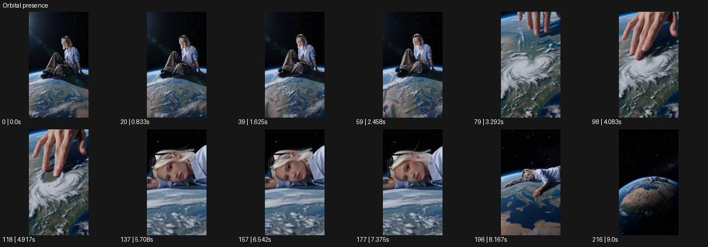

# Orbital presence

- 원본 효과명: **Orbital presence**
- 출처·분류: Higgsfield / scene
- 원본 ID: f9fcdd8a-38f2-42fb-9a7d-aa24530e1354
- [공식 원본 미리보기](https://cdn.higgsfield.ai/viral_hub_preset/88c7e4e9-ffd1-44fa-8e70-91ddd6e3e756.mp4)
- 확인 방식: 공식 미리보기의 12개 표본 프레임을 확인한 관찰 기록을 바탕으로 작성. 217프레임, 메타데이터 길이 9.042초. 표본 시점: [0.0, 0.833, 1.625, 2.458, 3.292, 4.083, 4.917, 5.708, 6.542, 7.375, 8.167, 9.0]초. 전체 재생·모든 프레임 검사·청음이나 생성 재현 테스트를 뜻하지 않는다.




## 실제 관찰

지구 표면 위 거대한 인물이 앉아 있다. 손이 구름 소용돌이에 닿는 근경, 누운 얼굴 근경을 거쳐 멀리 지구 전체로 빠져나간다.

## 작동 원리와 역할

거대한 사람과 작은 지구의 시적인 규모 대비를 근접·원경 변화로 보여준다. 천체 접촉은 상징적 설정으로 취급하고 얼굴, 손, 지구의 상대 위치를 유지한다.

## 해석의 한계

실제 천체 크기나 물리 접촉의 사실성보다 스케일의 시적 대비. 샘플 사이의 연결과 루프 경계는 별도 검사하지 않았다. 아래는 원본 설정을 복사한 기록이 아닌 새로운 장면 각색이며 생성 테스트는 하지 않았다.

## 뮤직비디오 적용 · 완성형 프롬프트

아래 길이와 설정은 독립 창작 예시다. 실제 요청의 길이·참조·음향·컷 조건을 우선한다.

```text
8초 뮤직비디오. 검은 우주 같은 공간에 작은 푸른 지구가 떠 있고 성인 보컬이 그 곡면 위에 조용히 앉아 있다. 카메라는 보컬의 손이 구름 위를 가볍게 스치는 근접 구도로 시작한다. 손이 지나간 자리의 구름만 천천히 퍼지고 대륙이나 바다는 찢어지지 않는다. 카메라는 얼굴 가까이 올라가 눈을 감은 표정을 읽힌 뒤 부드럽게 뒤로 물러나 보컬과 지구 전체를 드러낸다. 마지막에는 거대한 보컬이 작은 행성 위에 앉은 넓은 구도로 2초 머문다. 현실 물리보다 고요한 보호의 감정을 유지한다.
```

## 브랜드필름 적용 · 완성형 프롬프트

현재 제품과 브랜드 목적에 맞게 다시 설계하고 마지막 제품 가독성을 확보한다.

```text
8초 고급 니트 필름. 검정 배경 속 작은 지구 모형 위에 크림색 캐시미어를 입은 거대한 성인 모델이 앉아 있다. 카메라는 소매와 손의 가까운 구도에서 시작하며 모델이 손으로 모형 위 얇은 구름을 천천히 덮듯 정리한다. 니트의 섬유 결과 둥근 지구의 곡률을 같은 부드러운 빛으로 읽힌다. 카메라는 옆얼굴을 지나 뒤로 이동해 모델의 편안한 전신과 지구 모형 전체를 보여준다. 마지막 2초 정지해 니트의 정상적인 실루엣과 따뜻한 색을 남긴다. 환경 효과를 실제 제품 효능이나 환경 성과의 주장으로 만들지 않는다.
```

원본 음향은 확인하지 않았다. 실제 음원, 무음, NO BGM 등 사용자 조건을 유지한다. 명칭만으로 특정 생성 모델의 자동 재현을 보장하지 않는다.
