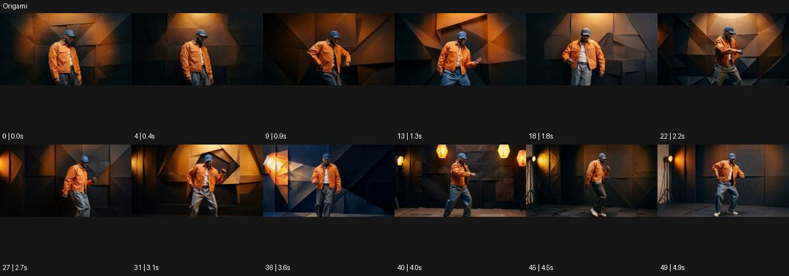

# Origami

출처: Higgsfield · 공식 원본명: **Origami** · 분류: look / 스타일 · ID: 35b52620-f7b6-400a-9664-3f93838fe01f

[원본 미리보기](https://cdn.higgsfield.ai/mixed_media_preset/4b844a70-1eb9-4ac2-b2ea-9e017f7fa31a.mp4) · [원본 썸네일](https://cdn.higgsfield.ai/mixed_media_preset/7c9692ba-9b67-4dfa-82c4-4d6f9483026a.webp)


## 확인 근거

공식 미리보기의 12개 표본 프레임을 확인한 관찰 기록을 바탕으로 작성했다. 원본 50프레임, 메타데이터 길이 5초. 전체 재생 감상·전 프레임 검사·음향 청취·생성 테스트를 했다는 뜻이 아니다.

표본 시점(초): 0, 0.4, 0.9, 1.3, 1.8, 2.2, 2.7, 3.1, 3.6, 4, 4.5, 4.9



## 원본에서 관찰한 변화

주황 재킷 인물 뒤 벽이 갈색·검정 접힌 삼각 면으로 구성돼 있다. 인물이 움직이는 동안 배경 면 경계와 조명 구도가 바뀐다.

## 장면에 재사용할 원리와 층 구분

접힌 삼각 면과 그 면에 닿는 조명으로 배경의 건축적 깊이를 만든다. 모든 인물을 종이로 바꾸는 변신이 아닌 공간 표면의 연출로 사용할 수 있다.

## 확인 한계

완전한 종이 인물 변신보다 배경의 접힌 건축 면이 두드러진다. 표본 사이의 미세한 변화·정확한 반복 경계·제작 공정은 확정하지 않는다. 음향은 확인하지 않았다.

## 뮤직비디오 각색 · 완성형 프롬프트

아래는 관찰한 시각 원리를 다른 장면 목적에 맞게 재설계한 창작안이다. 원본의 소재·길이·사건을 자동 상속하지 않는다.

```text
7초 뮤직비디오, 주황색 재킷을 입은 성인 보컬을 갈색 접힌 종이 벽 앞에 세운다. 카메라는 정면 상반신에서 천천히 오른쪽으로 이동한다. 첫 2초는 벽의 삼각 면과 그림자를 읽히고 보컬이 어깨를 돌리면 뒤쪽 면 세 개만 각도를 조금 바꿔 빛이 다른 순서로 닿게 한다. 보컬의 얼굴과 재킷은 실사 재질로 유지하고 몸에 접힘을 만들지 않는다. 5초에 보컬이 정면을 다시 바라보면 배경 면도 움직임을 멈춘다. 마지막 2초는 주황색 옷과 갈색 입체 면이 균형을 이루는 구도에서 안착한다. 문자·대사 없이 옷감 소리만 둔다.
```

## 브랜드필름 각색 · 완성형 프롬프트

```text
8초 조명 브랜드필름, 흰 스탠드 조명 한 개를 갈색 종이처럼 접힌 삼각 벽 앞에 둔다. 카메라는 낮은 삼사분면에서 천천히 25도 오빗한다. 2초에 조명이 켜지면 가까운 삼각 면부터 따뜻한 빛이 닿고 모서리마다 깊은 그림자가 생긴다. 배경 면 두 개가 천천히 각도를 바꾸면서 빛을 제품 쪽으로 반사하지만 실제 조명 헤드와 스탠드는 고정한다. 5초에 면 움직임과 카메라가 멈춘다. 마지막 3초는 제품의 매끈함과 접힌 벽의 깊이를 함께 읽힌다. 종이 인물·제품 변신·성능 수치·새 로고 없이 스위치 소리만 둔다.
```

생성 테스트: 미실시. 스타일의 명칭만으로 자동 재현을 보장하지 않으며 촬영·그래픽·합성·편집 층을 구별해 구현한다.
