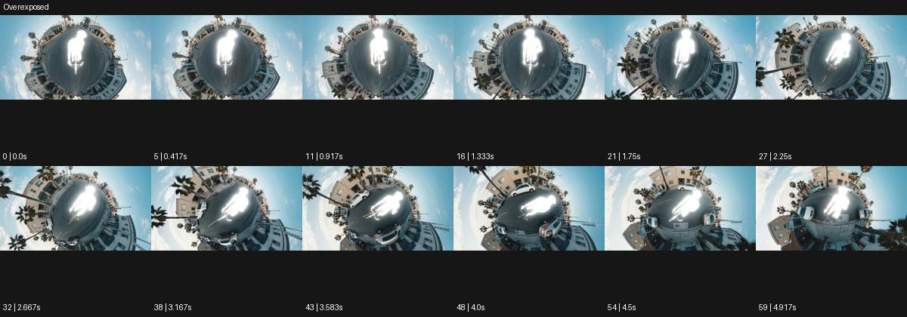

# Overexposed

출처: Higgsfield · 공식 원본명: **Overexposed** · 분류: look / 스타일 · ID: e3329ff5-dd6f-4773-aa3d-a1d3fba3cc0d

[원본 미리보기](https://cdn.higgsfield.ai/mixed_media_preset/2b60f7f8-19ab-4e0a-ad83-a96e4d4fb3d0.mp4) · [원본 썸네일](https://cdn.higgsfield.ai/mixed_media_preset/c09070e1-d568-4ea6-b7a1-406b5a8d9c39.webp)


## 확인 근거

공식 미리보기의 12개 표본 프레임을 확인한 관찰 기록을 바탕으로 작성했다. 원본 60프레임, 메타데이터 길이 5초. 전체 재생 감상·전 프레임 검사·음향 청취·생성 테스트를 했다는 뜻이 아니다.

표본 시점(초): 0, 0.417, 0.917, 1.333, 1.75, 2.25, 2.667, 3.167, 3.583, 4, 4.5, 4.917



## 원본에서 관찰한 변화

작은 행성 같은 원형 거리 중앙 자전거 인물의 몸이 순백 빛 덩어리로 날아간다. 주변 도시색은 남고 시점이 회전하며 인물 각도가 바뀐다.

## 장면에 재사용할 원리와 층 구분

대상 또는 배경의 선택 영역을 순백에 가까운 밝기로 밀어 형태를 그래픽화한다. 전체 과노출과 선택적 가독성 상실을 구분해 복귀 시점을 둔다.

## 확인 한계

전체 화면의 노출 과다가 아니라 대상 위주의 강조로 관찰. 표본 사이의 미세한 변화·정확한 반복 경계·제작 공정은 확정하지 않는다. 음향은 확인하지 않았다.

## 뮤직비디오 각색 · 완성형 프롬프트

아래는 관찰한 시각 원리를 다른 장면 목적에 맞게 재설계한 창작안이다. 원본의 소재·길이·사건을 자동 상속하지 않는다.

```text
6초 뮤직비디오, 성인 댄서가 짙은 파란 광장 가운데 선다. 낮은 정면 카메라가 천천히 20도 옆으로 이동한다. 첫 2초에는 얼굴과 옷을 정상 노출로 읽힌다. 댄서가 팔을 위로 뻗으면 몸만 순백 빛 덩어리로 밝아져 내부 질감이 잠깐 사라지고 광장은 원래 색으로 남는다. 몸의 실루엣과 손가락 외곽은 정확히 유지한다. 팔을 내리는 4초부터 흰 영역 안으로 옷과 얼굴 디테일이 돌아온다. 마지막 2초는 카메라가 멈춘 삼사분면에서 댄서가 숨을 고르는 모습으로 안착한다. 번쩍임 반복·자막·대사 없이 무음이다.
```

## 브랜드필름 각색 · 완성형 프롬프트

```text
7초 유리 제품 브랜드필름, 차가운 회색 테이블 위 투명 유리잔 한 개를 놓는다. 카메라는 낮은 삼사분면에서 시작해 2초 동안 제품 두께를 보여준다. 뒤의 얇은 조명이 밝아지며 유리 가장자리만 하얗게 번지고 중앙 표면과 잔의 바닥은 계속 읽히게 한다. 카메라는 빛 방향을 따라 20cm 옆으로 이동해 흰 반사가 림을 한 번 지나가게 한다. 4초에 밝기를 천천히 낮춰 실제 투명도와 곡률을 회복한다. 마지막 3초는 정상 노출의 제품 전체에서 멈춘다. 제품 라벨이나 기존 각인을 날리지 않고 새 문자·과장된 섬광 없이 작은 실내 환경음만 둔다.
```

생성 테스트: 미실시. 스타일의 명칭만으로 자동 재현을 보장하지 않으며 촬영·그래픽·합성·편집 층을 구별해 구현한다.
