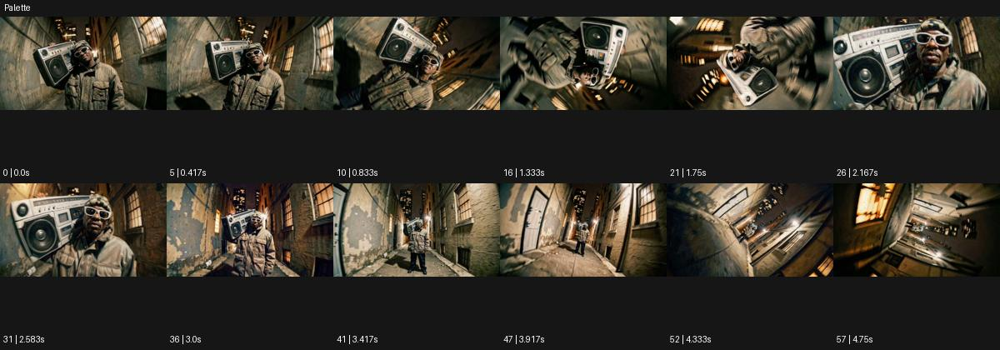

# Palette

출처: Higgsfield · 공식 원본명: **Palette** · 분류: look / 스타일 · ID: 3a4261c7-da21-4879-b4c1-f2516c5cd9be

[원본 미리보기](https://cdn.higgsfield.ai/mixed_media_preset/26bed71d-7789-4a45-8d95-7c01f1474ca1.mp4) · [원본 썸네일](https://cdn.higgsfield.ai/mixed_media_preset/08178a2a-f0bf-4f95-b5ae-8e48fc8015e0.webp)


## 확인 근거

공식 미리보기의 12개 표본 프레임을 확인한 관찰 기록을 바탕으로 작성했다. 원본 58프레임, 메타데이터 길이 4.833초. 전체 재생 감상·전 프레임 검사·음향 청취·생성 테스트를 했다는 뜻이 아니다.

표본 시점(초): 0, 0.417, 0.833, 1.333, 1.75, 2.167, 2.583, 3, 3.417, 3.917, 4.333, 4.75



## 원본에서 관찰한 변화

낡은 실내에서 붐박스를 든 인물을 중심으로 시점이 회전하고 멀어진다. 황갈색·먹색 면과 벗겨진 벽 질감이 강조된다.

## 장면에 재사용할 원리와 층 구분

제한된 황갈색·먹색과 거친 공간 표면으로 감정을 묶는다. 실제 붓칠 여부를 주장하지 않고 색의 범위·질감·카메라가 드러낼 깊이를 설계한다.

## 확인 한계

직접 그린 붓질은 표본에서 뚜렷하지 않아 회화 제작 방식으로 단정하지 않는다. 표본 사이의 미세한 변화·정확한 반복 경계·제작 공정은 확정하지 않는다. 음향은 확인하지 않았다.

## 뮤직비디오 각색 · 완성형 프롬프트

아래는 관찰한 시각 원리를 다른 장면 목적에 맞게 재설계한 창작안이다. 원본의 소재·길이·사건을 자동 상속하지 않는다.

```text
7초 뮤직비디오, 성인 보컬이 낡은 갈색 연습실에서 작은 녹음기를 들고 선다. 전체 색은 황토·먹색·탁한 크림색으로 제한하고 벗겨진 벽 질감을 선명하게 남긴다. 카메라는 보컬의 손 클로즈업에서 천천히 뒤로 이동하면서 20도 옆으로 돌아 공간을 드러낸다. 보컬이 녹음기를 내려놓는 3초 지점에 벽의 밝은 면이 조금 넓어져 인물과 방이 같은 팔레트로 연결된다. 얼굴을 붓칠로 지우거나 벽을 새로 생성하지 않는다. 마지막 2초에는 방의 여백과 보컬 전신을 함께 고정한다. 대사·문자 없이 기기의 작은 접촉음만 둔다.
```

## 브랜드필름 각색 · 완성형 프롬프트

```text
8초 목재 가구 브랜드필름, 황토색 벽과 짙은 갈색 바닥 사이에 호두나무 의자 한 개를 놓는다. 카메라는 등받이 결을 가까이 보여주며 시작해 느린 30도 오빗으로 전체 구조를 드러낸다. 색을 황갈색·먹색·크림색으로 제한하되 목재 자체의 미세한 색 차이는 유지한다. 3초에 따뜻한 측광이 접합부를 따라 이동해 거친 벽과 매끄러운 의자 표면을 구분한다. 제품 윤곽과 다리 각도는 변하지 않는다. 5초에 카메라와 빛을 멈추고 마지막 3초는 소재의 대비를 읽힌다. 회화 효과로 로고를 흐리거나 새 문구를 만들지 않고 실내 환경음만 둔다.
```

생성 테스트: 미실시. 스타일의 명칭만으로 자동 재현을 보장하지 않으며 촬영·그래픽·합성·편집 층을 구별해 구현한다.
