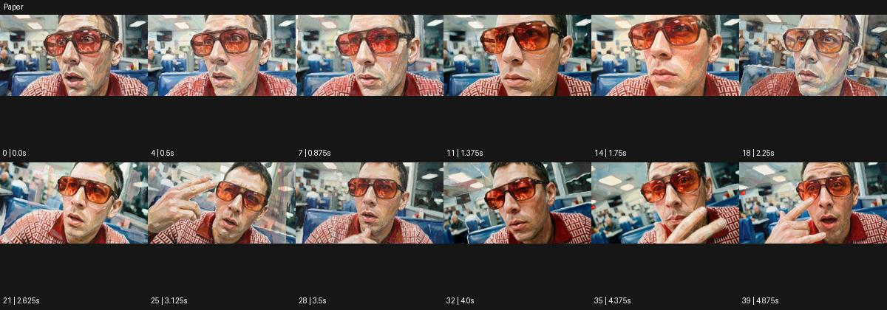

# Paper

출처: Higgsfield · 공식 원본명: **Paper** · 분류: look / 스타일 · ID: b3629014-bb3a-457d-88e9-448358233878

[원본 미리보기](https://cdn.higgsfield.ai/mixed_media_preset/e908cd25-8fc5-43b5-9835-f5193fcb1d46.mp4) · [원본 썸네일](https://cdn.higgsfield.ai/mixed_media_preset/e030016e-2e12-4444-8c63-47d3213808aa.webp)


## 확인 근거

공식 미리보기의 12개 표본 프레임을 확인한 관찰 기록을 바탕으로 작성했다. 원본 40프레임, 메타데이터 길이 5초. 전체 재생 감상·전 프레임 검사·음향 청취·생성 테스트를 했다는 뜻이 아니다.

표본 시점(초): 0, 0.5, 0.875, 1.375, 1.75, 2.25, 2.625, 3.125, 3.5, 4, 4.375, 4.875



## 원본에서 관찰한 변화

붉은 안경 인물의 얼굴과 주변 식당이 접힌 종이 조각 같은 각진 면·거친 표면으로 표현된다. 손과 얼굴 각도가 바뀌어도 조각 질감은 남는다.

## 장면에 재사용할 원리와 층 구분

대상과 공간을 각진 종이 면·거친 표면으로 표현한다. 접힘 질감을 지속적인 외형으로 사용할 수 있으며 스티커 제거나 변신 사건을 추가할 필요는 없다.

## 확인 한계

스티커 벗김이나 종이 접힘 전환은 이 예시의 필수 동작이 아니다. 표본 사이의 미세한 변화·정확한 반복 경계·제작 공정은 확정하지 않는다. 음향은 확인하지 않았다.

## 뮤직비디오 각색 · 완성형 프롬프트

아래는 관찰한 시각 원리를 다른 장면 목적에 맞게 재설계한 창작안이다. 원본의 소재·길이·사건을 자동 상속하지 않는다.

```text
7초 종이 질감 뮤직비디오, 붉은 안경을 쓴 성인 보컬을 작은 종이 식당 세트에 앉힌다. 카메라는 얼굴과 손이 함께 보이는 미디엄 클로즈업에서 시작한다. 얼굴·옷·배경을 접힌 종이 조각 같은 각진 면으로 표현하되 눈과 입의 위치, 안경 두께는 일관되게 유지한다. 보컬이 2초에 컵을 들고 옆을 바라보면 카메라는 같은 방향으로 20cm 이동해 접힌 면의 그림자를 보여준다. 5초에 컵을 내려놓으면 동작과 카메라가 멈춘다. 마지막 2초는 보컬의 표정과 테이블의 종이 섬유를 읽힌다. 실사 변신·새 글자·대사 없이 작은 종이 소리만 둔다.
```

## 브랜드필름 각색 · 완성형 프롬프트

```text
8초 패키지 디자인 브랜드필름, 크림색 종이 상자 한 개를 거친 회색 테이블에 놓는다. 카메라는 상자 모서리 근경에서 시작해 천천히 뒤로 이동한다. 전체 공간도 접힌 종이 면처럼 표현하지만 제품 상자의 실제 접힘선·두께·기존 라벨 위치는 정확하게 보존한다. 3초에 성인 손이 뚜껑을 들어 올리면 안쪽 면이 다른 종이색으로 드러나고 그림자는 접힘 구조를 따라 움직인다. 상자가 액체처럼 휘거나 찢어지지 않는다. 5초에 손이 멈추면 마지막 3초는 열린 패키지의 구조와 섬유 질감에 안착한다. 새 로고·문자 없이 종이 마찰음만 둔다.
```

생성 테스트: 미실시. 스타일의 명칭만으로 자동 재현을 보장하지 않으며 촬영·그래픽·합성·편집 층을 구별해 구현한다.
