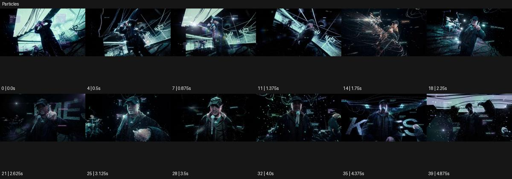

# Particles

출처: Higgsfield · 공식 원본명: **Particles** · 분류: look / 스타일 · ID: f1f09357-8db4-4932-b598-4b62e962a716

[원본 미리보기](https://cdn.higgsfield.ai/mixed_media_preset/27b85cfd-0747-4375-969f-b93eb9da19de.mp4) · [원본 썸네일](https://cdn.higgsfield.ai/mixed_media_preset/8376156c-dd55-4321-b3af-5f808eb71b8f.webp)


## 확인 근거

공식 미리보기의 12개 표본 프레임을 확인한 관찰 기록을 바탕으로 작성했다. 원본 40프레임, 메타데이터 길이 5초. 전체 재생 감상·전 프레임 검사·음향 청취·생성 테스트를 했다는 뜻이 아니다.

표본 시점(초): 0, 0.5, 0.875, 1.375, 1.75, 2.25, 2.625, 3.125, 3.5, 4, 4.375, 4.875



## 원본에서 관찰한 변화

마이크 든 공연자의 주위에 청록 빛점·선 궤적·작은 표시가 겹친다. 손과 몸 동작, 앵글이 바뀌며 입자 밀도와 큰 글자 조각도 달라진다.

## 장면에 재사용할 원리와 층 구분

주체 동작을 따라 입자의 방향·밀도·잔류 시간을 설계한다. 표시나 큰 글자는 원본 특징과 별개로 필요 여부를 결정하며 제품을 가리지 않게 한다.

## 확인 한계

입자가 물리적으로 추적된다는 보장은 없다. 글자 내용은 생성 프롬프트에 복제하지 않는다. 표본 사이의 미세한 변화·정확한 반복 경계·제작 공정은 확정하지 않는다. 음향은 확인하지 않았다.

## 뮤직비디오 각색 · 완성형 프롬프트

아래는 관찰한 시각 원리를 다른 장면 목적에 맞게 재설계한 창작안이다. 원본의 소재·길이·사건을 자동 상속하지 않는다.

```text
7초 뮤직비디오, 성인 보컬이 검은 무대에서 마이크를 한 손에 들고 선다. 카메라는 가슴 높이 정면에서 천천히 접근한다. 처음에는 청록 입자 다섯 개 정도만 어깨 뒤에 떠 있고 보컬이 자유로운 손을 위로 들 때 그 손의 경로를 따라 작은 빛점이 길게 늘어난다. 입자 궤적은 1초 늦게 옅어져 손의 과거 움직임을 읽히되 얼굴과 마이크 앞을 가리지 않는다. 5초에 손을 내리면 입자들이 아래로 천천히 가라앉고 카메라가 멈춘다. 마지막에는 보컬의 눈과 두세 개 남은 빛점으로 여운을 만든다. 새 문자·UI·대사 없이 무음으로 끝낸다.
```

## 브랜드필름 각색 · 완성형 프롬프트

```text
8초 공기청정기 브랜드필름, 밝은 회색 거실 중앙에 흰 제품을 세운다. 카메라는 제품 정면과 옆 공기 흐름 공간을 함께 담는다. 첫 2초는 실물 형태를 보여주고 2초부터 작고 옅은 빛점이 제품 옆에서 완만한 곡선으로 이동한다. 입자는 공기 흐름의 시각적 은유이며 오염 제거율이나 실제 측정값을 표시하지 않는다. 카메라는 30cm 옆으로 이동해 입자와 제품의 거리층을 드러낸다. 5초에는 빛점 밀도가 줄고 마지막 3초는 제품의 흡기부·버튼·재질에 안정적으로 안착한다. 제품 외곽을 분해하거나 새 로고·문구를 만들지 않는다.
```

생성 테스트: 미실시. 스타일의 명칭만으로 자동 재현을 보장하지 않으며 촬영·그래픽·합성·편집 층을 구별해 구현한다.
