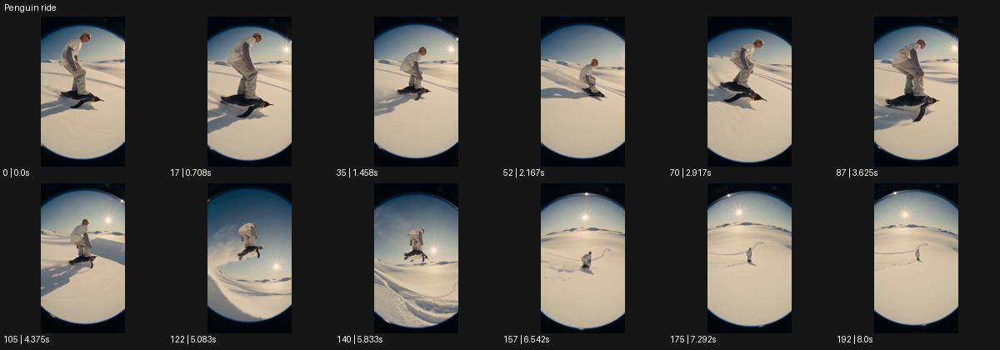

# Penguin ride

- 원본 효과명: **Penguin ride**
- 출처·분류: Higgsfield / scene
- 원본 ID: 4e5df49c-a253-494f-b616-20f471f6c518
- [공식 원본 미리보기](https://cdn.higgsfield.ai/viral_hub/b7ca03e3-5105-45e2-a674-f4e13d0f071c.mp4)
- 확인 방식: 공식 미리보기의 12개 표본 프레임을 확인한 관찰 기록을 바탕으로 작성. 193프레임, 메타데이터 길이 8.042초. 표본 시점: [0.0, 0.708, 1.458, 2.167, 2.917, 3.625, 4.375, 5.083, 5.833, 6.542, 7.292, 8.0]초. 전체 재생·모든 프레임 검사·청음이나 생성 재현 테스트를 뜻하지 않는다.




## 실제 관찰

눈밭의 인물이 발 아래 검은 펭귄 형태와 함께 미끄러지고 작은 둔덕에서 떠올랐다 내려간다. 끝에 멀어진 전신이 보인다.

## 작동 원리와 역할

눈밭에서 작은 검은 탈것과 인물이 함께 미끄러지고 둔덕을 넘어 착지하는 겨울 활주다. 눈의 접촉·분사와 카메라의 낮은 추적을 유지하며 수중 전환과 구분한다.

## 해석의 한계

앞선 잘못된 수중 전환 설명을 적용하지 않는다. 어안 눈밭 활주 예시. 샘플 사이의 연결과 루프 경계는 별도 검사하지 않았다. 아래는 원본 설정을 복사한 기록이 아닌 새로운 장면 각색이며 생성 테스트는 하지 않았다.

## 뮤직비디오 적용 · 완성형 프롬프트

아래 길이와 설정은 독립 창작 예시다. 실제 요청의 길이·참조·음향·컷 조건을 우선한다.

```text
7초 뮤직비디오. 파란 겨울 하늘 아래 성인 댄서가 펭귄 모양의 작은 검은 썰매 위에 서서 눈밭을 미끄러진다. 카메라는 낮은 광각으로 옆을 따라가며 흰 눈과 검은 실루엣의 대비를 읽힌다. 댄서가 팔을 벌려 작은 둔덕을 넘을 때 썰매와 몸이 함께 잠깐 떠올랐다 부드럽게 내려앉고 뒤로 얇은 눈가루가 남는다. 마지막에는 속도가 줄어 댄서가 발을 내려 멈춘다. 카메라는 뒤로 조금 빠져 전신과 넓은 눈밭을 담는다. 끝 2초 장난스러운 자세를 유지하고 실제 살아 있는 펭귄의 행동으로 표현하지 않는다.
```

## 브랜드필름 적용 · 완성형 프롬프트

현재 제품과 브랜드 목적에 맞게 다시 설계하고 마지막 제품 가독성을 확보한다.

```text
7초 고급 겨울 부츠 필름. 성인 모델이 펭귄 실루엣의 작은 검은 이동 발판 두 개 위에 서서 눈 덮인 평지를 천천히 지난다. 낮은 측면 카메라는 부츠 밑창과 눈가루를 따라가며 방한 소재의 표면을 읽힌다. 작은 둔덕에서 모델이 무릎을 굽히고 발판이 낮게 떠올랐다 착지한다. 마지막에는 발판이 멈추고 모델이 두 발을 눈 위에 내려 놓는다. 카메라가 정면 사선에 안착해 부츠의 정상적인 전체 형태를 2초 보여준다. 눈이 밑창에 자연스럽게 눌리는 접촉을 유지하고 수중이나 얼음 포털로 넘어가지 않는다.
```

원본 음향은 확인하지 않았다. 실제 음원, 무음, NO BGM 등 사용자 조건을 유지한다. 명칭만으로 특정 생성 모델의 자동 재현을 보장하지 않는다.
