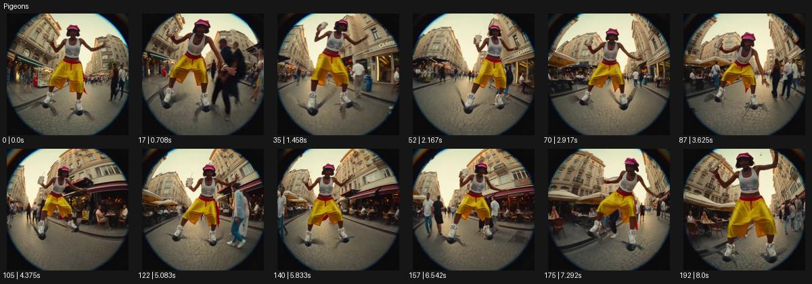

# Pigeons

- 원본 효과명: **Pigeons**
- 출처·분류: Higgsfield / scene
- 원본 ID: e0da05ed-12ae-485b-93ac-939f885f314d
- [공식 원본 미리보기](https://cdn.higgsfield.ai/viral_hub/95e80ebb-98d7-41d6-ad33-e81d405d9400.mp4)
- 확인 방식: 공식 미리보기의 12개 표본 프레임을 확인한 관찰 기록을 바탕으로 작성. 193프레임, 메타데이터 길이 8.042초. 표본 시점: [0.0, 0.708, 1.458, 2.167, 2.917, 3.625, 4.375, 5.083, 5.833, 6.542, 7.292, 8.0]초. 전체 재생·모든 프레임 검사·청음이나 생성 재현 테스트를 뜻하지 않는다.




## 실제 관찰

어안 원형 구도에서 인물이 팔로 균형을 잡고 양발 아래 새 모양 물체를 스케이트처럼 타며 거리 위를 전진한다.

## 작동 원리와 역할

발 아래의 작은 새 형태를 탈것처럼 배치한 비현실적인 활주다. 발·탈것의 접점과 균형 자세, 바닥의 흐름이 핵심이며 원형 어안 시점은 선택적 미학으로 구별한다.

## 해석의 한계

동물 행동의 사실적 재현이 아니라 초현실적 합성 장면. 샘플 사이의 연결과 루프 경계는 별도 검사하지 않았다. 아래는 원본 설정을 복사한 기록이 아닌 새로운 장면 각색이며 생성 테스트는 하지 않았다.

## 뮤직비디오 적용 · 완성형 프롬프트

아래 길이와 설정은 독립 창작 예시다. 실제 요청의 길이·참조·음향·컷 조건을 우선한다.

```text
7초 뮤직비디오. 성인 댄서가 양발 아래의 작은 흰 종이 새 두 마리를 스케이트처럼 타고 텅 빈 골목을 미끄러진다. 카메라는 낮은 원형 어안 구도로 앞에서 뒤로 이동해 발과 새의 접점을 보여준다. 댄서는 팔을 벌려 균형을 잡고 길의 완만한 곡선을 따라 몸을 기울인다. 종이 새는 바닥 가까이 같은 속도로 이동하며 실제 동물의 행동으로 표현하지 않는다. 마지막 댄서가 멈추면 두 새가 접혀 평평한 종이 조각이 되고 발은 자연스럽게 지면에 놓인다. 카메라도 정지해 전신의 장난스러운 자세를 남긴다.
```

## 브랜드필름 적용 · 완성형 프롬프트

현재 제품과 브랜드 목적에 맞게 다시 설계하고 마지막 제품 가독성을 확보한다.

```text
7초 경쾌한 고급 스니커즈 필름. 밝은 석재 광장에서 성인 모델의 신발 아래 두 개의 작은 도자기 새 조각이 부드럽게 미끄러진다. 카메라는 발 옆의 낮은 광각으로 따라가며 새 조각과 밑창의 접촉을 일정하게 유지한다. 모델이 몸을 살짝 기울이면 두 조각이 같은 방향으로 돌아 신발 측면을 드러낸다. 마지막에는 조각들이 멈추고 모델이 한 발씩 바닥에 내려선다. 카메라는 신발을 중심으로 사선 구도에 안착해 가죽과 밑창을 2초 읽힌다. 실제 살아 있는 새로 보이게 하지 않고 제품 구조는 변형하지 않는다.
```

원본 음향은 확인하지 않았다. 실제 음원, 무음, NO BGM 등 사용자 조건을 유지한다. 명칭만으로 특정 생성 모델의 자동 재현을 보장하지 않는다.
