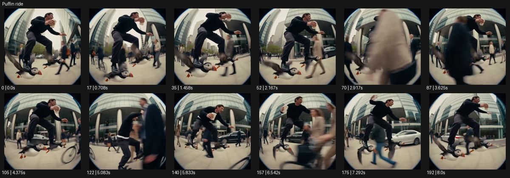

# Puffin ride

- 원본 효과명: **Puffin ride**
- 출처·분류: Higgsfield / scene
- 원본 ID: af906dd9-af11-4a6d-a58e-ff8797e68813
- [공식 원본 미리보기](https://cdn.higgsfield.ai/viral_hub/4616788e-abf2-45fd-bbde-23a92100ef70.mp4)
- 확인 방식: 공식 미리보기의 12개 표본 프레임을 확인한 관찰 기록을 바탕으로 작성. 193프레임, 메타데이터 길이 8.042초. 표본 시점: [0.0, 0.708, 1.458, 2.167, 2.917, 3.625, 4.375, 5.083, 5.833, 6.542, 7.292, 8.0]초. 전체 재생·모든 프레임 검사·청음이나 생성 재현 테스트를 뜻하지 않는다.




## 실제 관찰

어안 도심 구도에서 컵을 든 인물이 양발 아래 주황 부리 새 형태를 타고 낮게 뜬 채 보행자 사이로 이동한다.

## 작동 원리와 역할

컵을 든 인물이 양발 아래 주황 부리 새 형태와 함께 도심을 낮게 떠서 이동하는 조합이다. 손의 수평 유지, 탈것 접점, 군중 사이 동선과 낮은 카메라를 함께 설계한다.

## 해석의 한계

Pigeons와 유사 구조이나 이 영상은 컵과 도심 군중, 주황 부리로 구별. 샘플 사이의 연결과 루프 경계는 별도 검사하지 않았다. 아래는 원본 설정을 복사한 기록이 아닌 새로운 장면 각색이며 생성 테스트는 하지 않았다.

## 뮤직비디오 적용 · 완성형 프롬프트

아래 길이와 설정은 독립 창작 예시다. 실제 요청의 길이·참조·음향·컷 조건을 우선한다.

```text
8초 뮤직비디오. 성인 보컬이 작은 주황 부리의 새 모양 조형물 두 개 위에 서서 아침 도심을 낮게 미끄러진다. 한 손에는 흰 컵을 들고 다른 팔로 균형을 잡는다. 카메라는 낮은 광각으로 앞에서 후퇴하며 컵과 전신, 발 아래 조형물을 함께 담는다. 보컬은 보행자 사이의 비어 있는 동선을 따라 부드럽게 방향을 바꾸고 컵의 수면은 크게 넘치지 않는다. 마지막 카페 앞에서 조형물이 멈추면 보컬이 한 발을 내려 땅에 선다. 카메라도 정지해 컵을 들어 보이는 장난스러운 포즈를 남긴다. 실제 동물 행동으로 표현하지 않는다.
```

## 브랜드필름 적용 · 완성형 프롬프트

현재 제품과 브랜드 목적에 맞게 다시 설계하고 마지막 제품 가독성을 확보한다.

```text
8초 고급 텀블러 필름. 성인 모델이 주황 포인트가 있는 두 개의 작은 이동 발판 위에서 밝은 도시 광장을 천천히 지난다. 낮은 측면 카메라는 모델이 든 스테인리스 텀블러와 발의 균형을 한 프레임에 담는다. 모델이 완만하게 방향을 바꾸어도 손목은 차분히 수평을 유지하고 텀블러 표면에는 건물 반사가 흐른다. 마지막 모델이 카페 테라스 앞에서 멈춰 텀블러를 테이블에 내려놓는다. 카메라는 제품 가까이 접근해 뚜껑, 손잡이, 금속 결을 2초 읽힌다. 밀폐 성능을 입증하는 실험처럼 과장하지 않고 제품 형태를 유지한다.
```

원본 음향은 확인하지 않았다. 실제 음원, 무음, NO BGM 등 사용자 조건을 유지한다. 명칭만으로 특정 생성 모델의 자동 재현을 보장하지 않는다.
