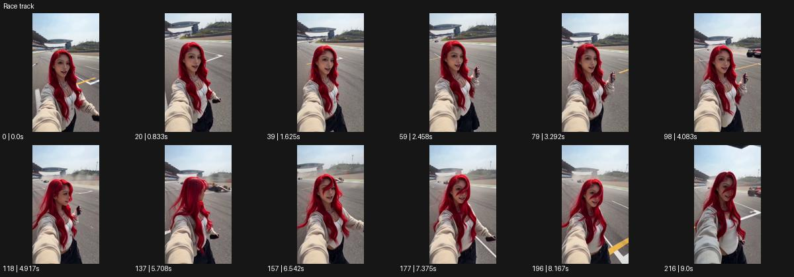

# Race track

- 원본 효과명: **Race track**
- 출처·분류: Higgsfield / scene
- 원본 ID: 96e1865c-c551-4aae-ad17-bf18447e74a1
- [공식 원본 미리보기](https://cdn.higgsfield.ai/viral_hub_preset/9f0c4caa-06f5-4e12-bb4f-a2a221a8afc8.mp4)
- 확인 방식: 공식 미리보기의 12개 표본 프레임을 확인한 관찰 기록을 바탕으로 작성. 217프레임, 메타데이터 길이 9.042초. 표본 시점: [0.0, 0.833, 1.625, 2.458, 3.292, 4.083, 4.917, 5.708, 6.542, 7.375, 8.167, 9.0]초. 전체 재생·모든 프레임 검사·청음이나 생성 재현 테스트를 뜻하지 않는다.




## 실제 관찰

서킷에서 셀피 구도의 인물이 카메라를 보며 움직인다. 후경에 차량이 지나가고 연기/먼지 구름이 생기며 머리카락이 흐트러진다.

## 작동 원리와 역할

전경 셀피 주체와 후경 차량의 빠른 이동·먼지·머리카락 반응을 대조한다. 실제 거리나 안전 조건을 원본에서 추정하지 않고 가상 장면의 동선을 명확히 분리한다.

## 해석의 한계

차량과 인물의 정확한 거리·안전 조건은 알 수 없다. 샘플 사이의 연결과 루프 경계는 별도 검사하지 않았다. 아래는 원본 설정을 복사한 기록이 아닌 새로운 장면 각색이며 생성 테스트는 하지 않았다.

## 뮤직비디오 적용 · 완성형 프롬프트

아래 길이와 설정은 독립 창작 예시다. 실제 요청의 길이·참조·음향·컷 조건을 우선한다.

```text
7초 뮤직비디오. 가상 서킷의 피트월 뒤에서 성인 보컬이 팔을 뻗어 셀피 카메라를 들고 있다. 얼굴이 선명한 넓은 근접 구도로 시작하고 뒤 트랙에는 붉은 자동차가 멀리서 지나온다. 차가 후경을 빠르게 가로지를 때 보컬의 머리카락과 재킷 끝이 한 번 흔들리고 카메라가 작게 반응한다. 보컬은 렌즈를 놓치지 않고 웃으며 손으로 머리카락을 정리한다. 차가 멀어진 뒤 먼지가 천천히 가라앉고 구도가 안정된다. 마지막 2초 얼굴과 빈 트랙을 함께 남긴다. 차량은 주체의 동선에 들어오지 않는다.
```

## 브랜드필름 적용 · 완성형 프롬프트

현재 제품과 브랜드 목적에 맞게 다시 설계하고 마지막 제품 가독성을 확보한다.

```text
7초 고급 스포츠 아이웨어 필름. 성인 모델이 서킷 피트월 뒤에서 선글라스를 쓰고 셀피처럼 가까운 카메라를 바라본다. 후경의 트랙을 자동차 한 대가 지나가며 바람에 머리카락이 살짝 움직인다. 카메라는 작은 반동만 남기고 눈과 프레임을 선명하게 유지한다. 모델이 손으로 안경 다리를 한 번 정리하면 렌즈에 트랙의 흰 선이 얇게 반사된다. 차가 사라진 뒤 카메라는 완전히 안정되어 제품과 얼굴을 2초 읽힌다. 후경의 속도와 전경의 차분함을 대조하며 실제 보호 성능이나 거리 수치를 임의로 표시하지 않는다.
```

원본 음향은 확인하지 않았다. 실제 음원, 무음, NO BGM 등 사용자 조건을 유지한다. 명칭만으로 특정 생성 모델의 자동 재현을 보장하지 않는다.
