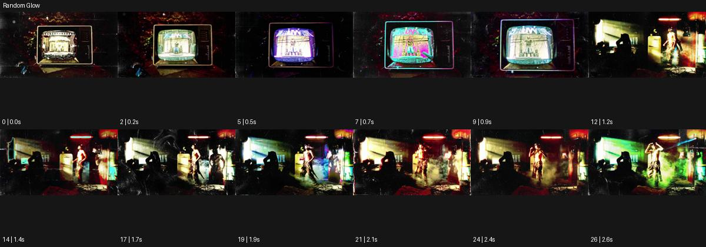

# Random Glow

출처: Higgsfield · 공식 원본명: **Random Glow** · 분류: look / 스타일 · ID: a036628d-9723-435a-9d24-1060a9ab3699

[원본 미리보기](https://cdn.higgsfield.ai/mixed_media_preset/7f697ee1-9df8-45c5-8523-005fb7482278.mp4) · [원본 썸네일](https://cdn.higgsfield.ai/mixed_media_preset/7a52a17e-75c5-4d69-b1d3-3e6c217369df.webp)


## 확인 근거

공식 미리보기의 12개 표본 프레임을 확인한 관찰 기록을 바탕으로 작성했다. 원본 27프레임, 메타데이터 길이 2.7초. 전체 재생 감상·전 프레임 검사·음향 청취·생성 테스트를 했다는 뜻이 아니다.

표본 시점(초): 0, 0.2, 0.5, 0.7, 0.9, 1.2, 1.4, 1.7, 1.9, 2.1, 2.4, 2.6



## 원본에서 관찰한 변화

작은 브라운관 같은 프레임 안 영상의 윤곽이 색을 바꾸다 넓은 야간 장면으로 이어진다. 빨강·노랑·초록 광번짐이 인물과 배경에 이동한다.

## 장면에 재사용할 원리와 층 구분

서로 다른 색의 광번짐을 불규칙한 위치·길이로 옮겨 순간의 주의를 만든다. 랜덤 알고리즘을 검증한 것이 아니며 핵심 얼굴·제품의 디테일은 안정적으로 둔다.

## 확인 한계

랜덤 알고리즘이 실제 쓰였다는 증거가 아니라 불규칙한 발광 관찰. 표본 사이의 미세한 변화·정확한 반복 경계·제작 공정은 확정하지 않는다. 음향은 확인하지 않았다.

## 뮤직비디오 각색 · 완성형 프롬프트

아래는 관찰한 시각 원리를 다른 장면 목적에 맞게 재설계한 창작안이다. 원본의 소재·길이·사건을 자동 상속하지 않는다.

```text
7초 뮤직비디오, 성인 보컬이 작은 야간 녹음실에서 모니터를 끄고 카메라를 바라본다. 카메라는 모니터 옆 정면 미디엄숏이다. 처음 2초는 파란 윤곽만 보이다가 붉은 빛이 어깨에 짧게 번지고 이어 노란 빛이 벽의 케이블을 따라 지나간다. 빛의 위치와 길이는 같게 반복하지 않되 얼굴 중앙은 중성광으로 유지한다. 카메라는 천천히 20cm 접근하고 보컬이 눈을 들면 초록 번짐이 배경 상단에서 한 번 나타난다. 5초 이후 빛 변화는 줄어들고 마지막 2초는 안정된 표정에 안착한다. 새 문자·대사·강한 섬광 없이 실내 소리만 둔다.
```

## 브랜드필름 각색 · 완성형 프롬프트

```text
8초 헤드폰 브랜드필름, 검정 받침 위 실버 헤드폰 한 개를 세운다. 카메라는 이어컵 근경에서 시작해 느린 20도 오빗으로 헤드밴드를 드러낸다. 2초부터 붉은색·호박색·청록색 광번짐이 제품 뒤 서로 다른 위치에서 짧게 나타나지만 제품 표면에는 얇은 반사만 남긴다. 빛이 일정 주기로 깜빡이지 않게 하고 메시·버튼·힌지 디테일은 유지한다. 5초에 색 변화가 멈추고 중성 백색 하이라이트가 이어컵에 안착한다. 마지막 3초는 제품의 실제 재질과 구조를 선명하게 읽힌다. 그래픽 문구·새 로고·성능 수치·음성은 없다.
```

생성 테스트: 미실시. 스타일의 명칭만으로 자동 재현을 보장하지 않으며 촬영·그래픽·합성·편집 층을 구별해 구현한다.
