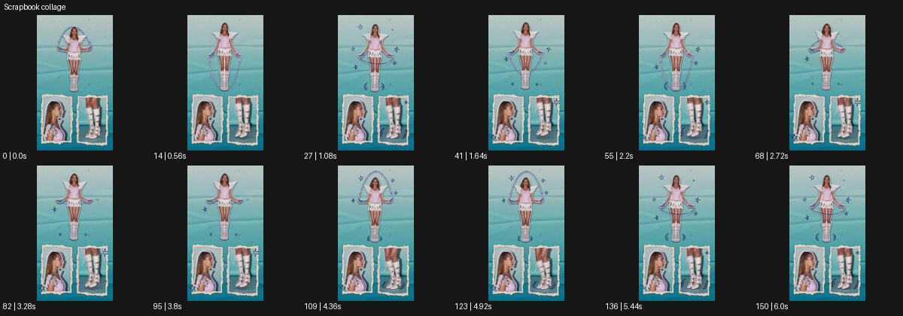

# Scrapbook collage

- 원본 효과명: **Scrapbook collage**
- 출처·분류: Higgsfield / scene
- 원본 ID: 4f46bb84-20f5-44d5-bee1-e1e2c0faa809
- [공식 원본 미리보기](https://cdn.higgsfield.ai/viral_hub/84f761d0-2033-417f-aee0-a2029cfb78fe.mp4)
- 확인 방식: 공식 미리보기의 12개 표본 프레임을 확인한 관찰 기록을 바탕으로 작성. 151프레임, 메타데이터 길이 6.04초. 표본 시점: [0.0, 0.56, 1.08, 1.64, 2.2, 2.72, 3.28, 3.8, 4.36, 4.92, 5.44, 6.0]초. 전체 재생·모든 프레임 검사·청음이나 생성 재현 테스트를 뜻하지 않는다.




## 실제 관찰

청록 바탕에 전신 오린 인물과 아래의 얼굴·부츠 작은 패널이 배치된다. 팔 동작과 주위 선/별 낙서가 변하며 패널 틀은 유지된다.

## 작동 원리와 역할

오린 주체·작은 디테일 영상 패널·낙서 그래픽을 나눠 시간차와 시선 흐름을 설계한다. 프레임 틀의 안정성과 패널 안 동작을 구별한다.

## 해석의 한계

각 패널의 정확한 동기나 자동 추출 방식은 미확인. 샘플 사이의 연결과 루프 경계는 별도 검사하지 않았다. 아래는 원본 설정을 복사한 기록이 아닌 새로운 장면 각색이며 생성 테스트는 하지 않았다.

## 뮤직비디오 적용 · 완성형 프롬프트

아래 길이와 설정은 독립 창작 예시다. 실제 요청의 길이·참조·음향·컷 조건을 우선한다.

```text
8초 뮤직비디오. 청록 종이 바탕 중앙에 성인 보컬의 전신을 흰 오린 테두리로 배치한다. 아래쪽에는 손과 부츠를 담은 작은 가로 영상창 두 개를 놓는다. 보컬이 팔을 올리면 손 패널의 동작이 조금 늦게 따라오고 부츠 패널에서는 한 번 발을 구른다. 그 순간 얇은 손그림 별과 선이 전신 주위에 나타났다 지워진다. 각 패널 안 카메라는 고정하고 바탕 종이는 구겨지지 않는다. 마지막에는 낙서가 사라지고 전신 보컬이 두 손을 내린다. 끝 2초 세 패널이 안정적으로 남고 얼굴과 신체 수는 일관되게 유지한다.
```

## 브랜드필름 적용 · 완성형 프롬프트

현재 제품과 브랜드 목적에 맞게 다시 설계하고 마지막 제품 가독성을 확보한다.

```text
8초 고급 가죽 가방 캠페인. 크림색 종이 바탕 가운데 성인 모델이 갈색 가방을 든 전신 영상 오리기를 놓는다. 아래 두 작은 패널에는 손잡이를 잡는 손과 잠금장치 매크로를 배치한다. 모델이 가방을 어깨에 올릴 때 디테일 패널도 순서대로 해당 동작을 보여준다. 얇은 연필선이 잠깐 손잡이 곡선을 따라 나타나 구조를 안내하되 읽히는 임의 문구는 넣지 않는다. 마지막 모델이 멈추면 아래 패널들이 천천히 작아지고 중앙 전신만 넓어진다. 끝 2초 제품 전체와 가죽 재질을 선명하게 보여준다.
```

원본 음향은 확인하지 않았다. 실제 음원, 무음, NO BGM 등 사용자 조건을 유지한다. 명칭만으로 특정 생성 모델의 자동 재현을 보장하지 않는다.
