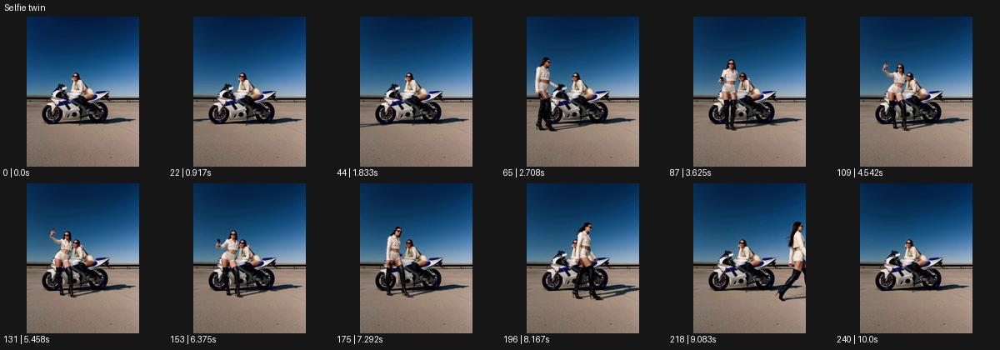

# Selfie twin

- 원본 효과명: **Selfie twin**
- 출처·분류: Higgsfield / scene
- 원본 ID: f9547ac5-21a8-4eb0-9312-12b62aec529c
- [공식 원본 미리보기](https://cdn.higgsfield.ai/viral_hub/f0eee690-e157-4188-bcaa-5670edaae510.mp4)
- 확인 방식: 공식 미리보기의 12개 표본 프레임을 확인한 관찰 기록을 바탕으로 작성. 241프레임, 메타데이터 길이 10.042초. 표본 시점: [0.0, 0.917, 1.833, 2.708, 3.625, 4.542, 5.458, 6.375, 7.292, 8.167, 9.083, 10.0]초. 전체 재생·모든 프레임 검사·청음이나 생성 재현 테스트를 뜻하지 않는다.




## 실제 관찰

오토바이에 앉은 인물 옆으로 같은 모습 인물이 걸어 들어온다. 함께 휴대폰을 들고 포즈를 취한 뒤 방문한 쪽 인물이 걸어 나간다.

## 작동 원리와 역할

복제 인물이 원래 인물 옆에 들어와 같은 카메라를 향해 포즈를 취한 뒤 떠나는 관계 장면이다. 두 인물의 역할과 입장·퇴장 동선을 분명히 정한다.

## 해석의 한계

사진 저장/촬영 성공은 보이지 않으며 포즈 행동으로 기록. 샘플 사이의 연결과 루프 경계는 별도 검사하지 않았다. 아래는 원본 설정을 복사한 기록이 아닌 새로운 장면 각색이며 생성 테스트는 하지 않았다.

## 뮤직비디오 적용 · 완성형 프롬프트

아래 길이와 설정은 독립 창작 예시다. 실제 요청의 길이·참조·음향·컷 조건을 우선한다.

```text
8초 뮤직비디오. 빈 옥상 난간에 성인 보컬이 앉아 휴대폰을 들여다본다. 고정 중간 와이드의 오른쪽에서 같은 얼굴과 옷의 복제가 걸어 들어와 보컬 옆에 앉는다. 두 사람은 서로를 보고 짧게 웃고 원래 보컬이 휴대폰을 들어 함께 셀피 자세를 취한다. 카메라는 두 얼굴과 한 대의 휴대폰을 선명히 유지하며 사진 저장 UI는 보여주지 않는다. 복제가 자리에서 일어나 왼쪽으로 걸어 나가면 원래 보컬은 폰을 내리고 떠난 자리를 본다. 마지막 2초 한 사람만 남은 구도를 유지해 짧은 동행의 감정을 남긴다.
```

## 브랜드필름 적용 · 완성형 프롬프트

현재 제품과 브랜드 목적에 맞게 다시 설계하고 마지막 제품 가독성을 확보한다.

```text
8초 고급 선글라스 캠페인. 성인 모델이 밝은 테라스 의자에 앉아 있다. 같은 얼굴과 같은 코트의 복제가 오른쪽에서 다가와 다른 색 렌즈의 같은 선글라스를 쓰고 나란히 선다. 고정된 허리 위 카메라가 두 제품의 차이를 함께 읽힌다. 앉은 모델이 휴대폰을 들어 셀피 포즈를 취하면 두 사람이 턱을 조금 돌려 프레임과 렌즈의 색을 보여준다. 이후 복제가 천천히 프레임 밖으로 나가고 원래 모델만 남는다. 마지막 2초 원래 선글라스에 카메라가 짧게 접근한다. 인물은 둘, 휴대폰은 하나로 유지한다.
```

원본 음향은 확인하지 않았다. 실제 음원, 무음, NO BGM 등 사용자 조건을 유지한다. 명칭만으로 특정 생성 모델의 자동 재현을 보장하지 않는다.
