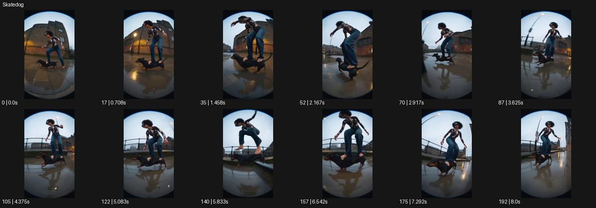

# Skatedog

- 원본 효과명: **Skatedog**
- 출처·분류: Higgsfield / scene
- 원본 ID: 8107940b-1567-4df5-b5de-617585a25972
- [공식 원본 미리보기](https://cdn.higgsfield.ai/viral_hub/15dce7ac-b95d-4829-849b-bd81d3940411.mp4)
- 확인 방식: 공식 미리보기의 12개 표본 프레임을 확인한 관찰 기록을 바탕으로 작성. 193프레임, 메타데이터 길이 8.042초. 표본 시점: [0.0, 0.708, 1.458, 2.167, 2.917, 3.625, 4.375, 5.083, 5.833, 6.542, 7.292, 8.0]초. 전체 재생·모든 프레임 검사·청음이나 생성 재현 테스트를 뜻하지 않는다.




## 실제 관찰

젖은 거리에서 인물이 작은 긴 몸 개 위에 서서 균형을 잡는다. 카메라가 낮게 따라가며 점프와 착지 같은 동작이 이어진다.

## 작동 원리와 역할

작고 긴 탈것 위에 선 인물의 균형과 낮은 주행·점프·착지를 설계한다. 원본의 개 소재는 원리의 한 사례이며 새 장면에서는 제품과 감정에 맞는 탈것으로 바꿀 수 있다.

## 해석의 한계

개를 탄 초현실 상황. 일반 스케이트 촬영과 소재를 분리해 각색. 샘플 사이의 연결과 루프 경계는 별도 검사하지 않았다. 아래는 원본 설정을 복사한 기록이 아닌 새로운 장면 각색이며 생성 테스트는 하지 않았다.

## 뮤직비디오 적용 · 완성형 프롬프트

아래 길이와 설정은 독립 창작 예시다. 실제 요청의 길이·참조·음향·컷 조건을 우선한다.

```text
7초 뮤직비디오. 젖은 골목에서 성인 댄서가 길쭉한 검은 개 모양의 바퀴 달린 조형물 위에 서 있다. 카메라는 무릎 아래 높이에서 앞쪽으로 후퇴하며 조형물의 활주와 발의 접점을 담는다. 댄서가 작은 물웅덩이 앞에서 무릎을 굽히면 조형물이 낮게 뛰어 물을 넘고 부드럽게 착지한다. 댄서는 팔을 펼쳐 균형을 유지하며 얼굴과 다리가 정상 비율로 남는다. 마지막에는 조형물이 멈추고 댄서가 한 발을 바닥에 내린다. 카메라도 멈춰 젖은 길의 반사와 전신 자세를 남긴다. 살아 있는 동물의 행동으로 표현하지 않는다.
```

## 브랜드필름 적용 · 완성형 프롬프트

현재 제품과 브랜드 목적에 맞게 다시 설계하고 마지막 제품 가독성을 확보한다.

```text
7초 고급 스트리트웨어 필름. 회색 셋업을 입은 성인 모델이 긴 강아지 실루엣의 흰 이동 받침 위에서 젖은 광장을 천천히 활주한다. 낮은 측면 카메라가 옷의 밑단과 신발, 받침을 함께 따라간다. 작은 바닥 이음매를 넘을 때 모델은 무릎을 살짝 굽히고 받침이 짧게 떠올랐다 내려앉는다. 소재의 움직임을 읽힐 만큼만 속도를 유지하고 마지막에는 받침이 정지한다. 모델이 똑바로 서면 카메라가 조금 높아져 전신을 담는다. 끝 2초 셋업의 봉제선과 실루엣을 선명하게 보여주며 원단이나 신체를 늘리지 않는다.
```

원본 음향은 확인하지 않았다. 실제 음원, 무음, NO BGM 등 사용자 조건을 유지한다. 명칭만으로 특정 생성 모델의 자동 재현을 보장하지 않는다.
