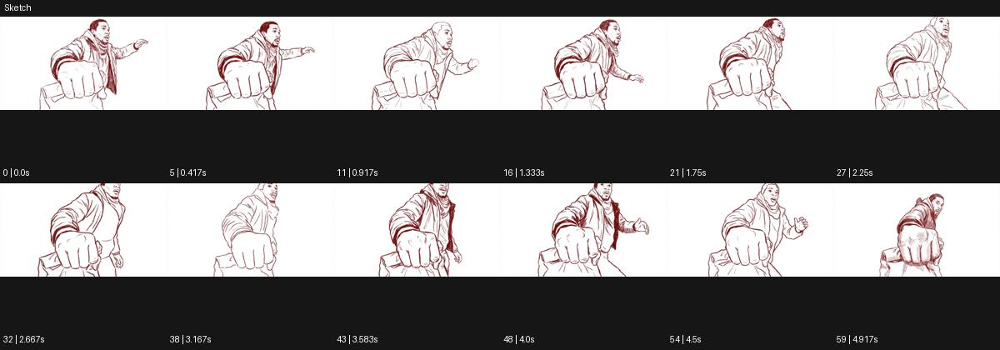

# Sketch

출처: Higgsfield · 공식 원본명: **Sketch** · 분류: look / 스타일 · ID: a6b66c57-2d6b-40cd-9bf3-c4f5dcc276ee

[원본 미리보기](https://cdn.higgsfield.ai/mixed_media_preset/5e169eba-a6db-41a7-afed-d852615efc07.mp4) · [원본 썸네일](https://cdn.higgsfield.ai/mixed_media_preset/20b71097-a115-42b8-b767-35ba25492431.webp)


## 확인 근거

공식 미리보기의 12개 표본 프레임을 확인한 관찰 기록을 바탕으로 작성했다. 원본 60프레임, 메타데이터 길이 5초. 전체 재생 감상·전 프레임 검사·음향 청취·생성 테스트를 했다는 뜻이 아니다.

표본 시점(초): 0, 0.417, 0.917, 1.333, 1.75, 2.25, 2.667, 3.167, 3.583, 4, 4.5, 4.917



## 원본에서 관찰한 변화

밝은 흰 공간에 붉은 갈색 가는 선으로 된 인물이 주먹을 크게 내밀고 몸을 움직인다. 선의 진하기와 일부 채움이 달라진다.

## 장면에 재사용할 원리와 층 구분

밝은 여백 위 가는 선의 농도·중첩으로 자세와 힘을 읽힌다. 주체 동작을 선화로 지속하되 실제 손그림 제작 공정은 주장하지 않는다.

## 확인 한계

실사 전환이 아닌 선화 스타일 지속. 프레임별 손그림 제작 방식은 미확인. 표본 사이의 미세한 변화·정확한 반복 경계·제작 공정은 확정하지 않는다. 음향은 확인하지 않았다.

## 뮤직비디오 각색 · 완성형 프롬프트

아래는 관찰한 시각 원리를 다른 장면 목적에 맞게 재설계한 창작안이다. 원본의 소재·길이·사건을 자동 상속하지 않는다.

```text
6초 선화 뮤직비디오, 성인 댄서를 흰 여백 위 붉은 갈색 연필선으로 그린다. 고정 정면 카메라로 무릎 위부터 머리까지 담는다. 처음에는 가는 외곽선만 보이고 댄서가 주먹을 렌즈 쪽으로 천천히 내밀면 가까운 손의 선이 굵어지고 팔꿈치에는 짧은 중첩 선이 남는다. 손가락 수와 관절 방향은 정확하게 유지한다. 4초에 주먹을 거두며 몸을 옆으로 돌리면 선의 밀도는 어깨 쪽으로 옮겨간다. 마지막 2초는 옆얼굴과 내려놓은 손에 얇은 선만 남기는 정지 포즈다. 색면 폭발·문자·대사 없이 연필 마찰 같은 작은 소리만 둔다.
```

## 브랜드필름 각색 · 완성형 프롬프트

```text
7초 세라믹 브랜드필름, 흰 종이 질감 위에 찻잔을 갈색 가는 선으로 그린다. 카메라는 사선 위쪽에서 천천히 20도 오빗하는 가상 시점이다. 첫 2초는 외곽과 손잡이만 읽히고 회전이 시작되면 잔 안쪽 깊이와 바닥 두께에 옅은 해칭이 더해진다. 선이 제품 구조를 벗어나 흔들리거나 손잡이 수가 바뀌지 않는다. 4초에 작은 손이 잔을 돌리는 선화 동작이 들어오고 곡면의 짙은 선이 반대편으로 이동한다. 마지막 3초는 정면에 안착한 완성 스케치를 유지해 디자인을 읽힌다. 실사 전환·새 각인·문구 없이 조용한 종이 소리만 둔다.
```

생성 테스트: 미실시. 스타일의 명칭만으로 자동 재현을 보장하지 않으며 촬영·그래픽·합성·편집 층을 구별해 구현한다.
