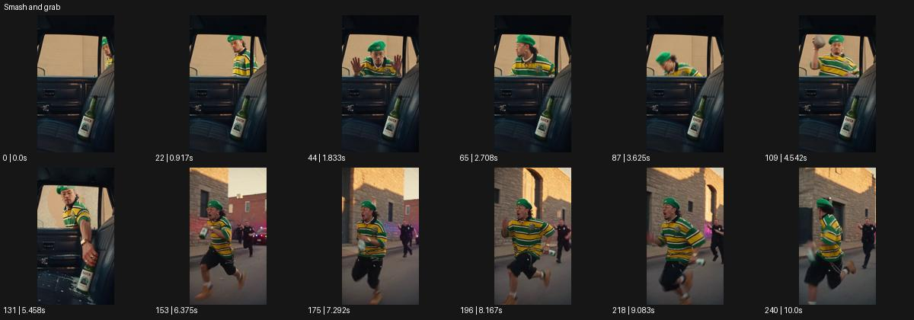

# Smash and grab

- 원본 효과명: **Smash and grab**
- 출처·분류: Higgsfield / scene
- 원본 ID: 3e568b72-8d27-4b0d-a772-399137f18850
- [공식 원본 미리보기](https://cdn.higgsfield.ai/viral_hub/c32886ee-2d15-4697-a366-041a9deaffe2.mp4)
- 확인 방식: 공식 미리보기의 12개 표본 프레임을 확인한 관찰 기록을 바탕으로 작성. 241프레임, 메타데이터 길이 10.042초. 표본 시점: [0.0, 0.917, 1.833, 2.708, 3.625, 4.542, 5.458, 6.375, 7.292, 8.167, 9.083, 10.0]초. 전체 재생·모든 프레임 검사·청음이나 생성 재현 테스트를 뜻하지 않는다.




## 실제 관찰

차 안의 병을 창문 너머로 바라보던 인물이 팔을 움직이고 병을 가져간 뒤, 바깥에서 병을 들고 달아나는 추적 구도로 바뀐다. 후경에 쫓는 사람들이 있다.

## 작동 원리와 역할

행동의 긴장과 제품의 위치를 먼저 읽힌 뒤 손이 가져가는 동작, 밖으로 이동하는 주체, 추적 시점으로 연결한다. 원본 파손의 미확인 세부와 새 각색의 실제 행동을 구분한다.

## 해석의 한계

유리 파손의 세부 순간은 듬성한 표본만으로 확정할 수 없다. 샘플 사이의 연결과 루프 경계는 별도 검사하지 않았다. 아래는 원본 설정을 복사한 기록이 아닌 새로운 장면 각색이며 생성 테스트는 하지 않았다.

## 뮤직비디오 적용 · 완성형 프롬프트

아래 길이와 설정은 독립 창작 예시다. 실제 요청의 길이·참조·음향·컷 조건을 우선한다.

```text
8초 뮤직비디오. 밤의 닫힌 음반 가게 창가에 붉은 데모 테이프가 놓여 있고 성인 보컬이 밖에서 그것을 바라본다. 카메라는 창 안쪽에서 테이프를 선명히 잡고 유리 너머 얼굴을 흐리게 둔다. 보컬이 옆의 열린 작은 창으로 손을 넣어 테이프를 집는 순간 초점이 손으로 이동한다. 손이 프레임을 가리면 한 번 컷해 거리에서 테이프를 쥐고 달리는 보컬을 옆으로 추적한다. 마지막 보컬이 골목 끝에서 멈춰 테이프를 가슴에 댄다. 유리 파손 대신 손의 과감한 동작으로 긴장을 만들고 끝에는 얼굴과 테이프를 함께 남긴다.
```

## 브랜드필름 적용 · 완성형 프롬프트

현재 제품과 브랜드 목적에 맞게 다시 설계하고 마지막 제품 가독성을 확보한다.

```text
8초 고급 향수 필름. 야간 호텔 라운지의 열린 유리 진열대 안에 향수병 하나가 놓여 있다. 카메라는 병의 전면을 근접 촬영하고 밖에서 다가오는 성인 모델의 반사를 함께 담는다. 모델이 열린 측면으로 손을 넣어 병을 단번에 집어 들면 카메라가 손의 방향으로 짧게 팬한다. 이어 복도를 빠르게 걷는 모델의 허리 위 추적 숏으로 컷하되 같은 손과 병 방향을 유지한다. 모델이 밝은 벽 앞에서 멈추면 카메라도 감속하고 병을 렌즈 쪽으로 천천히 내민다. 끝 2초 제품 형태와 라벨을 안정적으로 읽힌다.
```

원본 음향은 확인하지 않았다. 실제 음원, 무음, NO BGM 등 사용자 조건을 유지한다. 명칭만으로 특정 생성 모델의 자동 재현을 보장하지 않는다.
