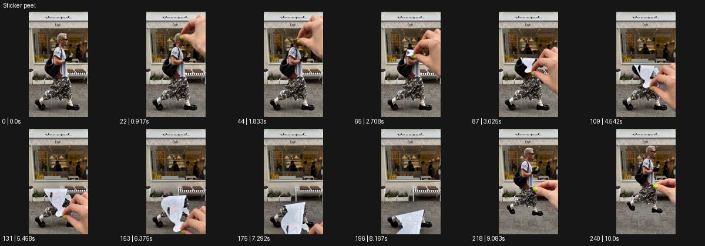

# Sticker peel

- 원본 효과명: **Sticker peel**
- 출처·분류: Higgsfield / scene
- 원본 ID: 33f1fe65-287a-4711-ac37-0b88d5a56708
- [공식 원본 미리보기](https://cdn.higgsfield.ai/viral_hub/c560128d-9812-4211-8d96-c1c5ce909f09.mp4)
- 확인 방식: 공식 미리보기의 12개 표본 프레임을 확인한 관찰 기록을 바탕으로 작성. 241프레임, 메타데이터 길이 10.042초. 표본 시점: [0.0, 0.917, 1.833, 2.708, 3.625, 4.542, 5.458, 6.375, 7.292, 8.167, 9.083, 10.0]초. 전체 재생·모든 프레임 검사·청음이나 생성 재현 테스트를 뜻하지 않는다.




## 실제 관찰

거리 보행자의 머리 근처로 큰 손이 들어와 인물 형상을 위에서 아래로 스티커처럼 벗긴다. 비어진 배경이 드러난 뒤 인물 형상이 다시 나타난다.

## 작동 원리와 역할

장면 속 주체의 겉면을 평면 스티커처럼 벗겨 뒤의 빈 배경을 드러낸다. 손의 잡는 점, 벗겨지는 방향, 말리는 가장자리, 최종 복귀를 별도 단계로 설계한다.

## 해석의 한계

손과 스티커 접촉 경계의 연속성을 표본만으로 보장하지 않는다. 샘플 사이의 연결과 루프 경계는 별도 검사하지 않았다. 아래는 원본 설정을 복사한 기록이 아닌 새로운 장면 각색이며 생성 테스트는 하지 않았다.

## 뮤직비디오 적용 · 완성형 프롬프트

아래 길이와 설정은 독립 창작 예시다. 실제 요청의 길이·참조·음향·컷 조건을 우선한다.

```text
8초 뮤직비디오. 노란 벽 앞에 성인 보컬이 정면으로 서서 작은 손짓을 한다. 카메라는 허리 위 고정 구도로 얼굴과 전신 일부를 선명하게 담는다. 화면 위쪽에서 커다란 손이 들어와 보컬의 오린 이미지 테두리 끝을 잡으면 보컬의 평면 형상이 스티커처럼 위에서 아래로 말리며 벗겨진다. 아래에는 사람 없는 같은 노란 벽이 드러나고 말린 스티커 속 보컬은 작은 입모양을 계속한다. 손이 다시 형상을 원래 자리에 펴 붙이면 인물이 입체적으로 돌아온다. 마지막 2초 보컬이 고개를 살짝 갸웃하는 표정으로 끝내며 피부가 벗겨지는 장면은 만들지 않는다.
```

## 브랜드필름 적용 · 완성형 프롬프트

현재 제품과 브랜드 목적에 맞게 다시 설계하고 마지막 제품 가독성을 확보한다.

```text
8초 고급 가방 캠페인. 크림색 벽 앞에 갈색 가방이 놓인 정면 제품 구도다. 성인 손이 제품 자체가 아닌 가방 모양의 평면 광고 스티커 모서리를 집어 천천히 벗긴다. 스티커가 오른쪽으로 말리면 뒤의 벽에 기대어 놓인 실제 같은 가방이 드러난다. 카메라는 고정하여 평면 인쇄와 입체 제품의 차이를 읽히고 손은 스티커를 화면 밖으로 가져간다. 이어 카메라가 조금 옆으로 이동해 실제 가방의 두께와 손잡이 곡선을 보여준다. 마지막 2초 가죽 결과 라벨을 선명하게 유지하며 제품 표면이 손상되는 것처럼 보이지 않게 한다.
```

원본 음향은 확인하지 않았다. 실제 음원, 무음, NO BGM 등 사용자 조건을 유지한다. 명칭만으로 특정 생성 모델의 자동 재현을 보장하지 않는다.
