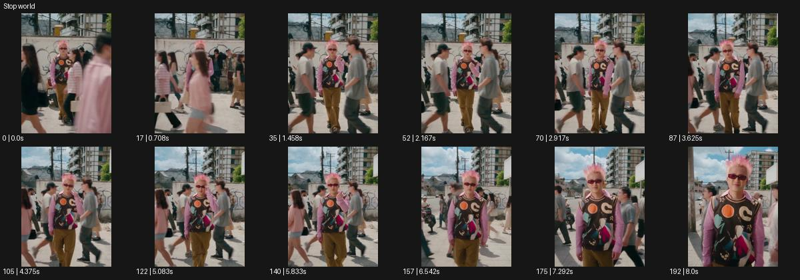

# Stop world

- 원본 효과명: **Stop world**
- 출처·분류: Higgsfield / scene
- 원본 ID: 8bca1173-5327-478c-b476-cbdfcaf001a3
- [공식 원본 미리보기](https://cdn.higgsfield.ai/viral_hub/fd94af6b-adf5-4eb2-90f7-22e92e34bb5a.mp4)
- 확인 방식: 공식 미리보기의 12개 표본 프레임을 확인한 관찰 기록을 바탕으로 작성. 193프레임, 메타데이터 길이 8.042초. 표본 시점: [0.0, 0.708, 1.458, 2.167, 2.917, 3.625, 4.375, 5.083, 5.833, 6.542, 7.292, 8.0]초. 전체 재생·모든 프레임 검사·청음이나 생성 재현 테스트를 뜻하지 않는다.




## 실제 관찰

처음 인파가 가로지르는 거리에서 분홍 머리 인물이 나타난다. 중간 표본의 주변 인물은 유사 자세에 머무는 동안 주인공이 가까워지고 마지막엔 근경이 된다.

## 작동 원리와 역할

주인공의 계속되는 이동과 주변 사람·소품의 정지를 대조한다. 카메라는 주인공을 따라 움직여 정지된 배경 사이의 깊이를 드러내며 끝에서 시간 재개 여부를 명시한다.

## 해석의 한계

표본 기반으로 주변 정지/주인공 이동 대비를 읽음. 전 프레임 완벽 정지 검사 아님. 샘플 사이의 연결과 루프 경계는 별도 검사하지 않았다. 아래는 원본 설정을 복사한 기록이 아닌 새로운 장면 각색이며 생성 테스트는 하지 않았다.

## 뮤직비디오 적용 · 완성형 프롬프트

아래 길이와 설정은 독립 창작 예시다. 실제 요청의 길이·참조·음향·컷 조건을 우선한다.

```text
8초 뮤직비디오. 저녁의 붐비는 역 통로를 성인 보컬이 카메라 쪽으로 걸어온다. 카메라는 눈높이에서 뒤로 이동하며 처음에는 주변 행인도 정상적으로 움직인다. 보컬이 이어폰을 빼는 순간 행인과 들고 있는 가방들이 각자의 자세로 멈추고 보컬만 계속 걷는다. 카메라는 정지된 사람 사이를 부드럽게 빠져나오며 보컬 얼굴에 가까워진다. 마지막 보컬이 멈춰 렌즈를 바라보면 뒤의 시간이 다시 흐르고 사람들이 지나간다. 끝 2초 얼굴을 선명하게 남기며 정지 인물의 신체나 가방이 떠서 변형되지 않게 한다.
```

## 브랜드필름 적용 · 완성형 프롬프트

현재 제품과 브랜드 목적에 맞게 다시 설계하고 마지막 제품 가독성을 확보한다.

```text
8초 고급 헤드폰 필름. 밝은 공항 라운지에서 성인 사용자가 헤드폰을 쓰기 전 주변 사람들이 일상적으로 움직인다. 카메라는 사용자의 가슴 위 구도로 천천히 접근한다. 헤드폰이 귀에 안착하는 순간 주변의 손과 발, 옷자락만 정지하고 사용자는 편안하게 눈을 감는다. 카메라는 작은 측면 이동으로 제품 외곽과 정지된 배경의 깊이를 보여준다. 마지막 사용자가 눈을 뜨면 주변의 움직임이 다시 시작된다. 끝 2초 헤드폰과 얼굴을 선명하게 유지한다. 소음 차단의 감각을 시각적 비유로 표현하며 기술적 성능 수치를 임의로 넣지 않는다.
```

원본 음향은 확인하지 않았다. 실제 음원, 무음, NO BGM 등 사용자 조건을 유지한다. 명칭만으로 특정 생성 모델의 자동 재현을 보장하지 않는다.
