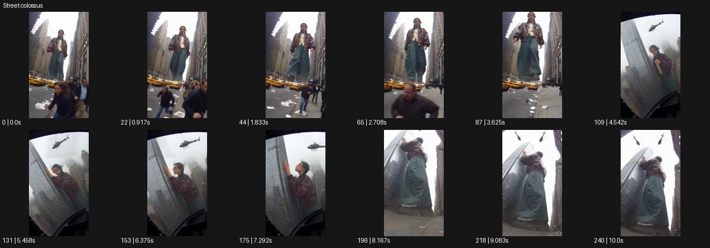

# Street colossus

- 원본 효과명: **Street colossus**
- 출처·분류: Higgsfield / scene
- 원본 ID: c277871a-938b-4c09-b825-41c217e7f727
- [공식 원본 미리보기](https://cdn.higgsfield.ai/viral_hub/e0278141-12c9-4139-91eb-b4294d833ed9.mp4)
- 확인 방식: 공식 미리보기의 12개 표본 프레임을 확인한 관찰 기록을 바탕으로 작성. 241프레임, 메타데이터 길이 10.042초. 표본 시점: [0.0, 0.917, 1.833, 2.708, 3.625, 4.542, 5.458, 6.375, 7.292, 8.167, 9.083, 10.0]초. 전체 재생·모든 프레임 검사·청음이나 생성 재현 테스트를 뜻하지 않는다.




## 실제 관찰

도시 빌딩 사이 거대한 인물이 서 있고 작은 사람들이 달린다. 중간에 유리/화면 테두리를 통한 다른 시점과 헬리콥터가 보인 뒤 발치 저각도로 바뀐다.

## 작동 원리와 역할

도시 건축과 작은 행인을 기준으로 거대한 인물의 스케일을 읽힌다. 여러 시점을 사용할 때 거인의 위치·방향을 유지하고 크기 변화와 카메라 거리 변화를 구분한다.

## 해석의 한계

한 숏의 단순 확대가 아닌 여러 시점의 예시. 실제 크기 수치는 미확인. 샘플 사이의 연결과 루프 경계는 별도 검사하지 않았다. 아래는 원본 설정을 복사한 기록이 아닌 새로운 장면 각색이며 생성 테스트는 하지 않았다.

## 뮤직비디오 적용 · 완성형 프롬프트

아래 길이와 설정은 독립 창작 예시다. 실제 요청의 길이·참조·음향·컷 조건을 우선한다.

```text
8초 뮤직비디오. 새벽의 비어 있는 도심 교차로에서 거대한 성인 보컬이 두 건물 사이에 서 있다. 첫 숏은 정상 크기의 신호등 뒤에서 올려다보는 낮은 와이드로 보컬의 크기를 읽힌다. 보컬이 천천히 고개를 돌리면 한 번 높은 옥상 시점으로 컷해 얼굴과 건물 높이를 나란히 보여준다. 보컬은 건물을 부수지 않고 한 손으로 자기 코트의 깃을 정리한다. 마지막에는 길가의 낮은 구도로 돌아와 두 발과 위쪽 얼굴을 함께 담는다. 카메라가 천천히 뒤로 물러나며 도시 안의 고립된 존재를 2초 유지한다.
```

## 브랜드필름 적용 · 완성형 프롬프트

현재 제품과 브랜드 목적에 맞게 다시 설계하고 마지막 제품 가독성을 확보한다.

```text
8초 고급 패션 필름. 새벽의 석재 광장 중앙에 거대한 크기로 확장된 성인 모델이 짙은 수트를 입고 서 있다. 카메라는 작은 가로등을 전경에 둔 낮은 사선에서 시작해 실제 건물과 모델의 크기 차이를 보여준다. 모델은 주변을 건드리지 않고 손목의 커프스를 천천히 정리한다. 카메라가 위로 상승해 재킷의 라펠과 어깨선을 읽히고, 마지막에는 건물 지붕 높이에서 상반신 구도로 멈춘다. 거대한 모델의 움직임은 절제되어야 하며 원단의 결은 정상 크기의 제품처럼 세밀하게 남긴다. 끝 2초 얼굴과 수트 실루엣을 선명하게 유지한다.
```

원본 음향은 확인하지 않았다. 실제 음원, 무음, NO BGM 등 사용자 조건을 유지한다. 명칭만으로 특정 생성 모델의 자동 재현을 보장하지 않는다.
