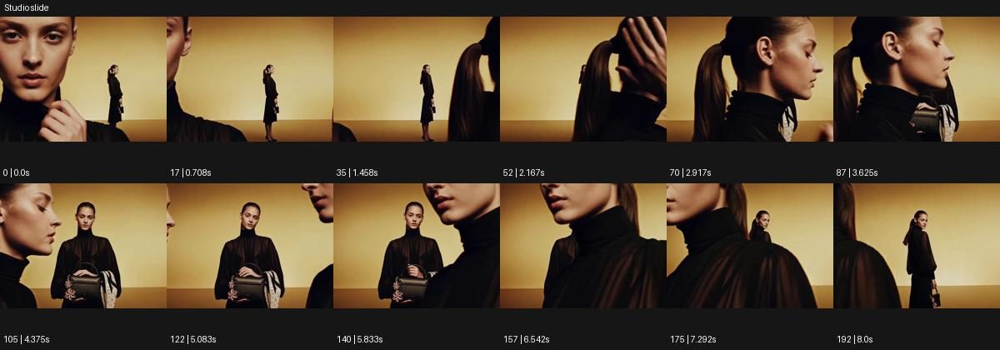

# Studio slide

- 원본 효과명: **Studio slide**
- 출처·분류: Higgsfield / scene
- 원본 ID: 568a5b0d-f82d-4441-b833-a14c48a0d815
- [공식 원본 미리보기](https://cdn.higgsfield.ai/viral_hub/c129fb83-2014-4a37-a3f8-6c7dfeab0254.mp4)
- 확인 방식: 공식 미리보기의 12개 표본 프레임을 확인한 관찰 기록을 바탕으로 작성. 193프레임, 메타데이터 길이 8.042초. 표본 시점: [0.0, 0.708, 1.458, 2.167, 2.917, 3.625, 4.375, 5.083, 5.833, 6.542, 7.292, 8.0]초. 전체 재생·모든 프레임 검사·청음이나 생성 재현 테스트를 뜻하지 않는다.




## 실제 관찰

황토 배경에 동일 인물의 전신·옆얼굴·가슴 위 근경이 서로 다른 크기로 겹쳐 옆으로 지나간다. 전경 대형 얼굴이 가렸다가 전신을 드러낸다.

## 작동 원리와 역할

같은 인물의 서로 다른 크기와 시점의 영상층이 옆으로 지나가며 가림과 공개를 만든다. 실제 인물 크기 변형이 아니라 독립 레이어의 위치·스케일 편집으로 설계한다.

## 해석의 한계

하나의 실제 공간에서 사람이 커지는 장면이 아닌 레이어 배치로 읽힌다. 샘플 사이의 연결과 루프 경계는 별도 검사하지 않았다. 아래는 원본 설정을 복사한 기록이 아닌 새로운 장면 각색이며 생성 테스트는 하지 않았다.

## 뮤직비디오 적용 · 완성형 프롬프트

아래 길이와 설정은 독립 창작 예시다. 실제 요청의 길이·참조·음향·컷 조건을 우선한다.

```text
7초 뮤직비디오. 황토색 스튜디오 배경에 성인 보컬의 전신을 중앙에 놓고 첫 1초 정면 동작을 읽힌다. 보컬이 손을 옆으로 펼치면 같은 인물의 큰 옆얼굴 영상층이 왼쪽에서 오른쪽으로 천천히 지나가 전신을 가린다. 큰 얼굴이 빠져나갈 때 오른쪽에는 가슴 위의 또 다른 영상층이 나타나 같은 입모양을 조금 늦게 이어간다. 모든 층의 얼굴과 의상은 같고 바닥 그림자는 전신층에만 자연스럽게 남긴다. 마지막에는 근접층들이 사라지고 원래 전신만 중앙에 남는다. 카메라 이동보다 층의 슬라이드로 리듬을 만든다.
```

## 브랜드필름 적용 · 완성형 프롬프트

현재 제품과 브랜드 목적에 맞게 다시 설계하고 마지막 제품 가독성을 확보한다.

```text
7초 고급 코트 캠페인. 크림색 배경 중앙에 검은 코트를 입은 성인 모델의 전신을 세운다. 모델이 몸을 조금 돌리면 같은 모델의 큰 소매 디테일 영상층이 오른쪽에서 왼쪽으로 지나가며 울의 질감을 보여준다. 이어 얼굴과 라펠의 근접층이 반대 방향으로 천천히 들어와 전신의 일부를 가린다. 레이어마다 카메라는 고정하고 제품의 색과 봉제 위치를 일치시킨다. 마지막에는 두 근접층이 화면 밖으로 빠져나가 전신의 3/4 자세만 남는다. 끝 2초 코트의 전체 실루엣을 읽히며 실제 몸이 커지거나 분리된 것처럼 만들지 않는다.
```

원본 음향은 확인하지 않았다. 실제 음원, 무음, NO BGM 등 사용자 조건을 유지한다. 명칭만으로 특정 생성 모델의 자동 재현을 보장하지 않는다.
