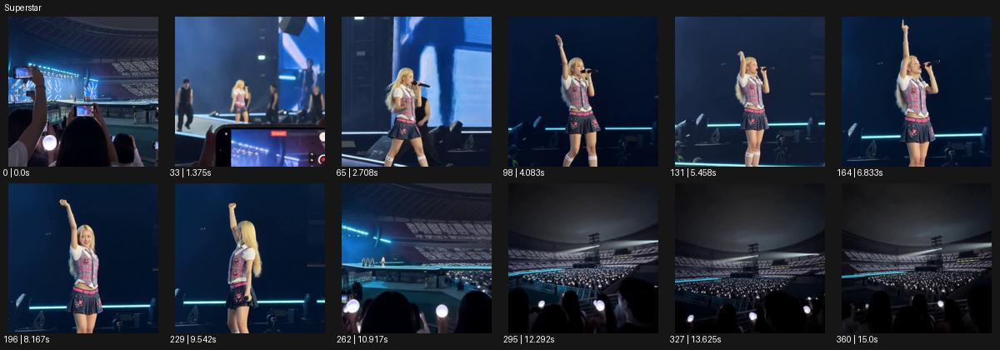

# Superstar

- 원본 효과명: **Superstar**
- 출처·분류: Higgsfield / scene
- 원본 ID: 6551373d-7ad9-4f33-8bb1-9bb7b570cf6e
- [공식 원본 미리보기](https://cdn.higgsfield.ai/viral_hub/69352fc9-6a72-4197-b13d-969d906512ce.mp4)
- 확인 방식: 공식 미리보기의 12개 표본 프레임을 확인한 관찰 기록을 바탕으로 작성. 361프레임, 메타데이터 길이 15.042초. 표본 시점: [0.0, 1.375, 2.708, 4.083, 5.458, 6.833, 8.167, 9.542, 10.917, 12.292, 13.625, 15.0]초. 전체 재생·모든 프레임 검사·청음이나 생성 재현 테스트를 뜻하지 않는다.




## 실제 관찰

관객의 휴대폰 너머 공연자를 보다 무대 가까운 구도로 이동한다. 가수가 손을 올린 뒤 다시 큰 경기장과 빛나는 관객석을 보여준다.

## 작동 원리와 역할

관객의 시점과 가까운 공연자 시점, 넓은 공연장 공개를 연결해 무대의 규모와 감정 거리를 조절한다. 손동작과 카메라 접근·후퇴를 공연의 계기로 맞춘다.

## 해석의 한계

노래/박자는 듣지 않았다. 실제 출연자 정체성은 분석 대상 아님. 샘플 사이의 연결과 루프 경계는 별도 검사하지 않았다. 아래는 원본 설정을 복사한 기록이 아닌 새로운 장면 각색이며 생성 테스트는 하지 않았다.

## 뮤직비디오 적용 · 완성형 프롬프트

아래 길이와 설정은 독립 창작 예시다. 실제 요청의 길이·참조·음향·컷 조건을 우선한다.

```text
8초 뮤직비디오. 어두운 공연장에서 관객이 든 휴대폰 화면 너머 성인 보컬이 작게 보인다. 카메라는 휴대폰 옆을 지나 무대 가까이 부드럽게 전진해 보컬의 가슴 위 구도에 도착한다. 보컬이 손을 들어 객석을 가리키면 카메라는 높이를 조금 올리며 뒤로 빠져나가 무대 전체와 불빛을 든 관객을 드러낸다. 휴대폰 화면을 포털로 쓰지 않고 실제 공간의 접근과 공개로 이어간다. 마지막에는 보컬을 화면 중앙에 작게 유지한 넓은 구도로 멈춘다. 지정 음원이 있으면 실제 퍼포먼스 변화점에 움직임을 맞춘다.
```

## 브랜드필름 적용 · 완성형 프롬프트

현재 제품과 브랜드 목적에 맞게 다시 설계하고 마지막 제품 가독성을 확보한다.

```text
8초 고급 공연장 브랜드 필름. 객석의 성인 관객 두 사람 뒤에서 시작해 조용한 무대의 피아니스트를 바라본다. 카메라는 좌석 사이 통로를 부드럽게 전진하며 무대 가까이 가지만 연주자를 방해하는 시점은 만들지 않는다. 피아니스트가 손을 들어 다음 구절을 준비하면 카메라는 천천히 상승하고 뒤로 이동해 목재 벽과 천장의 음향 구조를 넓게 공개한다. 마지막에는 무대와 객석이 균형을 이루는 높은 와이드에 안착한다. 끝 2초 따뜻한 재질과 공간의 규모를 선명하게 읽힌다. 실제 청음 성능을 수치나 시각 파동으로 단정하지 않는다.
```

원본 음향은 확인하지 않았다. 실제 음원, 무음, NO BGM 등 사용자 조건을 유지한다. 명칭만으로 특정 생성 모델의 자동 재현을 보장하지 않는다.
