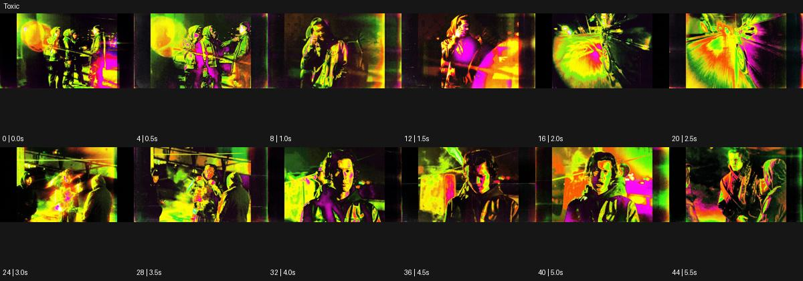

# Toxic

출처: Higgsfield · 공식 원본명: **Toxic** · 분류: look / 스타일 · ID: 27c5dbb2-9411-4c14-a55d-0004d304fcc6

[원본 미리보기](https://cdn.higgsfield.ai/mixed_media_preset/9ea0e5af-9f30-4a2e-89ea-54fbf2ad4874.mp4) · [원본 썸네일](https://cdn.higgsfield.ai/mixed_media_preset/9f8407e6-7f75-405e-99e3-630164868262.webp)


## 확인 근거

공식 미리보기의 12개 표본 프레임을 확인한 관찰 기록을 바탕으로 작성했다. 원본 45프레임, 메타데이터 길이 5.625초. 전체 재생 감상·전 프레임 검사·음향 청취·생성 테스트를 했다는 뜻이 아니다.

표본 시점(초): 0, 0.5, 1, 1.5, 2, 2.5, 3, 3.5, 4, 4.5, 5, 5.5



## 원본에서 관찰한 변화

어두운 공연 공간이 형광 황록·자홍 빛으로 번지고 인물 근경과 넓은 구도가 바뀐다. 일부 표본은 중심에서 늘어나는 방사 흐림을 보인다.

## 장면에 재사용할 원리와 층 구분

어두운 장면의 형광 황록·자홍 번짐과 일부 방사 흐림으로 밀도를 높인다. 독성 물질이나 유해 반응이 아니라 색·광학·편집 층으로 다룬다.

## 확인 한계

독성 물질의 실제 표현이 아니라 화면 스타일명. 표본 사이의 미세한 변화·정확한 반복 경계·제작 공정은 확정하지 않는다. 음향은 확인하지 않았다.

## 뮤직비디오 각색 · 완성형 프롬프트

아래는 관찰한 시각 원리를 다른 장면 목적에 맞게 재설계한 창작안이다. 원본의 소재·길이·사건을 자동 상속하지 않는다.

```text
6초 뮤직비디오, 성인 보컬이 어두운 지하 무대의 황록색 조명 아래 선다. 카메라는 정면 상반신에서 시작하고 뒤에는 자홍색 얇은 빛띠를 둔다. 보컬이 2초에 상체를 앞으로 기울이면 배경의 빛만 중심에서 바깥으로 짧게 늘어나고 얼굴은 선명하게 유지한다. 카메라는 몸의 접근을 받아 10cm 뒤로 물러나며 중심을 지킨다. 4초에 보컬이 바로 서면 방사 흐림이 사라지고 빛의 번짐도 좁아진다. 마지막 2초는 안정된 얼굴과 두 색의 대비에 안착한다. 액체 독성·피부 변형·문자·반복 섬광 없이 무음이다.
```

## 브랜드필름 각색 · 완성형 프롬프트

```text
7초 야간 스포츠웨어 브랜드필름, 성인 모델이 검정 스튜디오에서 황록색 포인트가 있는 재킷을 입는다. 낮은 삼사분면 카메라가 모델의 소매에서 시작해 천천히 뒤로 이동한다. 모델이 지퍼를 올리는 2초 지점에 뒤의 자홍색 빛이 바깥으로 짧게 퍼지고 배경에만 약한 방사 흐림이 생긴다. 제품의 지퍼·반사 소재·브랜드 색은 왜곡하지 않는다. 4초에 모델이 팔을 내리면 흐림이 정리되고 카메라는 전신 구도에서 멈춘다. 마지막 3초는 실제 재킷 실루엣과 두 색 조명의 관계를 읽힌다. 유해 물질·효능 수치·새 로고·문구 없이 옷감 소리만 둔다.
```

생성 테스트: 미실시. 스타일의 명칭만으로 자동 재현을 보장하지 않으며 촬영·그래픽·합성·편집 층을 구별해 구현한다.
