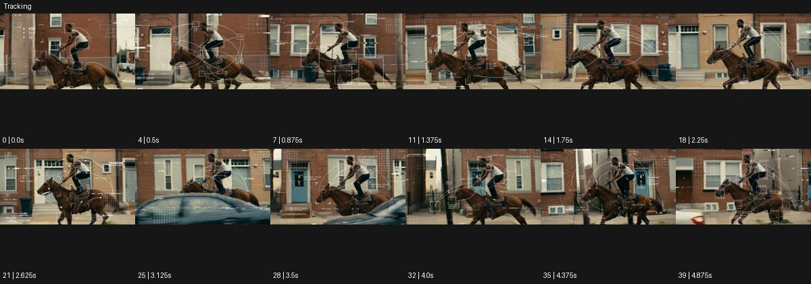

# Tracking

출처: Higgsfield · 공식 원본명: **Tracking** · 분류: look / 스타일 · ID: 91506e72-9b2f-474d-ada5-e1b144699b86

[원본 미리보기](https://cdn.higgsfield.ai/mixed_media_preset/c694ed05-d2b0-4850-a1e9-2b90dcee95d8.mp4) · [원본 썸네일](https://cdn.higgsfield.ai/mixed_media_preset/e2ec7f9e-a599-4569-a1d7-4342da9479c3.webp)


## 확인 근거

공식 미리보기의 12개 표본 프레임을 확인한 관찰 기록을 바탕으로 작성했다. 원본 40프레임, 메타데이터 길이 5초. 전체 재생 감상·전 프레임 검사·음향 청취·생성 테스트를 했다는 뜻이 아니다.

표본 시점(초): 0, 0.5, 0.875, 1.375, 1.75, 2.25, 2.625, 3.125, 3.5, 4, 4.375, 4.875



## 원본에서 관찰한 변화

달리는 말 위 인물을 옆에서 따라간다. 얇은 흰 사각형·십자·원과 궤적이 인물 및 배경에 겹쳐 변한다.

## 장면에 재사용할 원리와 층 구분

카메라가 대상을 따라가는 것과 좌표·상자 오버레이가 대상에 붙는 것을 구별한다. 표시의 수와 추적 대상을 제한해 움직임을 설명한다.

## 확인 한계

추적선 오버레이이며 Eyecandy의 카메라 Tracking과 구분. 표본 사이의 미세한 변화·정확한 반복 경계·제작 공정은 확정하지 않는다. 음향은 확인하지 않았다.

## 뮤직비디오 각색 · 완성형 프롬프트

아래는 관찰한 시각 원리를 다른 장면 목적에 맞게 재설계한 창작안이다. 원본의 소재·길이·사건을 자동 상속하지 않는다.

```text
7초 뮤직비디오, 성인 댄서가 빈 체육관에서 한 팔을 크게 원으로 돌린다. 카메라는 옆에서 천천히 이동하며 전신을 유지한다. 2초부터 손목과 발목에 작은 흰 사각 추적 상자만 나타나 동작을 따라가고 손목 뒤에는 한 줄의 가는 궤적이 0.5초 남는다. 얼굴과 몸통에는 좌표나 숫자를 겹치지 않는다. 댄서가 5초에 몸을 낮춰 손을 바닥에 대면 궤적도 바닥 점 하나로 모인다. 카메라는 그 정지 포즈의 측면에서 멈추고 마지막 2초는 상자가 차례로 사라진 뒤 몸만 남긴다. 실제 측정처럼 보이는 수치·자막·대사는 없다.
```

## 브랜드필름 각색 · 완성형 프롬프트

```text
8초 러닝화 브랜드필름, 성인 러너가 실내 트랙에서 느리게 세 걸음을 달린다. 카메라는 발 높이에서 나란히 따라가며 신발 측면을 읽힌다. 첫 2초 후 발목 옆에 작은 흰 십자와 발끝 주위 사각형이 붙어 이동 경로를 시각화한다. 표시에는 속도·충격량 같은 검증되지 않은 수치를 넣지 않는다. 착지마다 짧은 선 하나가 바닥 방향으로 남았다 지워지고 갑피·밑창·끈은 가리지 않는다. 5초에 러너가 멈추면 카메라도 멈추고 모든 표시가 옅어진다. 마지막 3초는 제품의 원형과 소재를 깨끗하게 보여준다. 새 로고·문구 없이 발소리만 둔다.
```

생성 테스트: 미실시. 스타일의 명칭만으로 자동 재현을 보장하지 않으며 촬영·그래픽·합성·편집 층을 구별해 구현한다.
