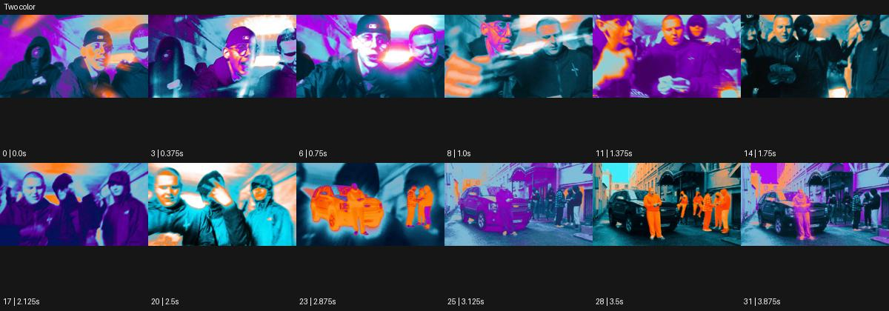

# Two color

출처: Higgsfield · 공식 원본명: **Two color** · 분류: look / 스타일 · ID: 928dd98a-20e4-42f8-8772-0cb5c9a758f9

[원본 미리보기](https://cdn.higgsfield.ai/mixed_media_preset/70c0bc83-9ba2-49c5-9a5d-80fa7c118dcc.mp4) · [원본 썸네일](https://cdn.higgsfield.ai/mixed_media_preset/e5426b50-caea-4e84-9ea0-275da7da373d.webp)


## 확인 근거

공식 미리보기의 12개 표본 프레임을 확인한 관찰 기록을 바탕으로 작성했다. 원본 32프레임, 메타데이터 길이 4초. 전체 재생 감상·전 프레임 검사·음향 청취·생성 테스트를 했다는 뜻이 아니다.

표본 시점(초): 0, 0.375, 0.75, 1, 1.375, 1.75, 2.125, 2.5, 2.875, 3.125, 3.5, 3.875



## 원본에서 관찰한 변화

군중 공연과 자동차가 청록·주황·보라의 넓은 색면으로 번갈아 채워진다. 실사 어둠과 색상 실루엣이 교차한다.

## 장면에 재사용할 원리와 층 구분

장면마다 두 우세 색을 정하고 실사 암부와 색상 실루엣을 교체한다. 원본 전체가 엄밀히 두 색만이었다고 주장하지 않으며 선택한 장면의 팔레트를 통제한다.

## 확인 한계

공식명과 달리 영상 전체가 엄밀히 두 색만인 것은 아니다. 표본 사이의 미세한 변화·정확한 반복 경계·제작 공정은 확정하지 않는다. 음향은 확인하지 않았다.

## 뮤직비디오 각색 · 완성형 프롬프트

아래는 관찰한 시각 원리를 다른 장면 목적에 맞게 재설계한 창작안이다. 원본의 소재·길이·사건을 자동 상속하지 않는다.

```text
6초 뮤직비디오, 성인 보컬과 두 댄서를 청록색 벽 앞에 세우고 의상은 주황색으로 통일한다. 고정 정면 와이드숏으로 시작해 처음 2초는 얼굴 디테일을 읽힌다. 보컬이 손을 올리면 피부·옷의 중간색을 줄여 청록과 주황이 우세한 실루엣으로 정리하되 눈과 입의 검정 선은 남긴다. 두 댄서는 서로 반대 방향으로 한 걸음 움직여 색면 사이 빈 공간을 바꾼다. 4초에 모두 멈추면 얼굴의 실사 명암이 돌아온다. 마지막 2초는 두 우세 색과 정면 응시를 유지한다. 색을 계속 늘리거나 글자·대사를 넣지 않고 무음으로 끝낸다.
```

## 브랜드필름 각색 · 완성형 프롬프트

```text
7초 가죽 액세서리 브랜드필름, 짙은 청록 배경 앞의 주황색 카드지갑 한 개를 정면으로 세운다. 카메라는 낮은 삼사분면에서 천천히 20도 오빗한다. 첫 2초는 실제 가죽 결을 보여주고 이어 배경 그림자를 깊게 정리해 청록과 주황의 넓은 색면 대비를 만든다. 지갑의 스티치·슬롯·모서리는 정확히 유지하고 제품 색은 지정 주황 그대로 둔다. 4초에 성인 손이 지갑을 들어 정면으로 돌리면 카메라가 멈춘다. 마지막 3초는 손과 제품의 비율, 실제 소재를 읽힐 만큼 명암을 회복한다. 새 로고·문구·세 번째 장식색 없이 가죽 소리만 둔다.
```

생성 테스트: 미실시. 스타일의 명칭만으로 자동 재현을 보장하지 않으며 촬영·그래픽·합성·편집 층을 구별해 구현한다.
