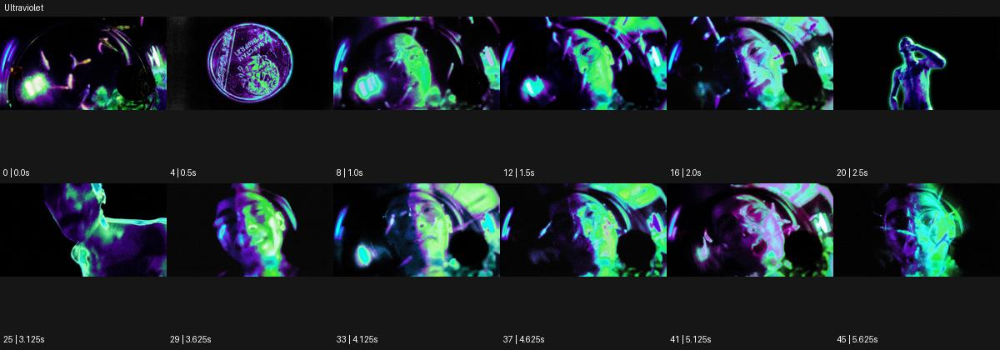

# Ultraviolet

출처: Higgsfield · 공식 원본명: **Ultraviolet** · 분류: look / 스타일 · ID: be3585f5-8246-4670-87a7-19c750e6da02

[원본 미리보기](https://cdn.higgsfield.ai/mixed_media_preset/dd675cab-cc8e-4305-96b7-9a808df33321.mp4) · [원본 썸네일](https://cdn.higgsfield.ai/mixed_media_preset/097b4dcb-ed44-4846-9557-67e709626b9b.webp)


## 확인 근거

공식 미리보기의 12개 표본 프레임을 확인한 관찰 기록을 바탕으로 작성했다. 원본 46프레임, 메타데이터 길이 5.75초. 전체 재생 감상·전 프레임 검사·음향 청취·생성 테스트를 했다는 뜻이 아니다.

표본 시점(초): 0, 0.5, 1, 1.5, 2, 2.5, 3.125, 3.625, 4.125, 4.625, 5.125, 5.625



## 원본에서 관찰한 변화

검정 배경에서 얼굴·손·상체에 형광 초록과 보라 경계가 떠오른다. 어안 같은 둥근 왜곡과 얼굴 근경/전신이 섞인다.

## 장면에 재사용할 원리와 층 구분

검정 바탕 위 형광 초록·보라 경계로 얼굴·손·상체를 선택적으로 드러낸다. 실제 자외선 조사나 소재 반응이 아니라 화면 스타일로 명시한다.

## 확인 한계

실제 자외선 촬영이나 물질 반응을 확인하지 않는다. 표본 사이의 미세한 변화·정확한 반복 경계·제작 공정은 확정하지 않는다. 음향은 확인하지 않았다.

## 뮤직비디오 각색 · 완성형 프롬프트

아래는 관찰한 시각 원리를 다른 장면 목적에 맞게 재설계한 창작안이다. 원본의 소재·길이·사건을 자동 상속하지 않는다.

```text
7초 뮤직비디오, 성인 보컬이 검정 공간에서 두 손을 얼굴 옆에 든다. 카메라는 약한 광각의 정면 클로즈업으로 시작하고 얼굴 외곽에는 보라색, 손가락 경계에는 형광 초록빛을 둔다. 2초에 보컬이 손을 천천히 바깥으로 펼치면 빛의 경계도 손을 따라 벌어지고 카메라는 뒤로 이동해 상체를 드러낸다. 몸이나 얼굴을 둥글게 찌그러뜨리지 않고 실제 표정과 손가락 수를 유지한다. 5초에 손이 내려가면 초록빛은 옅어지고 보라색 옆얼굴만 남는다. 마지막 2초는 정지한 상반신 구도로 안착한다. UV 효능·문자·대사 없이 무음이다.
```

## 브랜드필름 각색 · 완성형 프롬프트

```text
8초 메이크업 브랜드필름, 성인 모델의 눈과 손을 검정 배경 앞 가까운 정면으로 담는다. 보라색 가장자리 빛과 형광 초록의 작은 포인트를 눈 화장 주변에 두되 실제 피부톤과 제품 색을 읽을 중성광을 중앙에 유지한다. 모델이 2초에 손을 천천히 내리면 눈 화장 전체가 드러나고 카메라가 10cm 접근한다. 형광 경계는 눈꺼풀의 움직임을 따라가지만 눈의 해부학적 형태를 바꾸지 않는다. 5초에 색 경계가 약해지면 마지막 3초는 실제 질감과 모델의 편안한 응시에 안착한다. 자외선 반응·효능 주장·새 로고·문구 없이 무음으로 끝낸다.
```

생성 테스트: 미실시. 스타일의 명칭만으로 자동 재현을 보장하지 않으며 촬영·그래픽·합성·편집 층을 구별해 구현한다.
