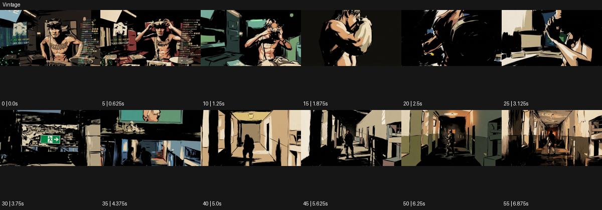

# Vintage

출처: Higgsfield · 공식 원본명: **Vintage** · 분류: look / 스타일 · ID: f9f7c94c-beca-4799-8276-238e54390a9d

[원본 미리보기](https://cdn.higgsfield.ai/mixed_media_preset/9b029b09-f910-431e-94c0-b9ca6db41715.mp4) · [원본 썸네일](https://cdn.higgsfield.ai/mixed_media_preset/b837742c-3354-4502-80af-fe0a415fb4f5.webp)


## 확인 근거

공식 미리보기의 12개 표본 프레임을 확인한 관찰 기록을 바탕으로 작성했다. 원본 56프레임, 메타데이터 길이 7초. 전체 재생 감상·전 프레임 검사·음향 청취·생성 테스트를 했다는 뜻이 아니다.

표본 시점(초): 0, 0.625, 1.25, 1.875, 2.5, 3.125, 3.75, 4.375, 5, 5.625, 6.25, 6.875



## 원본에서 관찰한 변화

실내 인물이 두꺼운 검정 선과 누런 색면의 만화 같은 질감으로 나온다. 손·얼굴 근경 뒤 복도 속 작은 인물로 바뀐다.

## 장면에 재사용할 원리와 층 구분

두꺼운 검정 선과 누런 삽화 색면으로 실내 장면의 시대감을 만든다. 일반 세피아 필름이나 VHS 오류를 자동으로 더하지 않는다.

## 확인 한계

일반 세피아 필름 필터보다 삽화 색면이 강한 예시. 표본 사이의 미세한 변화·정확한 반복 경계·제작 공정은 확정하지 않는다. 음향은 확인하지 않았다.

## 뮤직비디오 각색 · 완성형 프롬프트

아래는 관찰한 시각 원리를 다른 장면 목적에 맞게 재설계한 창작안이다. 원본의 소재·길이·사건을 자동 상속하지 않는다.

```text
7초 빈티지 삽화 뮤직비디오, 성인 보컬이 누런 복도 벽 앞에서 손에 든 편지를 접는다. 카메라는 손 근경에서 시작해 천천히 뒤로 이동한다. 두꺼운 검정 윤곽과 탁한 노랑·갈색 색면을 전 구간 유지하고 편지에는 읽을 수 있는 문자를 넣지 않는다. 보컬이 3초에 편지를 주머니에 넣고 뒤돌아 걸으면 카메라는 제자리에 멈춰 인물이 복도 끝에서 작아지는 모습을 본다. 인물의 얼굴과 의상 형태는 같은 삽화 비율을 유지한다. 마지막 2초는 복도 여백과 멀어진 인물이 남는 구도다. 테이프 오류·새 로고·대사 없이 발소리만 둔다.
```

## 브랜드필름 각색 · 완성형 프롬프트

```text
8초 헤리티지 가죽 신발 브랜드필름, 성인 모델이 누런 벽의 실내 벤치에 앉아 갈색 신발 끈을 묶는다. 낮은 삼사분면 카메라는 손과 신발에 집중하고 두꺼운 검정 선·탁한 황갈색 면으로 삽화 같은 질감을 만든다. 3초에 끈을 당기는 손의 힘에 맞춰 가죽 주름과 그림자 면이 조금 바뀌지만 신발 구조와 실제 끈 경로는 유지한다. 모델이 5초에 발을 바닥에 놓으면 카메라가 측면으로 20cm 이동해 전체 형태를 보여준다. 마지막 3초는 제품 실루엣과 정돈된 색면에 안착한다. 가짜 연도·광고 문구·새 로고·VHS 줄무늬 없이 가죽 소리만 둔다.
```

생성 테스트: 미실시. 스타일의 명칭만으로 자동 재현을 보장하지 않으며 촬영·그래픽·합성·편집 층을 구별해 구현한다.
