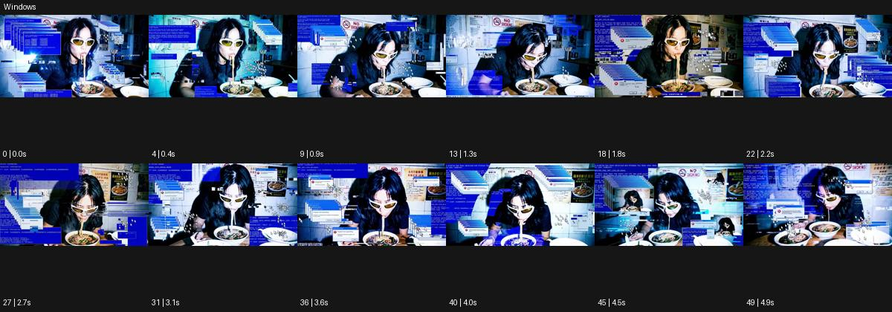

# Windows

출처: Higgsfield · 공식 원본명: **Windows** · 분류: look / 스타일 · ID: 507b31bc-1eed-4651-880a-3fbafbb1e21e

[원본 미리보기](https://cdn.higgsfield.ai/viral_hub/a247a841-8eab-4021-b34a-50ae15dd289e.mp4) · [원본 썸네일](https://cdn.higgsfield.ai/viral_hub/33fbee41-8c5b-4ac8-9c77-b65f25dad5a9.webp)


## 확인 근거

공식 미리보기의 12개 표본 프레임을 확인한 관찰 기록을 바탕으로 작성했다. 원본 50프레임, 메타데이터 길이 5초. 전체 재생 감상·전 프레임 검사·음향 청취·생성 테스트를 했다는 뜻이 아니다.

표본 시점(초): 0, 0.4, 0.9, 1.3, 1.8, 2.2, 2.7, 3.1, 3.6, 4, 4.5, 4.9



## 원본에서 관찰한 변화

식당에서 식사하는 인물 주변에 파란 구형 컴퓨터 창이 겹겹이 늘어나고 위치가 달라진다. 작은 인물 영상창도 중첩된다.

## 장면에 재사용할 원리와 층 구분

실사와 겹치는 창의 크기·위치·중첩 순서를 별도로 구성한다. 실제 운영체제 동작이 아닌 그래픽 언어로 쓰며 중요한 주체 영역을 남긴다.

## 확인 한계

실제 OS 동작이나 오류가 아닌 그래픽 합성. 표본 사이의 미세한 변화·정확한 반복 경계·제작 공정은 확정하지 않는다. 음향은 확인하지 않았다.

## 뮤직비디오 각색 · 완성형 프롬프트

아래는 관찰한 시각 원리를 다른 장면 목적에 맞게 재설계한 창작안이다. 원본의 소재·길이·사건을 자동 상속하지 않는다.

```text
7초 뮤직비디오, 성인 보컬이 밤의 작은 식탁에 혼자 앉아 컵을 만진다. 카메라는 정면 고정 미디엄숏이다. 첫 2초는 실사만 보이고 보컬이 컵을 놓으면 주변 빈 공간에 파란 테두리의 옛 컴퓨터 창 세 개가 차례로 열린다. 창 안에는 같은 보컬의 손·옆얼굴·빈 의자 영상이 서로 다른 시간차로 움직인다. 창 제목이나 오류 문자는 넣지 않고 중앙 얼굴은 가리지 않는다. 5초에 보컬이 눈을 감으면 창이 뒤쪽부터 닫히고 마지막 하나는 빈 의자 옆에서 멈춘다. 카메라는 끝까지 고정해 고립과 중첩을 대비한다. 컵 소리만 둔다.
```

## 브랜드필름 각색 · 완성형 프롬프트

```text
8초 모듈 가구 브랜드필름, 흰 스튜디오의 한 선반을 정면으로 담는다. 카메라는 고정하고 첫 2초 동안 선반의 실제 구조를 읽힌다. 이후 얇은 파란 테두리 창 세 개가 제품 오른쪽 여백에 겹쳐 나타나 같은 선반의 책·꽃병·조명 배치를 각각 보여준다. 실제 제품은 변형하지 않고 창 속 쓰임만 바뀌게 한다. 5초에 세 창이 같은 폭으로 나란히 정렬되며 카메라가 제품 쪽으로 20cm 접근한다. 마지막 3초는 제품과 정돈된 활용 이미지가 함께 읽히는 구도다. 실제 OS 로고·제목·성능 문구·임의 문자는 없고 실내 환경음만 둔다.
```

생성 테스트: 미실시. 스타일의 명칭만으로 자동 재현을 보장하지 않으며 촬영·그래픽·합성·편집 층을 구별해 구현한다.
